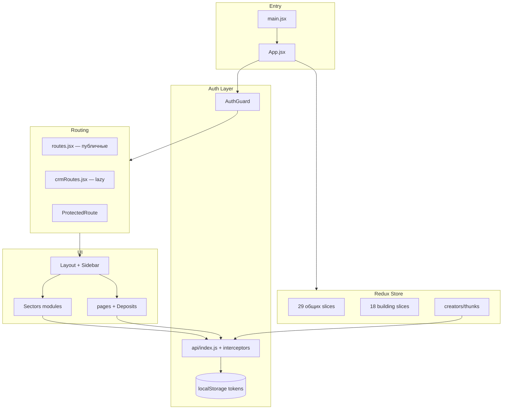

# NUR CRM — Полная документация проекта

> Дата анализа: 8 июня 2026  
> Версия проекта: `0.1.0`  
> Репозиторий: `/Users/undefined/projects/Nur`

---

## Содержание

1. [Обзор](#1-обзор)
2. [Технологический стек](#2-технологический-стек)
3. [Структура репозитория](#3-структура-репозитория)
4. [Точки входа и bootstrap](#4-точки-входа-и-bootstrap)
5. [Архитектура приложения](#5-архитектура-приложения)
6. [Роутинг](#6-роутинг)
7. [Аутентификация и авторизация](#7-аутентификация-и-авторизация)
8. [API-слой](#8-api-слой)
9. [Redux Store](#9-redux-store)
10. [Секторы бизнеса](#10-секторы-бизнеса)
11. [Общие модули (Deposits, Pages)](#11-общие-модули-deposits-pages)
12. [UI и Layout](#12-ui-и-layout)
13. [Стилизация](#13-стилизация)
14. [Интернационализация (i18n)](#14-интернационализация-i18n)
15. [PWA и Service Worker](#15-pwa-и-service-worker)
16. [Утилиты (tools/)](#16-утилиты-tools)
17. [Подпроект ubl-invoice](#17-подпроект-ubl-invoice)
18. [Переменные окружения](#18-переменные-окружения)
19. [Сборка и деплой](#19-сборка-и-деплой)
20. [Тестирование](#20-тестирование)
21. [Печать чеков (Cafe)](#21-печать-чеков-cafe)
22. [Существующая документация](#22-существующая-документация)
23. [Статистика кодовой базы](#23-статистика-кодовой-базы)
24. [Технический долг и наблюдения](#24-технический-долг-и-наблюдения)

---

## 1. Обзор

**NUR CRM** — многопрофильная CRM-система (frontend) для управления бизнесом в различных отраслях. Продукт ориентирован на рынок Кыргызстана.

### Ключевые характеристики

| Параметр | Значение |
|---|---|
| Тип | SPA (Single Page Application) |
| Сборщик | Vite 7 |
| UI-фреймворк | React 18 |
| Состояние | Redux Toolkit |
| Бэкенд API | `https://app.nurcrm.kg/api` |
| Dev-порт | `3000` |
| Production output | `build/` |

### Основные возможности

- Управление **12+ отраслевыми секторами** (кафе, маркет, барбершоп, школа, гостиница, строительство, производство, склад, логистика и др.)
- **Многопользовательская** система с ролевым доступом (permissions с бэкенда)
- Управление **филиалами** и **отделами**
- **Аналитика** и отчётность
- **Складской учёт** и кассовые операции
- **PWA** — установка как приложение
- **Многоязычность** (русский, кыргызский) — в основном для лендинга
- **Онлайн-витрины**: каталог маркета, меню кафе, онлайн-запись барбершопа

---

## 2. Технологический стек

### Основные зависимости

| Категория | Библиотеки |
|---|---|
| **Core** | React 18, React DOM, React Router DOM 6 |
| **State** | Redux Toolkit 2, React Redux 9 |
| **HTTP** | Axios 1.6 |
| **UI** | MUI 5, Radix UI, Emotion |
| **Стили** | SASS, Tailwind CSS 4 |
| **Графики** | Chart.js, react-chartjs-2, Recharts |
| **Календарь** | FullCalendar 6 |
| **PDF/Excel** | @react-pdf/renderer, jspdf, xlsx |
| **i18n** | i18next, react-i18next |
| **Анимации** | framer-motion, Swiper |
| **Утилиты** | date-fns, clsx, tailwind-merge, class-variance-authority |
| **Прочее** | jsbarcode, use-scan-detection, sonner, lucide-react, react-icons |

### Dev-зависимости

| Инструмент | Назначение |
|---|---|
| Vite 7 | Сборка и dev-сервер |
| @vitejs/plugin-react | JSX/TSX трансформация |
| @tailwindcss/vite | Tailwind CSS v4 |
| vite-plugin-pwa | PWA + Workbox |
| sass | SCSS компиляция |
| vitest | Unit-тесты |
| eslint-config-react-app | ESLint (наследие CRA) |

### NPM-скрипты

```bash
npm run dev          # Vite dev-сервер (порт 3000)
npm run build        # Production-сборка → build/
npm run preview      # Превью production-сборки
npm test             # vitest run
npm run printer-bridge  # Node bridge для Wi-Fi принтеров (файл может отсутствовать)
```

---

## 3. Структура репозитория

```
Nur/
├── public/                    # Статика: иконки, PWA-манифест, локали, звуки
│   ├── locales/ru/            # Русские переводы
│   ├── locales/ky/            # Кыргызские переводы
│   └── site.webmanifest       # PWA манифест
├── src/                       # Исходный код (~856 JS/JSX/TS файлов)
│   ├── api/                   # API-модули (18 файлов)
│   ├── assets/scss/           # Глобальные SCSS переменные и миксины
│   ├── Components/            # React-компоненты
│   │   ├── Auth/              # Авторизация
│   │   ├── common/            # Общие UI-компоненты
│   │   ├── Deposits/          # Legacy общие модули CRM
│   │   ├── Layout/            # Основной layout CRM
│   │   ├── pages/             # Страницы (лендинг, building, sell, info...)
│   │   ├── Sectors/           # Отраслевые модули (12 секторов)
│   │   └── Sidebar/           # Боковое меню
│   ├── config/                # routes.jsx, crmRoutes.jsx
│   ├── constants/             # Константы (публичные пути и др.)
│   ├── context/               # React Context (модалки)
│   ├── data/                  # Статические данные (countries.js)
│   ├── hooks/                 # Custom hooks (8 файлов)
│   ├── services/              # Сервисы (registerAccessService)
│   ├── store/                 # Redux: slices + creators
│   ├── theme/                 # MUI ThemeModeProvider
│   ├── tools/                 # Утилиты фронтенда
│   ├── utils/                 # Общие утилиты
│   ├── App.jsx                # Корневой компонент
│   ├── main.jsx               # Точка входа
│   ├── i18n.js                # Конфигурация i18next
│   ├── sw.js                  # Service Worker (Workbox)
│   └── ProtectedRoute.jsx     # HOC защиты маршрутов
├── docs/                      # Техническая документация (~42 файла)
├── tools/                     # Доменные утилиты (касса, штрихкоды, аналитика)
├── ubl-invoice/               # Отдельный TS-пакет UBL 2.1 счетов
├── build/                     # Production-сборка
├── index.html                 # HTML-шаблон Vite
├── vite.config.js             # Конфигурация Vite
├── vitest.config.ts           # Конфигурация тестов
├── package.json
├── .env.example
└── README.md
```

---

## 4. Точки входа и bootstrap

### `index.html` → `src/main.jsx`

```javascript
// main.jsx — порядок инициализации:
import './index.css'           // Tailwind
import store from './store'    // Redux
import { Provider } from 'react-redux'
import { registerSW } from 'virtual:pwa-register'  // PWA
registerSW({ immediate: true })
ReactDOM.createRoot(...).render(<Provider><App /></Provider>)
```

> `React.StrictMode` закомментирован.

### `src/App.jsx`

Цепочка провайдеров и роутинга:

```
AuthGuard
  └── ThemeModeProvider (MUI light/dark)
        └── ModalProvider (глобальные alert/confirm)
              └── BrowserRouter
                    └── AppRoutes
                          ├── publicRoutes (routes.jsx)
                          └── /crm/* → Layout + crmRoutes (lazy-load)
```

**Lazy-load CRM:** маршруты из `crmRoutes.jsx` (~765 строк) подгружаются динамически только при первом заходе на `/crm/*`, что уменьшает начальный бандл.

---

## 5. Архитектура приложения



### Принципы архитектуры

1. **Монорепо-секторы** — один фронтенд, маршруты и меню конфигурируются по `company.sector` и permissions с бэкенда.
2. **Lazy CRM routes** — тяжёлый бандл CRM подгружается только при `/crm/*`.
3. **Permission-based UI** — sidebar фильтрует пункты меню по permissions пользователя.
4. **Секторные алиасы** — barber / services / dentistry используют одни React-компоненты с разными URL-префиксами.
5. **Два слоя «склада»** — legacy `Deposits/Sklad` + `Market/Warehouse` vs отдельный сектор `Warehouse/` (агентская модель).

---

## 6. Роутинг

### Публичные маршруты (`src/config/routes.jsx`, ~112 строк)

| Путь | Компонент | Описание |
|---|---|---|
| `/` | `NewLanding` | Маркетинговый лендинг |
| `/login` | `Login` | Авторизация |
| `/register` | `RegisterGate` | Регистрация (с защитой паролем) |
| `/register-access/settings` | `RegisterAccessSettings` | Настройки доступа к регистрации |
| `/old-landing` | `Landing` | Старый лендинг |
| `/video-lessons/*` | VideoLessons | Обучающие видео |
| `/catalog/:slug` | `OnlineCatalog` | Публичный каталог маркета |
| `/production/:slug` | `ProductionShowcase` | Витрина производства |
| `/cafe/:company_slug/menu` | `CafeMenuOnline` | Онлайн-меню кафе |
| `/barber\|services\|dentistry/:company_slug/booking` | `OnlineBooking` | Онлайн-запись |
| `/submit-application` | `SubmitApplication` | Заявка на подключение |
| `/get-application-list` | `ApplicationList` | Список заявок (ProtectedRoute) |

### CRM-маршруты (`src/config/crmRoutes.jsx`, ~765 строк)

Все под префиксом `/crm`, обёрнуты в `<Layout />`.

#### Паттерны защиты маршрутов

| Функция | Назначение |
|---|---|
| `createProtectedRoute(path, Component)` | Проверка подписки компании |
| `createPermissionProtectedRoute` | Проверка permission из профиля |
| `createProductionAgentProtectedRoute` | Gate для тарифа «Старт» (производство) |
| `createWarehouseAgentProtectedRoute` | Gate для тарифа «Старт» (склад) |

#### Группы CRM-маршрутов

| Префикс | Сектор / модуль |
|---|---|
| `/crm/obzor`, `/crm/sklad`, `/crm/kassa`, `/crm/sell`… | Общие (Deposits) |
| `/crm/barber/*`, `/crm/services/*`, `/crm/dentistry/*` | Барбершоп / услуги / стоматология |
| `/crm/hostel/*` | Гостиница |
| `/crm/school/*` | Школа |
| `/crm/market/*`, `/crm/clients/*` | Магазин |
| `/crm/cafe/*` | Кафе |
| `/crm/building/*` | Строительство |
| `/crm/consulting/*` | Консалтинг |
| `/crm/warehouse/*` | Склад (агентская модель) |
| `/crm/production/*` | Производство |
| `/crm/pilorama/*` | Пилорама |
| `/crm/logistics`, `/crm/logistics-analytics` | Логистика |

#### Вложенные Layout-ы

- `BuildingLayout` — строительный модуль
- `CafeLayout` — кафе
- `CafeOrdersLayout` — заказы кафе
- `SellLayout` — универсальная касса

### ProtectedRoute (`src/ProtectedRoute.jsx`)

- Проверяет `company.end_date` (срок подписки)
- При истечении — редирект на `/` с alert
- Permission-based редирект в sidebar закомментирован

---

## 7. Аутентификация и авторизация

### Поток логина

```
Login.jsx
  → dispatch(loginUserAsync(formData))
    → userCreators.js → POST /users/auth/login/
      → localStorage: accessToken, refreshToken, userId, userData
      → migrateUserPermissions() — автоустановка sector-permissions для владельца
        → navigate('/crm/')
```

### AuthGuard (`src/Components/Auth/AuthGuard/AuthGuard.jsx`)

| Событие | Действие |
|---|---|
| Старт приложения | Проверка токена → `getProfile()` |
| Валидный токен на публичной странице | Редирект на `/crm` |
| Нет токена на защищённом пути | Редирект на `/login` |
| `/crm/logout` | Очистка токенов |
| Есть токен | `getCompany()` |

### Хранение в localStorage

| Ключ | Назначение |
|---|---|
| `accessToken` | JWT access token |
| `refreshToken` | JWT refresh token |
| `userId` | ID пользователя |
| `userData` | Данные пользователя (JSON) |

### Refresh token (axios interceptor)

При 401:
1. Очередь failed requests (`failedQueue`)
2. `POST /users/auth/refresh/` с refresh token
3. Обновление accessToken → повтор оригинального запроса
4. При неудаче — очистка токенов, редирект на `/login`

### Регистрация

- `RegisterGate` — защита паролем (`VITE_REGISTER_ACCESS_PASSWORD` или бэкенд)
- `registerUser` в `auth.js` — автоустановка permissions по сектору для роли «Владелец»

### Permissions и меню

Конфигурация в `src/Components/Sidebar/config/menuConfig.js`:
- Каждый пункт меню привязан к `permission` с бэкенда
- Фильтрация через `useMenuItems`, `useMenuPermissions`
- Тариф «Старт» ограничивает видимость пунктов

---

## 8. API-слой

### Axios instance (`src/api/index.js`)

```javascript
baseURL: import.meta.env.VITE_API_URL || "https://app.nurcrm.kg/api"
timeout: 20000
// Request: Authorization: Bearer {accessToken}
// Response: auto-refresh при 401
```

### API-модули (`src/api/`)

| Файл | Домен |
|---|---|
| `index.js` | Axios instance + interceptors |
| `auth.js` | Регистрация, логин, industries, subscription plans, permissions |
| `employees.js` | Сотрудники |
| `products.js` | Товары |
| `orders.js` | Заказы |
| `warehouse.js` | Склад |
| `building.js` | Строительство |
| `catalog.js` | Каталог |
| `analytics.js` | Аналитика |
| `transfers.js` | Перемещения |
| `agentSales.js` | Агентские продажи |
| `agentCarts.js` | Корзины агентов |
| `departments.js` | Отделы |
| `notification.js` | Уведомления |
| `event.js` | События |
| `additionalServices.js` | Доп. услуги |
| `registerAccess.js` | Доступ к регистрации |
| `knowledgeBase.js` | База знаний |

> Модули `clients.js`, `user.js` могут быть в других путях или интегрированы в creators.

---

## 9. Redux Store

### Конфигурация (`src/store/index.js`)

**47 reducers** зарегистрировано в store.

### Общие slices (29)

| Ключ store | Файл | Назначение |
|---|---|---|
| `user` | `userSlice.js` | Аутентификация, профиль, компания, тариф |
| `order` | `orderSlice.js` | Заказы |
| `employee` | `employeeSlice.js` | Сотрудники |
| `product` | `productSlice.js` | Товары |
| `event` | `eventsSlice.js` | События/расписание |
| `notification` | `notificationSlice.js` | Уведомления |
| `analytics` | `analyticsSlice.js` | Аналитика |
| `logistics` | `logisticsSlice.js` | Логистика |
| `departments` | `departmentSlice.js` | Отделы |
| `client` | `ClientSlice.js` | Клиенты |
| `sale` | `saleSlice.js` | Продажи |
| `instagram` | `InstagramSlice.js` | Instagram-интеграция |
| `cash` | `cashSlice.js` | Касса |
| `jobs` | `jobsSlice.js` | Фоновые задачи UI |
| `ui` | `uiSlice.js` | UI-состояние |
| `consulting` | `consultingSlice.js` | Консалтинг |
| `transfer` | `transferSlice.js` | Перемещения |
| `acceptance` | `acceptanceSlice.js` | Приёмка |
| `return` | `returnSlice.js` | Возвраты |
| `agent` | `agentSlice.js` | Агенты |
| `agentCart` | `agentCartSlice.js` | Корзина агента |
| `catalog` | `catalogSlice.js` | Каталог |
| `cart` | `cartSlice.js` | Корзина |
| `cafeOrders` | `cafeOrdersSlice.js` | Заказы кафе |
| `branches` | `branchSlice.js` | Филиалы |
| `shifts` | `shiftSlice.js` | Смены |
| `warehouse` | `warehouseSlice.js` | Склад |
| `counterparty` | `counterpartySlice.js` | Контрагенты |

### Building slices (18) — `src/store/slices/building/`

| Ключ store | Назначение |
|---|---|
| `buildingProjects` | Проекты |
| `buildingProcurements` | Закупки |
| `buildingProcurementItems` | Позиции закупок |
| `buildingCashRegister` | Касса |
| `buildingTransfers` | Перемещения |
| `buildingStock` | Остатки |
| `buildingWorkflowEvents` | Workflow-события |
| `buildingWarehouses` | Склады |
| `buildingWorkEntries` | Рабочие записи |
| `buildingApartments` | Квартиры |
| `buildingDrawings` | Чертежи |
| `buildingClients` | Клиенты |
| `buildingSuppliers` | Поставщики |
| `buildingContractors` | Подрядчики |
| `buildingTreaties` | Договоры |
| `buildingTasks` | Задачи |
| `buildingSalary` | Зарплата |
| `buildingTreatyInstallments` | Рассрочки по договорам |

### Creators / Thunks (`src/store/creators/`, 38 файлов)

| Файл | Область |
|---|---|
| `userCreators.js` | login, register, profile, company |
| `employeeCreators.js` | Сотрудники |
| `productCreators.js` | Товары |
| `orderCreators.js` | Заказы |
| `saleThunk.js` | Продажи |
| `analyticsCreators.js` | Аналитика |
| `notificationCreators.js` | Уведомления |
| `eventsCreators.js` | События |
| `clientCreators.js` | Клиенты |
| `departmentCreators.js` | Отделы |
| `branchCreators.js` | Филиалы |
| `shiftThunk.js` | Смены |
| `warehouseCreators.js`, `warehouseThunk.js` | Склад |
| `transferCreators.js` | Перемещения |
| `agentCreators.js`, `agentCartCreators.js` | Агенты |
| `cafeOrdersCreators.js` | Заказы кафе |
| `consultingThunk.js` | Консалтинг |
| `logisticsCreators.js` | Логистика |
| `building/*Creators.js` (15 файлов) | Строительный модуль |

> **Примечание:** `sectorSlice.js` существует, но **не подключён** к store.

---

## 10. Секторы бизнеса

Все секторы находятся в `src/Components/Sectors/`.

### Barber (`Barber/`)

**Барбершоп, салоны услуг, стоматология** — общая кодовая база, разные URL-префиксы (`/crm/barber`, `/crm/services`, `/crm/dentistry`).

| Модуль | Назначение |
|---|---|
| `Recorda` | Запись клиентов на услуги (календарь/расписание) |
| `Services` | Справочник услуг и цен |
| `Masters` | Мастера, роли, ставки, выплаты, история |
| `Clients` | Клиентская база |
| `ClientDocuments` | Документы клиентов |
| `History` | История визитов/операций |
| `Documents` | Документооборот |
| `BarberAnalitika` | Кассовые отчёты и аналитика |
| `Requests` | Заявки/запросы |
| `OnlineBooking` | Публичная онлайн-запись |
| `common/` | Общие UI-компоненты сектора |

### Market (`Market/`)

**Розничный магазин.**

| Модуль | Назначение |
|---|---|
| `Warehouse` | Склад, товары, штрихкоды, приёмка от поставщиков |
| `CashierPage` | POS-касса, смены, split-payment |
| `Categories` | Категории товаров |
| `Clients`, `ClientDetails` | Клиенты и поставщики |
| `Counterparties` | Контрагенты |
| `History` | История продаж |
| `Documents` | Счета, накладные, акты сверки |
| `Analytics` | Аналитика продаж |
| `Bar` | Бар (доп. точка) |
| `Catalog` | Публичный онлайн-каталог |

### Cafe (`cafe/`)

**Ресторан / кафе.**

| Модуль | Назначение |
|---|---|
| `Orders` | Заказы, KDS, печать чеков (ESC/POS) |
| `Menu` | Меню, техкарты, весовые позиции |
| `Tables` | Столы и зал |
| `Cook` | Экран кухни (KDS) |
| `Reservations` | Бронирования |
| `Clients` | Клиенты |
| `Stock` | Склад кафе |
| `Purchasing` | Закупки |
| `Inventory` | Инвентаризация |
| `Costing` | Калькуляция/себестоимость |
| `Payroll` | Зарплата |
| `Reports` | Отчёты |
| `CafeAnalytics` | Аналитика |
| `Documents` | Документы |
| `kassaCafe` | Касса |
| `CafeMenuOnline` | Публичное онлайн-меню |
| `CafeLayout` | Layout сектора |

### Building (`Building/` + `pages/Building/`)

**Строительная сфера.** Legacy-компоненты в `Sectors/Building/`, основной UI в `pages/Building/`.

| Модуль (pages/Building) | Назначение |
|---|---|
| `Analytics` | Аналитика |
| `CashRegister` | Касса, рассрочки |
| `Clients` | Клиенты, подрядчики |
| `Employees` | Сотрудники |
| `Notification` | Напоминания |
| `Procurement` | Закупки |
| `Projects` | Проекты |
| `Drawings` | Чертежи |
| `Salary` | Зарплата |
| `Sell` | Продажи |
| `Stock` | Остатки |
| `Treaty` | Договоры |
| `Work` | Рабочие процессы |

### Production (`Production/`)

**Производственный ERP.**

| Модуль | Назначение |
|---|---|
| `Warehouse` | Склад готовой продукции и сырья |
| `RawMaterialsWarehouse` | Обработка сырья |
| `FinishedGoods` | Готовая продукция, рецепты |
| `Catalog` | Каталог для агентов, публичная витрина |
| `Request` | Заявки агентов на товар |
| `ProductionAgents` | Агенты, клиенты, долги |
| `Sell` | Продажи производства |
| `Analytics` | Аналитика владельца и агента |
| `TransferStatus` | Статусы перемещений |
| `ProductionStartAgentGate` | Gate тарифа «Старт» |

### Warehouse (`Warehouse/`)

**Агентский склад** (отдельный сектор от Market).

| Модуль | Назначение |
|---|---|
| `Warehouses` | Склады, партнёрские каталоги |
| `Stocks`, `AgentStocks` | Остатки (владелец/агент) |
| `Products` | Номенклатура |
| `Movements` | Движения товара |
| `Supply` | Поставки |
| `WriteOffs` | Списания |
| `Documents` | Счета, накладные, коммерческие предложения |
| `Money` | Денежные документы |
| `Analytics` | Аналитика владельца, агентов, партнёров |
| `Agents` | Агенты |
| `Clients` | Клиенты |
| `BrandCategory`, `Brands`, `Categories` | Бренды и категории |
| `Kassa` | Касса |
| `Directories` | Справочники |
| `WarehouseStartAgentGate` | Gate тарифа «Старт» |

### Hostel (`Hostel/`)

**Гостиница / хостел.**

| Модуль | Назначение |
|---|---|
| `RoomsHalls` | Номера и залы |
| `Bookings` | Бронирования и заезды |
| `Clients` | Гости |
| `Bar` | Бар/доп. услуги |
| `Warehouse` | Склад гостиницы |
| `Documents` | Документы |
| `Analytics` | Аналитика |
| `Reports` | Отчёты |
| `kassa` | Касса |

### School (`School/`)

**Образовательное учреждение.**

| Модуль | Назначение |
|---|---|
| `Students` | Ученики |
| `CoursesGroups` | Курсы и группы |
| `LessonsRooms` | Уроки и аудитории |
| `Teachers` | Преподаватели |
| `Leads` | Лиды/заявки |
| `Invoices` | Счета и рассрочки |
| `Documents` | Документы |

### Consulting (`Consulting/`)

**Консалтинговые услуги.**

| Модуль | Назначение |
|---|---|
| `client` | Клиенты |
| `client-requests` | Заявки клиентов |
| `services` | Услуги |
| `Bookings` | Бронирования |
| `Teachers` | Преподаватели/консультанты |
| `sale` | Продажи |
| `salary` | Зарплата |
| `Kassa` | Касса и отчёты |
| `Analytics` | Аналитика |

### Logistics (`logistics/`)

| Модуль | Назначение |
|---|---|
| `LogisticsPage` | Заказы, трекинг, формы доставки |

### Pilorama (`Pilorama/`)

| Модуль | Назначение |
|---|---|
| `PiloramaWarehouse` | Склад пиломатериалов |

---

## 11. Общие модули (Deposits, Pages)

### Deposits (`src/Components/Deposits/`) — legacy общие модули

Используются несколькими секторами как базовый функционал:

| Модуль | CRM-путь | Назначение |
|---|---|---|
| `Obzor` | `/crm/obzor` | Дашборд/обзор |
| `Zakaz` | `/crm/zakaz` | Закупки |
| `Sklad` | `/crm/sklad` | Склад (market) |
| `Kassa` | `/crm/kassa` | Касса (владелец) |
| `KassaWorker` | `/crm/kassa-worker` | Касса (сотрудник) |
| `KassaWorkerDet` | `/crm/kassa-det` | Детальная касса |
| `Raspisanie` | `/crm/raspisanie` | Расписание/бронирование |
| `BrandCategoryPage` | `/crm/brand-category` | Бренды и категории |
| `Warehouse` | `/crm/warehouse-accounting` | Складской учёт |
| `Employ` | `/crm/employ` | Сотрудники |

### Pages (`src/Components/pages/`)

| Папка | Назначение |
|---|---|
| `Landing/` | Старый и новый лендинг (`NewLanding/` — Hero, Pricing, Demo, Team, Footer, VideoLessons) |
| `Building/` | Полноценный строительный модуль |
| `Sell/` | Универсальная касса/продажи |
| `Analytics/` | Общая аналитика |
| `AdditionalServices/` | Дополнительные услуги (Instagram и др.) |
| `Branch/` | Филиалы |
| `Shifts/` | Смены |
| `Info/` | Настройки (Settings, PosPrintSettings, Users, Company, Security) |
| `Registration/` | Регистрация компании |
| `SubmitApplication/` | Заявки на подключение |
| `Pending/` | Ожидающие операции |
| `LogisticsAnalytics/` | Аналитика логистики |
| `logistics/` | UI-компоненты логистики (Radix/shadcn-style) |

---

## 12. UI и Layout

### Layout (`Components/Layout/`)

- Sidebar + Header + `<Outlet />`
- Скрытие chrome на fullscreen-страницах (касса, sell/start)
- Баннер об истечении подписки (≤3 дней)
- Декоративные орнаменты, scroll-to-top

### Sidebar (`Components/Sidebar/`)

| Файл | Назначение |
|---|---|
| `config/menuConfig.js` | Конфигурация меню по permissions (~965 строк) |
| `config/menuIcons.js` | Иконки пунктов меню |
| `config/hideRules.js` | Правила скрытия пунктов |
| `hooks/useMenuItems.js` | Фильтрация меню |
| `hooks/useMenuPermissions.js` | Проверка permissions |

### Common (`Components/common/`)

`AlertModal`, `DataContainer`, `Loading`, `Modal`, `Notification`, `Portal`, `RouteFallback`, `SearchableCombobox`

### Custom Hooks (`src/hooks/`)

| Hook | Назначение |
|---|---|
| `useDebounce` | Debounce значений |
| `useDialog` | Управление диалогами |
| `useCafeWebSocket` | WebSocket для заказов кафе |
| `useMarketCashierMultiCart` | Мульти-корзины POS маркета |
| `useTransfers` | Перемещения товаров |
| `usePlurize` | Склонение слов |
| `useResize` | Отслеживание resize |
| `ScrollToTop` | Скролл наверх при смене маршрута |

### Context & Theme

- `context/modal.jsx` — глобальные модалки (alert/confirm)
- `theme/ThemeModeProvider.jsx` — MUI theme light/dark

---

## 13. Стилизация

### SCSS (основной подход)

```
src/assets/scss/
├── _variables.scss    # Переменные (цвета, размеры)
├── _mixin.scss        # Миксины
├── core.scss
└── main.scss
```

Vite автоподключает SCSS partials во все `.scss`-файлы через `additionalData` в `vite.config.js`.

**Паттерн:** компонентные стили `Component.scss` / `Component.module.scss`.

### Tailwind CSS v4

- Подключён через `@import "tailwindcss"` в `index.css`
- Плагин `@tailwindcss/vite`
- Используется **точечно**: logistics UI, production/market компоненты, utility-классы

### UI-библиотеки

| Библиотека | Использование |
|---|---|
| MUI v5 | Тема, компоненты, иконки |
| Radix UI | checkbox, dialog, select, tabs (logistics, landing) |
| lucide-react, react-icons | Иконки |
| framer-motion | Анимации лендинга |
| sonner | Toast-уведомления |

**Паттерн:** legacy-модули на SCSS + BEM; новые/рефакторенные части — Tailwind utility + MUI.

---

## 14. Интернационализация (i18n)

### Конфигурация (`src/i18n.js`)

| Параметр | Значение |
|---|---|
| Библиотека | i18next + react-i18next + i18next-http-backend + LanguageDetector |
| Языки | `ru` (fallback), `ky` (кыргызский) |
| Namespaces | `translation`, `newLanding` |
| Загрузка | `/locales/{{lng}}/{{ns}}.json` |
| Детекция | localStorage → navigator |

### Файлы переводов

```
public/locales/
├── ru/
│   ├── translation.json    # ~60 строк (лендинг, header, industries)
│   └── newLanding.json
└── ky/
    ├── translation.json    # ~41 строка
    └── newLanding.json
```

> **Важно:** большая часть CRM-интерфейса **не интернационализирована** — строки захардкожены на русском.

---

## 15. PWA и Service Worker

### Манифест

- Vite PWA генерирует `site.webmanifest`
- `name`: NurCRM, `display`: standalone, `theme_color`: #000000

### Service Worker (`src/sw.js`)

| Ресурс | Стратегия |
|---|---|
| Build-ассеты | Precache |
| HTML | NetworkFirst (online-first) |
| JS/CSS | StaleWhileRevalidate |
| Images | CacheFirst (30 дней, max 200) |
| Media `app.nurcrm.kg/media/` | NetworkOnly |

- Стратегия: **injectManifest** (Workbox)
- Dev: PWA enabled (`devOptions.enabled: true`)
- Регистрация: `main.jsx` → `registerSW({ immediate: true })`

---

## 16. Утилиты (tools/)

### Корневой `tools/` — доменные утилиты

| Файл | Назначение |
|---|---|
| `posSaleCarts.js` | Логика мульти-корзин POS |
| `marketCashierSplitPayment.js` | Split-payment на кассе |
| `marketPackPieceSale.js` | Продажа упаковками/штучно |
| `marketWarehouseBarcodeScan.js` | Сканирование штрихкодов склада |
| `productBarcode.js` | Генерация штрихкодов |
| `cafeAnalyticsDynamics.js` | Динамика аналитики кафе |
| `cafeCashflowCategory.js` | Категории cashflow |
| `cafePurchaseExpense.js` | Расходы на закупки |
| `validateResErrors.js` | Нормализация ошибок API |
| `sleep.js` | Утилита задержки |
| `receipt-market-demo.html` | Демо чека маркета |

### `src/tools/` — утилиты фронтенда

`cafeEmployeePermissions.js`, `deferredPaymentDates.js`, `marketWarehouseFilters.js`, `posSalesListResponse.js`

---

## 17. Подпроект ubl-invoice

**Отдельный TypeScript-пакет** в `ubl-invoice/` — не подключён как dependency основного `package.json`.

| Аспект | Детали |
|---|---|
| Назначение | Генерация счетов в формате **UBL 2.1** (XML) |
| Зависимости | `decimal.js`, `xmlbuilder2`, `zod` |
| API | `InvoiceBuilder`, `generateInvoiceXml`, `validateInvoice` |
| Тесты | Vitest: builder, validator, formatters, xml.builder |
| Node | >= 20 |

**Связь с CRM:** основное приложение использует `src/utils/archiveInvoiceXml.ts` (упрощённый XML для архивных счетов склада), **не** пакет `ubl-invoice`.

---

## 18. Переменные окружения

| Переменная | Назначение | По умолчанию |
|---|---|---|
| `VITE_API_URL` | Base URL API | `https://app.nurcrm.kg/api` |
| `VITE_WS_API_URL` | WebSocket URL (кафе) | `https://app.nurcrm.kg` |
| `VITE_REGISTER_ACCESS_PASSWORD` | Пароль страницы регистрации | `nurcrm2026` |
| `VITE_REGISTER_ACCESS_BACKEND` | Проверка пароля через бэкенд | `false` |

Файл `.env.example`:

```env
# VITE_API_URL=http://192.168.1.175:8000/api
# VITE_REGISTER_ACCESS_PASSWORD=nurcrm
# VITE_REGISTER_ACCESS_BACKEND=true
```

> **Устаревшее в README:** `REACT_APP_API_BASE_URL` (CRA) — проект мигрирован на Vite (`VITE_*`).

---

## 19. Сборка и деплой

### Vite config highlights

```javascript
// vite.config.js
server: { port: 3000, proxy: { '/media': 'https://app.nurcrm.kg' } }
build: { outDir: 'build', manualChunks: { swiper, charts } }
resolve: { alias: { '@': '/src' } }
```

### Production build

```bash
npm run build    # → build/
npm run preview  # локальный превью
```

### Manual chunks

- `vendor-swiper` — Swiper
- `vendor-charts` — chart.js + recharts

---

## 20. Тестирование

### Основной проект

| Параметр | Значение |
|---|---|
| Runner | Vitest 3 (`npm test`) |
| Конфиг | `vitest.config.ts` — environment `node` |
| Include | `src/**/*.test.ts` |
| Тесты | `src/utils/archiveInvoiceXml.test.ts` (единственный) |

### ubl-invoice

- Отдельный Vitest 2
- 4 тестовых файла: builder, validator, formatters, xml.builder

**Вывод:** тестовое покрытие минимальное; инфраструктура есть, но почти не используется.

---

## 21. Печать чеков (Cafe)

### Проблема

Сетевые чековые принтеры (XPrinter XP-N160II) на порту **9100** принимают **RAW TCP** (JetDirect). Браузер не умеет открывать сырой TCP — только HTTP, WebSocket, WebUSB.

### Решение: printer-bridge

Цепочка: `браузер → HTTP → bridge → RAW TCP → принтер`

| Вариант | Описание |
|---|---|
| **USB** | WebUSB — bridge не нужен |
| **Wi-Fi** | printer-bridge (Node) или printer-agent (Python/Flet) |
| **Бэкенд** | Endpoint `{ ip, port, data }` — см. `docs/PRINT_BACKEND_API.md` |

### Настройка

```javascript
localStorage.setItem("cafe_printer_bridge_url", "http://127.0.0.1:5179/print");
```

```bash
npm run printer-bridge  # → tools/printer-bridge.mjs (может отсутствовать в репо)
```

### Production

| Компонент | Где |
|---|---|
| Фронт | VPS (nurcrm.kg) |
| Бэкенд API | VPS |
| Printer-bridge | **В офисе** (LAN с принтером) |
| Принтер | Офис, Wi-Fi 192.168.x.x:9100 |

---

## 22. Существующая документация

### Корень проекта

| Файл | Описание |
|---|---|
| `README.md` | Быстрый старт, printer-bridge |
| `PROJECT_DOCUMENTATION.md` | Этот файл |
| `BACKEND-SERVICES-FIX.md` | Исправления бэкенд-сервисов |
| `cafe-receipt-print-analysis.md` | Анализ печати чеков кафе |
| `orders-jsx-complete-analysis.md` | Анализ компонента заказов |

### `docs/` (~42 файла)

| Категория | Примеры |
|---|---|
| **Building** | `BUILDING_FRONTEND_API.md`, `building_procurement_frontend_api.md`, `building_payroll_backend.md` |
| **Cafe** | `CAFE_WEBSOCKETS.md`, `cafe_tech_cards_frontend_api.md`, `CAFE_RECEIPT_PRINTER_SETTINGS_API.md` |
| **Market** | `MARKET_CASHIER_MULTI_CART_AND_SPLIT_PAYMENT_API.md`, `market_warehouse_barcode_ru.md` |
| **Production** | `PRODUCTION_FINISHED_GOODS_RECIPE_AND_AUTO_CONSUMPTION_API.md` |
| **Warehouse** | `warehouse-purchase-vs-receipt.md` |
| **Print** | `PRINT_BACKEND_API.md` |
| **AI context** | `sector-segmentation-ai-context.md`, `additional-services-ai-context.md` |

### Внутренняя документация компонентов

- `src/Components/Sectors/Market/Warehouse/README.md`
- `src/Components/Deposits/Sklad/AddProductPage/README.md`
- `src/Components/Sectors/Production/Catalog/README.md`
- и др.

---

## 23. Статистика кодовой базы

| Метрика | Значение |
|---|---|
| JS/JSX/TS файлов в `src/` | ~856 |
| Redux reducers | 47 |
| Redux creators/thunks | 38 |
| API-модулей | 18 |
| Custom hooks | 8 |
| Секторов в `Sectors/` | 12 |
| CRM-маршрутов (строк) | ~765 |
| Публичных маршрутов (строк) | ~112 |
| Документация в `docs/` | ~42 файла |
| Unit-тестов (основной проект) | 1 |

### Секторы (папки)

```
Barber, Building, Consulting, Hostel, Market, Pilorama,
Production, School, Warehouse, cafe, logistics, utils
```

---

## 24. Технический долг и наблюдения

| # | Наблюдение | Приоритет |
|---|---|---|
| 1 | `sectorSlice.js` не подключён к store — сектор хранится в localStorage напрямую | Средний |
| 2 | i18n покрывает в основном лендинг; CRM — русский hardcode | Низкий |
| 3 | `printer-bridge.mjs` документирован в README, но может отсутствовать в репо | Средний |
| 4 | README ссылается на `npm start` (CRA), проект на Vite (`npm run dev`) | Низкий |
| 5 | `REACT_APP_*` env vars устарели → нужны `VITE_*` | Низкий |
| 6 | Тестовое покрытие минимальное (1 тест) | Высокий |
| 7 | Два слоя «склада»: Deposits/Sklad + Market/Warehouse vs Warehouse/ (агентская) | Информационный |
| 8 | Building: UI в `pages/Building/`, Redux в `slices/building/`, API в `api/building.js` | Информационный |
| 9 | `React.StrictMode` отключён | Низкий |
| 10 | ESLint config ссылается на `react-app/jest` (наследие CRA) | Низкий |
| 11 | Стили: SCSS-доминанта + постепенное внедрение Tailwind в новых модулях | Информационный |
| 12 | `ubl-invoice` не интегрирован в основной проект | Низкий |

---

## Быстрый старт (актуальный)

```bash
# Клонирование и установка
git clone <repository-url>
cd Nur
npm install

# Настройка .env
cp .env.example .env
# VITE_API_URL=https://app.nurcrm.kg/api

# Запуск
npm run dev        # http://localhost:3000

# Production
npm run build
npm run preview
```

---

*Документ сгенерирован автоматически на основе анализа кодовой базы NUR CRM.*
