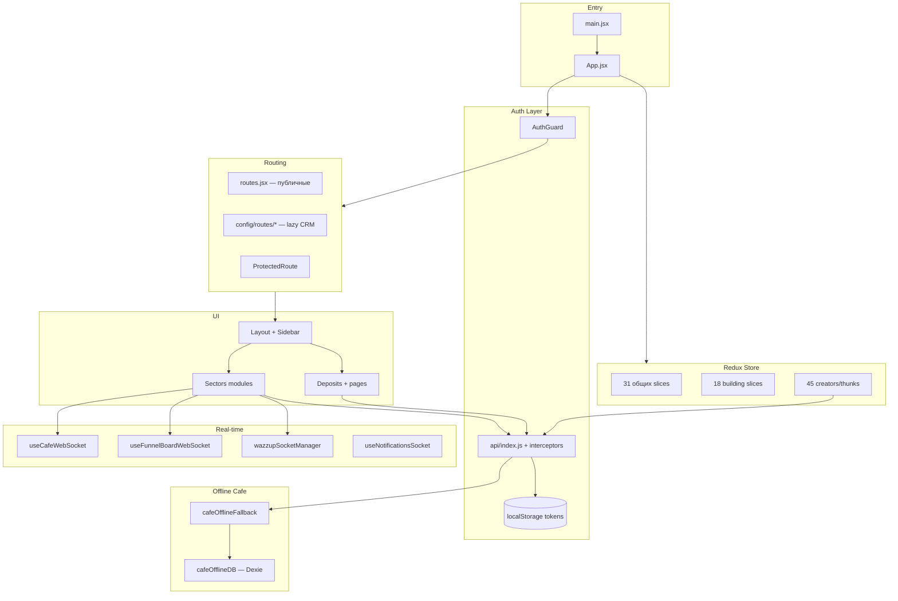

# NUR CRM — документация проекта

> **Дата обновления:** 24 августа 2026  
> **Версия:** `0.1.0`  
> **Репозиторий:** `NurFront` (frontend SPA для [app.nurcrm.kg](https://app.nurcrm.kg))

---

## Содержание

1. [Обзор продукта](#1-обзор-продукта)
2. [Быстрый старт](#2-быстрый-старт)
3. [Технологический стек](#3-технологический-стек)
4. [Структура репозитория](#4-структура-репозитория)
5. [Архитектура приложения](#5-архитектура-приложения)
6. [Точки входа и bootstrap](#6-точки-входа-и-bootstrap)
7. [Роутинг](#7-роутинг)
8. [Аутентификация и авторизация](#8-аутентификация-и-авторизация)
9. [API-слой](#9-api-слой)
10. [Redux Store](#10-redux-store)
11. [Секторы бизнеса](#11-секторы-бизнеса)
12. [Общие модули (Deposits, Pages)](#12-общие-модули-deposits-pages)
13. [UI, Layout и меню](#13-ui-layout-и-меню)
14. [Real-time и офлайн](#14-real-time-и-офлайн)
15. [Стилизация](#15-стилизация)
16. [Интернационализация](#16-интернационализация)
17. [PWA и Service Worker](#17-pwa-и-service-worker)
18. [Утилиты и доменная логика](#18-утилиты-и-доменная-логика)
19. [Печать чеков (Cafe)](#19-печать-чеков-cafe)
19a. [Печать чеков (Market)](#19a-печать-чеков-market)
20. [Подпроект ubl-invoice](#20-подпроект-ubl-invoice)
21. [Переменные окружения](#21-переменные-окружения)
22. [Сборка и деплой](#22-сборка-и-деплой)
23. [Тестирование](#23-тестирование)
24. [Доменная документация (docs/)](#24-доменная-документация-docs)
25. [Статистика кодовой базы](#25-статистика-кодовой-базы)
26. [Технический долг и рекомендации](#26-технический-долг-и-рекомендации)

---

## 1. Обзор продукта

**NUR CRM** — многопрофильная CRM-система (frontend) для управления бизнесом в различных отраслях. Продукт ориентирован на рынок Кыргызстана; интерфейс, комментарии и коммиты — преимущественно на русском языке.

### Ключевые характеристики

| Параметр | Значение |
|---|---|
| Тип | SPA (Single Page Application) |
| Сборщик | Vite 7 |
| UI-фреймворк | React 18 |
| Состояние | Redux Toolkit |
| Бэкенд API | `https://app.nurcrm.kg/api` (настраивается) |
| Dev-порт | `3000` |
| Production output | `build/` |

### Основные возможности

- **12+ отраслевых секторов:** кафе, маркет, барбершоп/услуги/стоматология, школа, гостиница, строительство, производство, склад (агентская модель), консалтинг, логистика, пилорама
- **Многопользовательская** система с ролевым доступом (permissions с бэкенда)
- Управление **филиалами**, **отделами** и **сменами**
- **Аналитика** и отчётность по секторам
- **Складской учёт**, кассовые операции, документооборот
- **PWA** — установка как приложение, кэширование статики
- **Офлайн-режим кафе** — IndexedDB (Dexie) + очередь синхронизации
- **Real-time:** WebSocket для заказов кафе, воронки консалтинга, Wazzup-чатов, уведомлений
- **Онлайн-витрины:** каталог маркета, меню кафе, витрина производства, онлайн-запись барбершопа
- **Многоязычность** (русский, кыргызский) — в основном для лендинга

### Связанные приложения

| Приложение | URL | Назначение |
|---|---|---|
| Основной CRM | app.nurcrm.kg | Этот репозиторий |
| Staging | stage.nurcrm.kg | Тестовая сборка (`npm run build:staging`) |
| Строительство | stroy.nurcrm.kg | Отдельное SPA; редирект после логина через `crossAppAuth` |

---

## 2. Быстрый старт

### Требования

- Node.js **18+** (рекомендуется LTS)
- npm **9+**

### Установка и запуск

```bash
git clone <repository-url>
cd NurFront
npm install

cp .env.example .env
# При необходимости создайте .env.local для локального бэкенда

npm run dev        # http://localhost:3000
```

### Разработка против локального бэкенда

Создайте `.env.local` (в `.gitignore`):

```env
DEV_BACKEND=http://192.168.1.175:8000
VITE_API_URL=/api
VITE_WS_API_URL=
```

Vite проксирует:
- `/api` → `DEV_BACKEND` (REST)
- `/ws` → `DEV_BACKEND` (WebSocket)
- `/media` → `https://app.nurcrm.kg` (медиафайлы с прода)

### Основные команды

| Команда | Назначение |
|---|---|
| `npm run dev` | Dev-сервер Vite (порт 3000, hot reload) |
| `npm run build` | Production-сборка → `build/` |
| `npm run build:staging` | Staging-сборка (читает `.env.staging`) |
| `npm run preview` | Локальный просмотр production-сборки |
| `npm test` | Vitest — все unit-тесты |
| `npm run lint` | ESLint (flat config в `eslint.config.js`) |
| `npm run printer-bridge` | Node-мост для Wi‑Fi принтеров кафе |

---

## 3. Технологический стек

### Основные зависимости

| Категория | Библиотеки |
|---|---|
| **Core** | React 18, React DOM, React Router DOM 6 |
| **State** | Redux Toolkit 2, React Redux 9 |
| **HTTP** | Axios 1.18 |
| **UI** | MUI 5, Radix UI, Emotion |
| **Стили** | SASS, Tailwind CSS 4 |
| **Графики** | Chart.js, react-chartjs-2, Recharts |
| **Календарь** | FullCalendar 6 |
| **PDF/Excel** | @react-pdf/renderer, jspdf, xlsx |
| **i18n** | i18next, react-i18next |
| **Офлайн** | Dexie 4 (IndexedDB для кафе) |
| **Анимации** | framer-motion, Swiper |
| **Утилиты** | date-fns, clsx, tailwind-merge, class-variance-authority |
| **Прочее** | jsbarcode, use-scan-detection, sonner, lucide-react, react-icons |

### Dev-зависимости

| Инструмент | Назначение |
|---|---|
| Vite 7 | Сборка и dev-сервер |
| @vitejs/plugin-react | JSX/TSX трансформация |
| @tailwindcss/vite | Tailwind CSS v4 |
| vite-plugin-pwa | PWA + Workbox (injectManifest) |
| sass | SCSS компиляция |
| vitest + jsdom + Testing Library | Unit-тесты |
| eslint + eslint-plugin-react | Линтинг |
| electron + electron-builder | Зависимости для десктоп-упаковки (в `package.json`) |

---

## 4. Структура репозитория

```
NurFront/
├── public/                         # Статика: иконки, PWA-манифест, локали, звуки
│   ├── locales/ru/                 # Русские переводы (i18next)
│   ├── locales/ky/                 # Кыргызские переводы
│   └── site.webmanifest
├── src/                            # Исходный код (~1060 JS/JSX/TS файлов)
│   ├── api/                        # API-модули по доменам (~35 файлов)
│   ├── assets/scss/                # Глобальные SCSS переменные и миксины
│   ├── Components/
│   │   ├── Auth/                   # Логин, регистрация, AuthGuard
│   │   ├── common/                 # Общие UI-компоненты
│   │   ├── Deposits/               # Legacy общие модули CRM
│   │   ├── Layout/                 # Основной layout CRM
│   │   ├── pages/                  # Страницы (лендинг, building, sell, info…)
│   │   ├── Sectors/                # Отраслевые модули (12 секторов)
│   │   └── Sidebar/                # Боковое меню и конфигурация
│   ├── config/
│   │   ├── routes.jsx              # Публичные маршруты
│   │   └── routes/                 # Модульные CRM-маршруты по секторам
│   ├── constants/                  # Константы (пути, auth)
│   ├── context/                    # React Context (модалки)
│   ├── db/                         # Dexie-схема офлайн-БД кафе
│   ├── hooks/                      # Custom hooks (~19 файлов)
│   ├── services/                   # Сервисы (офлайн, Wazzup, fiscal, registerAccess)
│   ├── store/                      # Redux: slices + creators
│   ├── test/                       # Vitest setup
│   ├── theme/                      # MUI ThemeModeProvider
│   ├── tools/                      # Утилиты фронтенда (доменная логика)
│   ├── utils/                      # Общие утилиты
│   ├── App.jsx                     # Корневой компонент
│   ├── main.jsx                    # Точка входа
│   ├── i18n.js                     # Конфигурация i18next
│   ├── sw.js                       # Service Worker (Workbox)
│   └── ProtectedRoute.jsx          # Guard подписки компании
├── docs/                           # Доменная техническая документация (~56 файлов)
├── tools/                          # Доменные утилиты + printer-bridge + тесты
│   └── printer-agent/              # Python/Flet агент печати (альтернатива bridge)
├── ubl-invoice/                    # Отдельный TS-пакет UBL 2.1 счетов
├── build/                          # Production-сборка (gitignore)
├── index.html                      # HTML-шаблон Vite
├── vite.config.js                  # Конфигурация Vite + PWA + proxy
├── vitest.config.ts                # Конфигурация тестов
├── eslint.config.js                # ESLint flat config
├── package.json
├── .env.example
├── README.md                       # Краткий старт + printer-bridge
├── CLAUDE.md                       # Контекст для AI-ассистентов
└── PROJECT_DOCUMENTATION.md        # Этот файл
```

---

## 5. Архитектура приложения

### Общая схема


```mermaid
flowchart TB
    subgraph entry [Entry]
        main[main.jsx]
        app[App.jsx]
    end

    subgraph auth [Auth Layer]
        guard[AuthGuard]
        axios[api/index.js + interceptors]
        ls[(localStorage tokens)]
    end

    subgraph routing [Routing]
        public[routes.jsx — публичные]
        crm[config/routes/* — lazy CRM]
        protected[ProtectedRoute]
    end

    subgraph state [Redux Store]
        slices[31 общих slices]
        building[18 building slices]
        creators[45 creators/thunks]
    end

    subgraph realtime [Real-time]
        wsCafe[useCafeWebSocket]
        wsFunnel[useFunnelBoardWebSocket]
        wsWazzup[wazzupSocketManager]
        wsNotify[useNotificationsSocket]
    end

    subgraph offline [Offline Cafe]
        dexie[cafeOfflineDB — Dexie]
        fallback[cafeOfflineFallback]
    end

    subgraph ui [UI]
        layout[Layout + Sidebar]
        sectors[Sectors modules]
        deposits[Deposits + pages]
    end

    main --> app
    app --> guard
    guard --> routing
    routing --> layout
    layout --> sectors
    layout --> deposits
    sectors --> axios
    deposits --> axios
    creators --> axios
    axios --> ls
    axios --> fallback
    fallback --> dexie
    app --> state
    sectors --> wsCafe
    sectors --> wsFunnel
    sectors --> wsWazzup
```

### Принципы архитектуры

1. **Монорепо-секторы** — один фронтенд; маршруты и меню конфигурируются по `company.sector` и permissions с бэкенда.
2. **Lazy CRM routes** — тяжёлый бандл CRM подгружается только при первом заходе на `/crm/*`.
3. **Модульный роутинг** — CRM-маршруты разбиты по секторам в `src/config/routes/` (~940 строк суммарно).
4. **Permission-based UI** — sidebar фильтрует пункты меню по permissions пользователя.
5. **Секторные алиасы** — barber / services / dentistry используют одни React-компоненты с разными URL-префиксами.
6. **Два слоя «склада»:**
   - Legacy: `Deposits/Sklad` + `Market/Warehouse` (розничный магазин)
   - Отдельный сектор: `Warehouse/` (агентская модель с партнёрами)
7. **Building — cross-app** — после логина пользователи строительного сектора могут перенаправляться на отдельное SPA (`stroy.nurcrm.kg`).

---

## 6. Точки входа и bootstrap

### `index.html` → `src/main.jsx`

```javascript
import './index.css'           // Tailwind
import store from './store'    // Redux
import { Provider } from 'react-redux'

// PWA: registerSW только в production
// В dev — unregister старых SW (конфликт с Vite HMR)

ReactDOM.createRoot(...).render(
  <React.StrictMode>
    <Provider store={store}>
      <App />
    </Provider>
  </React.StrictMode>
)
```

### `src/App.jsx` — цепочка провайдеров

```
AuthGuard
  └── ThemeModeProvider (MUI light/dark)
        └── ModalProvider (глобальные alert/confirm)
              └── BrowserRouter
                    └── AppRoutes
                          ├── publicRoutes (routes.jsx)
                          └── /crm/* → Layout + crmRoutes (dynamic import)
```

**Lazy-load CRM:** при первом переходе на `/crm/*` выполняется `import("./config/routes/index.js")`. До загрузки показывается `RouteFallback`. При ошибке — автоматический retry через 1.5 с.

---

## 7. Роутинг

### Публичные маршруты (`src/config/routes.jsx`)

| Путь | Компонент | Описание |
|---|---|---|
| `/` | `NewLanding` | Маркетинговый лендинг |
| `/login` | `Login` | Авторизация |
| `/register` | `RegisterGate` | Регистрация (с защитой паролем) |
| `/register-access/settings` | `RegisterAccessSettings` | Настройки доступа к регистрации |
| `/old-landing` | `Landing` | Старый лендинг |
| `/video-lessons/*` | VideoLessons | Обучающие видео |
| `/catalog/:slug` | `OnlineCatalog` | Публичный каталог маркета |
| `/production/:slug` | `ProductionShowcase` | Витрина производства |
| `/cafe/:company_slug/menu` | `CafeMenuOnline` | Онлайн-меню кафе |
| `/service\|services\|dentistry/:company_slug/booking` | `OnlineBooking` | Онлайн-запись |
| `/submit-application` | `SubmitApplication` | Заявка на подключение |
| `/get-application-list` | `ApplicationList` | Список заявок (ProtectedRoute) |

### CRM-маршруты (`src/config/routes/`)

Агрегатор: `src/config/routes/index.js` — объединяет модули:

| Файл | Сектор / модуль |
|---|---|
| `commonRoutes.jsx` | Общие: obzor, sklad, kassa, sell, settings, analytics… |
| `barberRoutes.jsx` | Барбершоп / услуги / стоматология |
| `marketRoutes.jsx` | Магазин (market) |
| `cafeRoutes.jsx` | Кафе |
| `buildingRoutes.jsx` | Строительство |
| `warehouseRoutes.jsx` | Склад (агентская модель) |
| `productionRoutes.jsx` | Производство |
| `schoolRoutes.jsx` | Школа |
| `hostelRoutes.jsx` | Гостиница |
| `consultingRoutes.jsx` | Консалтинг |
| `logisticsRoutes.jsx` | Логистика |
| `piloramaRoutes.jsx` | Пилорама |

Все CRM-маршруты под префиксом `/crm`, обёрнуты в `<Layout />`.

### Паттерны защиты маршрутов (`helpers.jsx`)

| Функция | Назначение |
|---|---|
| `createProtectedRoute(path, Component)` | Проверка подписки компании через `ProtectedRoute` |
| `createPermissionProtectedRoute` | Проверка permission из профиля |
| `createProductionAgentProtectedRoute` | Gate для тарифа «Старт» (производство) |
| `createWarehouseAgentProtectedRoute` | Gate для тарифа «Старт» (склад) |

### ProtectedRoute (`src/ProtectedRoute.jsx`)

- Проверяет статус подписки компании (`getCompanySubscriptionStatus`)
- При истечении — редирект на `/` с alert
- Пока `companyLoading` — показывает «Загрузка…»

---

## 8. Аутентификация и авторизация

### Поток логина

```
Login.jsx
  → dispatch(loginUserAsync(formData))
    → userCreators.js → POST /users/auth/login/
      → localStorage: accessToken, refreshToken, userId, userData
      → migrateUserPermissions() — автоустановка sector-permissions для владельца
        → navigate('/crm/') или редирект на stroy.nurcrm.kg (building)
```

### AuthGuard (`Components/Auth/AuthGuard/AuthGuard.jsx`)

| Событие | Действие |
|---|---|
| Старт приложения | Проверка токена → `getProfile()` |
| Валидный токен на публичной странице | Редирект на `/crm` |
| Нет токена на защищённом пути | Редирект на `/login` |
| `/crm/logout` или `?logout=1` | Очистка токенов (в т.ч. cross-app logout) |
| Есть токен | `getCompany()` |
| Building sector | `tryRedirectToBuildingApp()` → stroy.nurcrm.kg |

### Хранение в localStorage

| Ключ | Назначение |
|---|---|
| `accessToken` | JWT access token |
| `refreshToken` | JWT refresh token |
| `userId` | ID пользователя |
| `userData` | Данные пользователя (JSON) |

### Refresh token (`authInterceptors.js`)

При 401:
1. Очередь failed requests (`failedQueue`)
2. `POST /users/auth/refresh/` с refresh token
3. Обновление accessToken → повтор оригинального запроса
4. При неудаче — очистка токенов, редирект на `/login`

### Permissions и меню

Конфигурация в `Components/Sidebar/config/`:
- `menuConfig.js` — агрегатор секторных меню
- `sectors/*.js` — меню по секторам (buildingMenu, marketMenu, cafeMenu…)
- `commonMenu.js` — общие пункты
- Фильтрация через `useMenuItems`, `useMenuPermissions`, `hideRules.js`
- Тариф «Старт» ограничивает видимость пунктов (production, warehouse)

---

## 9. API-слой

### Axios instance (`src/api/index.js`)

```javascript
baseURL: import.meta.env.VITE_API_URL || "https://app.nurcrm.kg/api"
timeout: 20000
// Request: Authorization: Bearer {accessToken}
// Request: FormData — автоматическое удаление Content-Type
// Response: auto-refresh при 401 (authInterceptors)
// Response: circuit breaker при серии 5xx
// Response: offline fallback для кафе при network error
```

### Interceptors

| Interceptor | Файл | Назначение |
|---|---|---|
| Bearer token | `index.js` | Authorization header |
| FormData fix | `index.js` | Корректная отправка multipart |
| Circuit breaker | `circuitBreaker.js` | Временная блокировка запросов при серии ошибок |
| Auth refresh | `authInterceptors.js` | Refresh token + retry queue |
| Offline fallback | `cafeOfflineFallback.js` | Dexie-ответ при offline (кафе) |

### API-модули (`src/api/`)

| Файл | Домен |
|---|---|
| `index.js` | Axios instance + interceptors |
| `auth.js` | Регистрация, логин, industries, subscription plans |
| `authInterceptors.js` | Refresh token logic |
| `circuitBreaker.js` | Circuit breaker |
| `employees.js` | Сотрудники |
| `products.js` | Товары |
| `orders.js` | Заказы |
| `clients.js` | Клиенты |
| `warehouse.js` | Склад (legacy/market) |
| `warehouseSummaries.js` | Агрегаты склада |
| `warehouseSalary.js` | Зарплата склада |
| `building.js` | Строительство |
| `catalog.js` | Каталог |
| `analytics.js` | Аналитика |
| `transfers.js` | Перемещения |
| `agentSales.js` | Агентские продажи |
| `agentCarts.js` | Корзины агентов |
| `departments.js` | Отделы |
| `notification.js` | Уведомления |
| `event.js` | События |
| `additionalServices.js` | Доп. услуги |
| `registerAccess.js` | Доступ к регистрации |
| `knowledgeBase.js` | База знаний |
| `marketCashierSettings.js` | Настройки кассы маркета |
| `productionSalary.js` | Зарплата производства |
| `servicesSalary.js` | Зарплата услуг |
| **Consulting cluster** | |
| `consultingHttp.js` | Базовый HTTP для консалтинга |
| `consultingLeads.js` | Лиды |
| `consultingSales.js` | Продажи |
| `consultingSalary.js` | Зарплата |
| `consultingCashbox.js` | Касса |
| `consultingAnalytics.js` | Аналитика |
| `consultingCatalog.js` | Каталог услуг |
| `consultingEmployees.js` | Сотрудники консалтинга |
| `consultingSubscriptions.js` | Подписки |
| `consultingWazzup.js` | Wazzup / WhatsApp интеграция |

---

## 10. Redux Store

### Конфигурация (`src/store/index.js`)

**49 reducers** зарегистрировано в store.

### Общие slices (31)

| Ключ store | Файл | Назначение |
|---|---|---|
| `user` | `userSlice.js` | Аутентификация, профиль, компания, тариф |
| `sector` | `sectorSlice.js` | Активный сектор |
| `funnel` | `funnelSlice.js` | Воронка консалтинга |
| `order` | `orderSlice.js` | Заказы |
| `employee` | `employeeSlice.js` | Сотрудники |
| `product` | `productSlice.js` | Товары |
| `event` | `eventsSlice.js` | События/расписание |
| `notification` | `notificationSlice.js` | Уведомления |
| `analytics` | `analyticsSlice.js` | Аналитика |
| `logistics` | `logisticsSlice.js` | Логистика |
| `departments` | `departmentSlice.js` | Отделы |
| `client` | `ClientSlice.js` | Клиенты |
| `sale` | `saleSlice.js` | Продажи |
| `instagram` | `InstagramSlice.js` | Instagram-интеграция |
| `cash` | `cashSlice.js` | Касса |
| `jobs` | `jobsSlice.js` | Фоновые задачи UI |
| `ui` | `uiSlice.js` | UI-состояние |
| `consulting` | `consultingSlice.js` | Консалтинг |
| `transfer` | `transferSlice.js` | Перемещения |
| `acceptance` | `acceptanceSlice.js` | Приёмка |
| `return` | `returnSlice.js` | Возвраты |
| `agent` | `agentSlice.js` | Агенты |
| `agentCart` | `agentCartSlice.js` | Корзина агента |
| `catalog` | `catalogSlice.js` | Каталог |
| `cart` | `cartSlice.js` | Корзина |
| `cafeOrders` | `cafeOrdersSlice.js` | Заказы кафе |
| `branches` | `branchSlice.js` | Филиалы |
| `shifts` | `shiftSlice.js` | Смены |
| `warehouse` | `warehouseSlice.js` | Склад |
| `counterparty` | `counterpartySlice.js` | Контрагенты |

### Building slices (18) — `src/store/slices/building/`

| Ключ store | Назначение |
|---|---|
| `buildingProjects` | Проекты |
| `buildingProcurements` | Закупки |
| `buildingProcurementItems` | Позиции закупок |
| `buildingCashRegister` | Касса |
| `buildingTransfers` | Перемещения |
| `buildingStock` | Остатки |
| `buildingWorkflowEvents` | Workflow-события |
| `buildingWarehouses` | Склады |
| `buildingWorkEntries` | Рабочие записи |
| `buildingApartments` | Квартиры |
| `buildingDrawings` | Чертежи |
| `buildingClients` | Клиенты |
| `buildingSuppliers` | Поставщики |
| `buildingContractors` | Подрядчики |
| `buildingTreaties` | Договоры |
| `buildingTasks` | Задачи |
| `buildingSalary` | Зарплата |
| `buildingTreatyInstallments` | Рассрочки по договорам |

### Creators / Thunks (`src/store/creators/`, 45 файлов)

Async thunks вынесены из slices. Основные группы:
- **Общие:** user, employee, product, order, sale, analytics, notification, events, client, department, branch, shift, warehouse, transfer, agent, cafeOrders, consulting, logistics, funnel
- **Building:** 15 файлов в `creators/building/`
- **Утилиты:** `utils/handleThunkError.js`

---

## 11. Секторы бизнеса

Все секторы находятся в `src/Components/Sectors/`.

### Barber / Services / Dentistry (`Barber/`)

Общая кодовая база, разные URL-префиксы.

| Модуль | Назначение |
|---|---|
| `Recorda` | Запись клиентов (календарь) |
| `Services` | Справочник услуг и цен |
| `Masters` | Мастера, роли, ставки, выплаты |
| `Clients`, `ClientDocuments` | Клиентская база и документы |
| `History`, `Documents` | История и документооборот |
| `BarberAnalitika` | Кассовые отчёты |
| `OnlineBooking` | Публичная онлайн-запись |
| `Requests` | Заявки |

### Market (`Market/`)

Розничный магазин.

| Модуль | Назначение |
|---|---|
| `Warehouse` | Склад, товары, штрихкоды, приёмка |
| `CashierPage` | POS-касса, смены, split-payment, мульти-корзины |
| `Categories` | Категории |
| `Clients`, `ClientDetails`, `Counterparties` | Клиенты, поставщики, контрагенты |
| `History`, `Documents` | История продаж, счета, накладные |
| `Analytics` | Аналитика |
| `Catalog` | Публичный онлайн-каталог |
| `Bar` | Бар (доп. точка) |

### Cafe (`cafe/`)

Ресторан / кафе.

| Модуль | Назначение |
|---|---|
| `Orders` | Заказы, KDS, печать чеков (ESC/POS) |
| `Menu` | Меню, техкарты, весовые позиции |
| `Tables` | Столы и зал |
| `Cook` | Экран кухни (KDS) |
| `Reservations` | Бронирования |
| `Stock`, `Purchasing`, `Inventory` | Склад, закупки, инвентаризация |
| `Costing` | Калькуляция |
| `Payroll`, `Reports`, `CafeAnalytics` | Зарплата, отчёты, аналитика |
| `kassaCafe` | Касса |
| `CafeMenuOnline` | Публичное онлайн-меню |
| `CafeLayout` | Layout сектора |

### Building (`Building/` + `pages/Building/`)

Строительная сфера. UI в `pages/Building/`, Redux в `slices/building/`, API в `api/building.js`. Основной UX может редиректить на отдельное SPA.

### Production (`Production/`)

Производственный ERP.

| Модуль | Назначение |
|---|---|
| `Warehouse`, `RawMaterialsWarehouse` | Склад сырья и ГП |
| `FinishedGoods` | Готовая продукция, рецепты |
| `Catalog` | Каталог для агентов, публичная витрина |
| `Request` | Заявки агентов |
| `ProductionAgents` | Агенты, клиенты, долги |
| `Sell`, `Analytics` | Продажи и аналитика |
| `ProductionStartAgentGate` | Gate тарифа «Старт» |

### Warehouse (`Warehouse/`)

Агентский склад (отдельный сектор от Market).

| Модуль | Назначение |
|---|---|
| `Warehouses` | Склады, партнёрские каталоги |
| `Stocks`, `AgentStocks` | Остатки |
| `Products`, `Movements`, `Supply`, `WriteOffs` | Номенклатура и движения |
| `Documents`, `Money` | Счета, накладные, КП, деньги |
| `Analytics` | Аналитика владельца/агентов/партнёров |
| `Agents`, `Clients` | Агенты и клиенты |
| `BrandCategory`, `Brands`, `Categories` | Справочники |
| `Kassa`, `Directories` | Касса и справочники |
| `WarehouseStartAgentGate` | Gate тарифа «Старт» |

### Hostel (`Hostel/`)

| Модуль | Назначение |
|---|---|
| `RoomsHalls`, `Bookings` | Номера и бронирования |
| `Clients`, `Bar`, `Warehouse` | Гости, бар, склад |
| `Documents`, `Analytics`, `Reports`, `kassa` | Документы и отчёты |

### School (`School/`)

| Модуль | Назначение |
|---|---|
| `Students`, `CoursesGroups` | Ученики, курсы, группы |
| `LessonsRooms`, `Teachers` | Уроки, преподаватели |
| `Leads`, `Invoices`, `Documents` | Лиды, счета, документы |

### Consulting (`Consulting/`)

Консалтинг с CRM-воронкой и WhatsApp (Wazzup).

| Модуль | Назначение |
|---|---|
| `Funnel` | Kanban-воронка лидов, чат, оплаты |
| `leads` | Входящие лиды, распределение, аналитика |
| `Chats` | Inbox Wazzup-чатов |
| `client`, `client-requests` | Клиенты и заявки |
| `services` | Каталог услуг |
| `Bookings` | Бронирования |
| `Teachers` | Сотрудники, KPI, рейтинг |
| `sale` | Продажи, отмена |
| `salary` | Схемы, начисления, payslip |
| `Kassa` | Касса, cash requests, отчёты |
| `Analytics` | Аналитика |
| `common/` | Shell, realtime hooks, Wazzup bridge |

### Logistics (`logistics/`)

| Модуль | Назначение |
|---|---|
| `LogisticsPage` | Заказы, трекинг, формы доставки |

### Pilorama (`Pilorama/`)

| Модуль | Назначение |
|---|---|
| `PiloramaWarehouse` | Склад пиломатериалов |

---

## 12. Общие модули (Deposits, Pages)

### Deposits (`Components/Deposits/`) — legacy общие модули

Используются несколькими секторами:

| Модуль | CRM-путь | Назначение |
|---|---|---|
| `Obzor` | `/crm/obzor` | Дашборд |
| `Zakaz` | `/crm/zakaz` | Закупки |
| `Sklad` | `/crm/sklad` | Склад (market) |
| `Kassa` | `/crm/kassa` | Касса (владелец) |
| `KassaWorker` | `/crm/kassa-worker` | Касса (сотрудник) |
| `Raspisanie` | `/crm/raspisanie` | Расписание |
| `BrandCategoryPage` | `/crm/brand-category` | Бренды и категории |
| `Warehouse` | `/crm/warehouse-accounting` | Складской учёт |
| `Employ` | `/crm/employ` | Сотрудники |

> **Важно:** правки в Deposits влияют сразу на несколько секторов.

### Pages (`Components/pages/`)

| Папка | Назначение |
|---|---|
| `Landing/NewLanding/` | Новый лендинг (Hero, Pricing, Demo, Team, VideoLessons) |
| `Building/` | Строительный модуль |
| `Sell/` | Универсальная касса/продажи |
| `Analytics/` | Общая аналитика |
| `AdditionalServices/` | Доп. услуги (Instagram и др.) |
| `Branch/`, `Shifts/` | Филиалы и смены |
| `Info/` | Настройки (Settings, PosPrintSettings, Users, Company) |
| `Registration/`, `SubmitApplication/` | Регистрация и заявки |
| `Pending/` | Ожидающие операции |
| `LogisticsAnalytics/`, `logistics/` | Логистика |

---

## 13. UI, Layout и меню

### Layout (`Components/Layout/`)

- Sidebar + Header + `<Outlet />`
- Скрытие chrome на fullscreen-страницах (касса, sell/start)
- Баннер об истечении подписки (≤3 дней)
- Scroll-to-top

### Sidebar (`Components/Sidebar/`)

| Файл / папка | Назначение |
|---|---|
| `config/menuConfig.js` | Агрегатор меню |
| `config/sectors/*.js` | Меню по секторам |
| `config/commonMenu.js` | Общие пункты |
| `config/hideRules.js` | Правила скрытия |
| `config/menuIcons.js` | Иконки |
| `hooks/useMenuItems.js` | Фильтрация меню |
| `hooks/useMenuPermissions.js` | Проверка permissions |

### Common UI (`Components/common/`)

`AlertModal`, `DataContainer`, `Loading`, `Modal`, `Notification`, `Portal`, `RouteFallback`, `SearchableCombobox`, `SearchSelect`

### Custom Hooks (`src/hooks/`)

| Hook | Назначение |
|---|---|
| `useDebounce` | Debounce значений |
| `useDialog` | Alert/confirm модалки |
| `useCafeWebSocket` | WebSocket заказов кафе |
| `useCafeSync` | Синхронизация офлайн-данных кафе |
| `useFunnelBoardWebSocket` | WebSocket воронки консалтинга |
| `useWazzupChatSocket` | WebSocket Wazzup-чатов |
| `useNotificationsSocket` | WebSocket уведомлений |
| `useMarketCashierMultiCart` | Мульти-корзины POS маркета |
| `useMarketCashierSettings` | Настройки кассы |
| `useCashierQtyScanGuard` | Guard сканирования на кассе |
| `useFiscalSettings` | Фискальные настройки |
| `useNetworkStatus` | Статус сети |
| `useTransfers` | Перемещения товаров |
| `useSearchableOptions` | Поисковые select-ы |
| `usePointerReorder` | Drag-reorder |
| `ScrollToTop` | Скролл при смене маршрута |

### Context & Theme

- `context/modal.jsx` — глобальные модалки (alert/confirm)
- `theme/ThemeModeProvider.jsx` — MUI theme light/dark

---

## 14. Real-time и офлайн

### WebSocket-подключения

| Hook / Service | Назначение | URL |
|---|---|---|
| `useCafeWebSocket` | Заказы кафе, KDS | `VITE_WS_API_URL` или proxy `/ws` |
| `useFunnelBoardWebSocket` | Воронка консалтинга | `/ws/funnel/...` |
| `wazzupSocketManager` | Wazzup WhatsApp | Consulting API |
| `useNotificationsSocket` | Push-уведомления | `/ws/notifications/...` |

### Офлайн-режим кафе

```
Network error → api interceptor → cafeOfflineFallback
  → cafeOfflineDB (Dexie: menu, tables, orders, queue)
  → sync при восстановлении сети (useCafeSync)
```

Таблицы Dexie (`src/db/cafeOfflineDB.js`):
- `menu_categories`, `menu_items`, `cafe_tables`
- `open_orders`, `current_shift`
- `offline_queue` — очередь операций для синхронизации
- `id_mapping` — маппинг offline_id → server_id
- `kitchen_tasks` — задачи кухни

---

## 15. Стилизация

### SCSS (основной подход)

```
src/assets/scss/
├── _variables.scss
├── _mixin.scss
├── core.scss
└── main.scss
```

Vite автоподключает SCSS partials через `additionalData` в `vite.config.js`.

**Паттерн:** `Component.scss` / `Component.module.scss`.

### Tailwind CSS v4

- `@import "tailwindcss"` в `index.css`
- Плагин `@tailwindcss/vite`
- Используется точечно: logistics, production/market компоненты, новые UI

### UI-библиотеки

| Библиотека | Использование |
|---|---|
| MUI v5 | Тема, компоненты, иконки |
| Radix UI | Dialog, select, tabs, checkbox |
| lucide-react, react-icons | Иконки |
| framer-motion | Анимации лендинга |
| sonner | Toast-уведомления |

**Паттерн:** legacy — SCSS + BEM; новые модули — Tailwind + MUI/Radix.

---

## 16. Интернационализация

### Конфигурация (`src/i18n.js`)

| Параметр | Значение |
|---|---|
| Библиотека | i18next + react-i18next + http-backend + LanguageDetector |
| Языки | `ru` (fallback), `ky` |
| Namespaces | `translation`, `newLanding` |
| Загрузка | `/locales/{{lng}}/{{ns}}.json` |

> **Важно:** большая часть CRM-интерфейса **не интернационализирована** — строки на русском.

---

## 17. PWA и Service Worker

### Манифест

- Vite PWA генерирует `site.webmanifest`
- `name`: NurCRM, `display`: standalone

### Service Worker (`src/sw.js`)

| Ресурс | Стратегия |
|---|---|
| Build-ассеты | Precache |
| `/api`, `/ws` | NetworkOnly (никогда не кэшировать) |
| HTML (navigate) | NetworkFirst (timeout 30s, только 200 в кэш) |
| JS/CSS | StaleWhileRevalidate |
| Images | CacheFirst (30 дней, max 200) |
| Media `app.nurcrm.kg/media/` | NetworkOnly |

- Стратегия: **injectManifest** (Workbox)
- Регистрация: только в **production** (`main.jsx`)
- В dev: unregister старых SW (конфликт с Vite)

---

## 18. Утилиты и доменная логика

### Корневой `tools/` — доменные утилиты

| Файл | Назначение |
|---|---|
| `posSaleCarts.js` | Мульти-корзины POS |
| `marketCashierSplitPayment.js` | Split-payment |
| `marketPackPieceSale.js` | Продажа упаковками/штучно |
| `marketWarehouseBarcodeScan.js` | Сканирование штрихкодов |
| `marketSaleConsultant.js` | Комиссия консультанта |
| `productBarcode.js` | Генерация штрихкодов |
| `barcodeAmbiguity.js` | Разрешение неоднозначных штрихкодов |
| `cafeAnalyticsDynamics.js` | Динамика аналитики кафе |
| `validateResErrors.js` | Нормализация ошибок API |
| `printer-bridge.mjs` | HTTP → RAW TCP для принтеров |

### `src/tools/` — утилиты фронтенда

`cafeEmployeePermissions.js`, `deferredPaymentDates.js`, `marketWarehouseFilters.js`, `posSalesListResponse.js`, `buildDebtSchedule.js`, `clientKpis.js`

---

## 19. Печать чеков (Cafe)

**Полная документация для агентов/разработчиков:** [docs/cafe/receipt-printing.md](./docs/cafe/receipt-printing.md) (оглавление — [docs/cafe/README.md](./docs/cafe/README.md)).

Сетевые принтеры (XPrinter XP-N160II, порт **9100**) принимают **RAW TCP** (JetDirect). Браузер не умеет открывать сырой TCP.

### Решение

```
браузер → HTTP → printer-bridge → RAW TCP → принтер
```

| Вариант | Описание |
|---|---|
| **USB** | WebUSB — bridge не нужен |
| **Wi-Fi** | `tools/printer-bridge.mjs` или `tools/printer-agent/` (Python/Flet) |
| **Контракт bridge** | `POST /print` `{ ip, port, data(base64) }`, `GET /health` |

Два контура: **чек кассы** (`cafe_receipt_printer`) и **тикеты кухонь** (`kitchen.printer` / `kitchen_printer_map`). Автопечать кухни — в `CafeLayout` по WebSocket; ручной чек — в `Orders` после оплаты. Фискальный ККМ — отдельный поток (`fiscalDriverService`), не путать с термопринтером.

### Настройка

```javascript
localStorage.setItem("cafe_printer_bridge_url", "http://127.0.0.1:5179/print");
```

```bash
npm run printer-bridge   # http://127.0.0.1:5179/print
```

> Bridge запускается **в офисе** (LAN с принтером), не на VPS. Подробнее — в [README.md](./README.md).

---

## 19a. Печать чеков (Market)

**Полная документация для агентов/разработчиков:** [docs/market/receipt-printing.md](./docs/market/receipt-printing.md) (оглавление — [docs/market/README.md](./docs/market/README.md)).

Маркет **не** использует `printer-bridge` и **не** вызывает `fiscalDriverService`. Печать = **WebUSB → ESC/POS** через `src/Components/pages/Sell/services/printService.js` с `receiptStyle: "market"` (graphic layout на canvas + native QR).

| Аспект | Маркет |
|---|---|
| Транспорт | Только USB (Chrome/Edge WebUSB) |
| Настройки | `/crm/pos-print-settings` → `escpos_*` в localStorage |
| Автопечать | После `POST main/pos/sales/{id}/checkout/` (если не «Без чека») |
| eKassa | Поля в checkout JSON мержатся в термочек; фискализация на бэкенде |
| «Без чека» | `localStorage.market_withoutCheck` |

Не смешивать с §19 (кафе).

---

## 20. Подпроект ubl-invoice

Отдельный TypeScript-пакет в `ubl-invoice/` — **не подключён** как dependency основного `package.json`.

| Аспект | Детали |
|---|---|
| Назначение | Генерация счетов **UBL 2.1** (XML) |
| Зависимости | decimal.js, xmlbuilder2, zod |
| API | InvoiceBuilder, generateInvoiceXml, validateInvoice |
| Тесты | Vitest: builder, validator, formatters, xml.builder |

Основное приложение использует `src/utils/archiveInvoiceXml.ts` для архивных счетов склада.

---

## 21. Переменные окружения

| Переменная | Назначение | По умолчанию |
|---|---|---|
| `VITE_API_URL` | Base URL REST API | `https://app.nurcrm.kg/api` |
| `VITE_WS_API_URL` | WebSocket URL | `https://app.nurcrm.kg` |
| `DEV_BACKEND` | URL бэкенда для Vite proxy (не в браузере) | `http://localhost:8000` |
| `VITE_REGISTER_ACCESS_PASSWORD` | Пароль страницы регистрации | `nurcrm2026` |
| `VITE_REGISTER_ACCESS_BACKEND` | Проверка пароля через бэкенд | `false` |
| `VITE_BUILDING_APP_URL` | URL строительного SPA | `https://stroy.nurcrm.kg` |
| `VITE_MAIN_APP_URL` | URL основного SPA (staging) | — |
| `VITE_FUNNEL_V2` | Расширенная воронка 2.0 | — |

Пример `.env.local` для локальной разработки — см. [раздел 2](#2-быстрый-старт).

---

## 22. Сборка и деплой

### Vite config highlights

```javascript
server: {
  port: 3000,
  proxy: {
    '/api': DEV_BACKEND,
    '/ws': DEV_BACKEND (ws: true),
    '/media': 'https://app.nurcrm.kg',
  },
}
build: {
  outDir: 'build',
  manualChunks: { vendor-react, vendor-swiper, vendor-charts },
}
resolve: { alias: { '@': '/src' } }
```

### Production

```bash
npm run build          # → build/
npm run build:staging  # staging mode (.env.staging)
npm run preview        # локальный превью
```

### Manual chunks

- `vendor-react` — React core
- `vendor-swiper` — Swiper
- `vendor-charts` — chart.js

---

## 23. Тестирование

| Параметр | Значение |
|---|---|
| Runner | Vitest 3 (`npm test`) |
| Environment | jsdom |
| Setup | `src/test/setup.js` |
| Include | `src/**/*.{test,spec}.*`, `tools/**/*.test.js` |

### Покрытие (~40 тестовых файлов)

- API: `authInterceptors`, `circuitBreaker`, `clients`, `marketCashierSettings`, `consultingWazzup.media`
- Store: `userCreators`, `orderCreators`, `saleThunk`, `sectorSlice`, `productSlice`, `handleThunkError`
- Components: `ProtectedRoute`, `SearchSelect`, `NumberInput`, `SummaryPdfDocument`
- Tools: `posSaleCarts`, `productBarcode`, `marketPackPieceSale`, `validateResErrors`
- Utils: `archiveInvoiceXml`, `crossAppAuth`, `buildDebtSchedule`
- ubl-invoice: 4 тестовых файла (отдельный пакет)

Запуск одного файла:

```bash
npx vitest run src/ProtectedRoute.test.jsx
```

---

## 24. Доменная документация (docs/)

### По секторам

| Папка | Темы |
|---|---|
| `docs/market/` | Касса, склад, витрина, штрихкоды, аналитика, долги, скидки; печать WebUSB ([receipt-printing.md](./docs/market/receipt-printing.md)) |
| `docs/cafe/` | Печать: чековый аппарат, кухни, ESC/POS, WS/dedupe ([receipt-printing.md](./docs/cafe/receipt-printing.md)) |
| `docs/production/` | ГП, закупки, зарплата, аналитика, POS |
| `docs/warehouse/` | Агентская модель, склады, зарплата, чеклист бэкенда |
| `docs/consulting/` | Воронка, Wazzup, лиды, зарплата, подписки, backend API specs |
| `docs/platform-admin/` | Платформенная админка NUR: компании, пользователи, impersonate |
| `docs/kassa/` | Cashflows, фильтры |
| `docs/services/` | Зарплата услуг |

### Consulting backend specs

`docs/consulting/backend/` — детальные спеки API:
- `01-leads.md` … `09-cash-confirmation.md`

### Внутренняя документация компонентов

- `src/Components/Sectors/Market/Warehouse/README.md`, `WAREHOUSE_STRUCTURE.md`
- `src/Components/Deposits/Sklad/AddProductPage/README.md`
- `src/Components/Sectors/Production/Catalog/README.md`

---

## 25. Статистика кодовой базы

| Метрика | Значение |
|---|---|
| JS/JSX/TS файлов в `src/` | ~1061 |
| Redux reducers | 49 |
| Redux creators/thunks | 45 |
| API-модулей | ~35 |
| Custom hooks | 19 |
| Секторов в `Sectors/` | 12 |
| CRM route files (строк) | ~940 |
| Публичных маршрутов | 14 |
| Документация в `docs/` | ~56 файлов |
| Unit-тестов | ~40 файлов |

### Секторы (папки)

```
Barber, Building, Consulting, Hostel, Market, Pilorama,
Production, School, Warehouse, cafe, logistics, utils
```

---

## 26. Технический долг и рекомендации

| # | Наблюдение | Приоритет |
|---|---|---|
| 1 | i18n покрывает в основном лендинг; CRM — русский hardcode | Низкий |
| 2 | Два слоя «склада»: Deposits/Sklad + Market/Warehouse vs Warehouse/ (агентская) | Информационный |
| 3 | Building: UI в `pages/Building/`, отдельное SPA stroy.nurcrm.kg | Информационный |
| 4 | Стили: SCSS-доминанта + постепенное внедрение Tailwind | Информационный |
| 5 | `ubl-invoice` не интегрирован в основной проект | Низкий |
| 6 | Electron в dependencies, но конфиг упаковки может быть неполным | Средний |
| 7 | Тестовое покрытие растёт (~40 файлов), но UI/E2E минимально | Средний |
| 8 | README ссылается на `frontend-actual` — устаревшее имя папки | Низкий |

### Рекомендации для новых разработчиков

1. **Определите сектор** — посмотрите `company.sector` и соответствующий файл в `config/routes/` и `Sidebar/config/sectors/`.
2. **Deposits — осторожно** — изменения затрагивают несколько секторов.
3. **Локальный бэкенд** — используйте `.env.local` с `VITE_API_URL=/api`, не меняйте prod URL в `.env`.
4. **Lazy routes** — новые CRM-страницы добавляйте в соответствующий `*Routes.jsx` с `lazy()`.
5. **Permissions** — каждый пункт меню привязан к permission; проверяйте `menuConfig` и бэкенд.
6. **Доменные детали** — ищите в `docs/<sector>/` перед реализацией.

---

*Документ обновлён на основе анализа кодовой базы NurFront, август 2026.*
