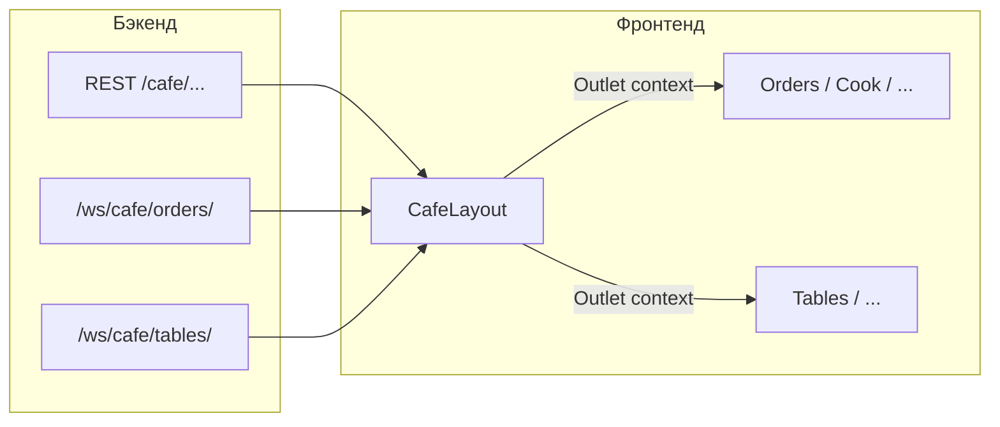

# WebSocket в сфере «Кафе»

Документ описывает, как фронтенд подключается к WebSocket для кафе, какие каналы и типы сообщений используются, и как это связано с layout, страницами и REST API.

## Назначение

Два параллельных канала обновляют интерфейс в реальном времени:

| Канал  | Путь WebSocket     | Назначение                                                 |
| ------ | ------------------ | ---------------------------------------------------------- |
| Заказы | `/ws/cafe/orders/` | Создание и обновление заказов, события кухни для официанта |
| Столы  | `/ws/cafe/tables/` | Смена статуса столов (свободен / занят и т.д.)             |

Начальный снимок данных после входа в раздел кафе подгружается через REST (`GET /cafe/orders/`, `GET /cafe/tables/`), дальнейшие изменения приходят по WebSocket.

## Расположение в коде

- **Хуки:** `src/hooks/useCafeWebSocket.js`
  - `useCafeWebSocket(endpoint, options)` — низкоуровневое подключение
  - `useCafeOrdersWebSocket` — заказы + локальное состояние
  - `useCafeTablesWebSocket` — столы + история смены статусов
  - `useCafeWebSocketManager` — оба канала и общие методы (`connectAll`, `fetchAllData`, …)
- **Единая точка подключения в UI:** `src/Components/Sectors/cafe/CafeLayout.jsx` вызывает `useCafeWebSocketManager()` и передаёт сокеты дочерним маршрутам через `<Outlet context={{ socketOrders, socketTables }} />`.
- **Потребители контекста:** например `Orders.jsx`, `Tables.jsx`, `Cook.jsx` (через `useOutletContext`).

## URL, авторизация и филиал

- Базовый хост: `import.meta.env.VITE_WS_API_URL`, при отсутствии — `https://app.nurcrm.kg` (см. также корневой `.env`).
- Полный адрес:  
  `{baseUrl}/ws/cafe/{endpoint}/?token={accessToken}`  
  где `endpoint` — `orders` или `tables`, токен читается из `localStorage` (`accessToken`).
- Для владельца (`user.is_owner`) при переданном `branchId` добавляется query-параметр `branch_id` (мультифилиальность).

При смене токена, `branch_id` или флага владельца URL пересчитывается: старое соединение закрывается и открывается новое.

## Поведение соединения

- Первое подключение откладывается на **500 ms** после монтирования (`autoConnect: true` по умолчанию).
- **Переподключение:** до **5** попыток с интервалом **3 s**, если закрытие не «нормальное» (коды **1000** и **1001** не считаются поводом для авто-reconnect).
- Явный `disconnect()` помечает отключение как намеренное и сбрасывает попытки переподключения.
- **Ping клиента:** `sendMessage({ action: 'ping' })` (метод `ping()` на хуке). Используется менеджером в `pingAll()`.

Состояние: `isConnected`, `lastMessage`, `error`, `readyState`, методы `connect`, `disconnect`, `sendMessage`, `ping`, `checkConnection`.

## Протокол сообщений (входящие JSON)

Сообщения парсятся как JSON и ожидается поле **`type`**. Ниже — то, что обрабатывается на клиенте.

### Канал `orders` (`useCafeOrdersWebSocket`)

| `type`                 | Действие клиента                                                                                                                                                                             |
| ---------------------- | -------------------------------------------------------------------------------------------------------------------------------------------------------------------------------------------- |
| `order_created`        | В `message.data.order` — новый заказ: добавление в `orders` и `newOrders`, дедупликация по id; при разрешении браузера — desktop-уведомление «Новый заказ».                                  |
| `order_updated`        | Обновление записи в `orders` или удаление, если заказ считается оплаченным (`status` / `is_paid` и строковые варианты «оплачен» и т.п.). Дубликаты режутся по ключу `updated-{id}-{status}`. |
| `table_status_changed` | В хуке заказов только логирование (основная логика столов — в канале `tables`).                                                                                                              |

Дополнительно **`CafeLayout`** подписан на **`orders.lastMessage`** и обрабатывает:

| `type`               | Назначение                                                                                                         |
| -------------------- | ------------------------------------------------------------------------------------------------------------------ |
| `kitchen_task_ready` | Уведомление официанту (`data.task.waiter === profile.id`): звук/баннер через `NotificationCafeSound`.              |
| `order_created`      | На странице кухни (`/cafe/cook`) — отдельное уведомление; автопечать кухонных чеков, если включена станция печати. |
| `order_updated`      | Автопечать чека при оплате; при неоплаченном заказе — печать «диффа» позиций на кухне.                             |

### Канал `tables` (`useCafeTablesWebSocket`)

| `type`                 | Действие клиента                                                                                                                                                                                                                     |
| ---------------------- | ------------------------------------------------------------------------------------------------------------------------------------------------------------------------------------------------------------------------------------ |
| `table_status_changed` | Обновление или добавление стола в локальном массиве `tables` по `table_id` / `table.id`; запись в `tableStatusHistory` (до 100 событий). Ожидаются поля вроде `status`, `status_display`, `table_number`, `company_id`, `branch_id`. |

## REST как источник правды и синхронизация

- Заказы: `fetchOrdersStatus()` → `GET /cafe/orders/` — заполняет начальный список в хуке заказов.
- Столы: `fetchTables()` → `GET /cafe/tables/`.

Страница заказов синхронизирует локальный UI с `socketOrders.orders` из контекста (фильтр открытых неоплаченных заказов). При сбоях доставки событий **`CafeLayout`** дополнительно опрашивает **`GET /cafe/orders/`** (последние заказы, интервал **15 s**) и при возврате вкладки в фокус (`visibilitychange`), чтобы не пропустить заказы, созданные с другого устройства.

## Менеджер `useCafeWebSocketManager(options)`

Параметры:

- `branchId` — проброс в оба хука;
- `autoConnectOrders` / `autoConnectTables` — по умолчанию оба `true`;
- `onOrdersMessage`, `onOrdersError`, `onTablesMessage`, `onTablesError` — дополнительные колбэки.

Возвращает: `orders`, `tables` (полные объекты хуков), `allConnected`, `connectAll`, `disconnectAll`, `pingAll`, `fetchAllData`.

## Зависимость маршрутов

Родительский маршрут `path="cafe"` рендерит `CafeLayout`, поэтому дочерние экраны (`/crm/cafe/orders`, `/crm/cafe/tables`, …) получают один общий набор WebSocket-подключений через контекст outlet.

## Переменные окружения

| Переменная        | Роль                                                                                              |
| ----------------- | ------------------------------------------------------------------------------------------------- |
| `VITE_WS_API_URL` | Базовый URL API для сборки WebSocket-адреса (в репозитории по умолчанию совпадает с прод-хостом). |

Убедитесь, что в целевой среде базовый URL совместим с тем, что ожидает браузер для `WebSocket` (обычно схема **`wss://`** для HTTPS-сайтов). При необходимости задайте `VITE_WS_API_URL` явно в формате, который принимает `new WebSocket(url)`.

## Краткая схема потока

---

_Документ составлен по состоянию фронтенд-кода в репозитории; формат и полный набор полей серверных сообщений при необходимости уточняйте по бэкенду._
