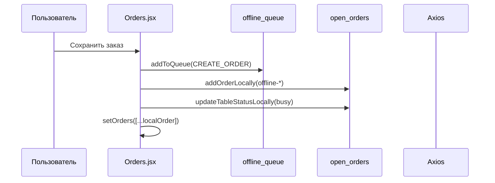
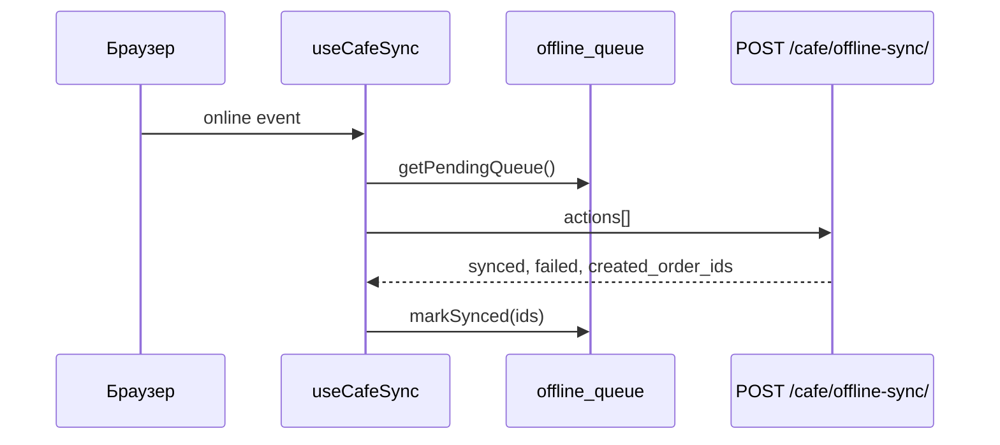
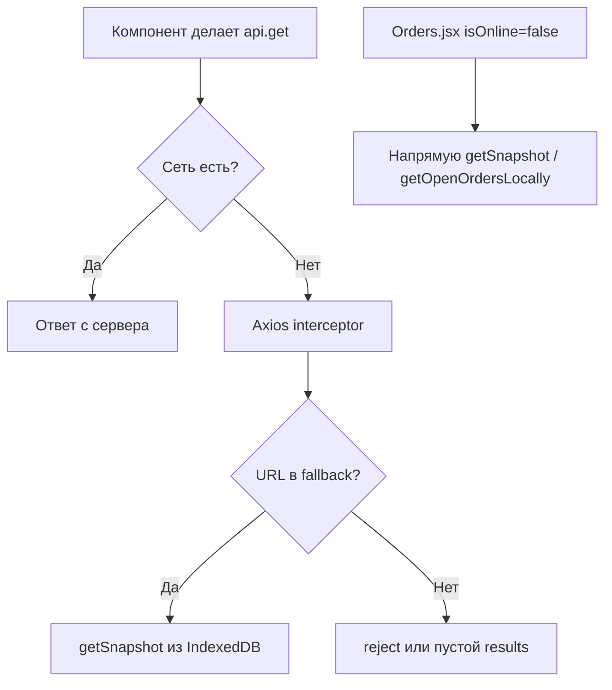

# Офлайн-режим модуля «Кафе»

Документ описывает текущую реализацию офлайн-режима в NurCRM: архитектуру, потоки данных, API, ограничения и план доработок.

---

## Содержание

1. [Обзор](#обзор)
2. [Архитектура](#архитектура)
3. [Хранилище IndexedDB](#хранилище-indexeddb)
4. [Сервисный слой](#сервисный-слой)
5. [Сетевой перехват (Axios)](#сетевой-перехват-axios)
6. [Синхронизация](#синхронизация)
7. [UI и индикация](#ui-и-индикация)
8. [Интеграция по экранам](#интеграция-по-экранам)
9. [Аутентификация офлайн](#аутентификация-офлайн)
10. [API бэкенда](#api-бэкенда)
11. [Особенности реальных данных](#особенности-реальных-данных)
12. [Service Worker](#service-worker)
13. [Снимок при открытии смены](#снимок-при-открытии-смены)
14. [Диаграммы потоков](#диаграммы-потоков)
15. [Что реализовано / не реализовано](#что-реализовано--не-реализовано)
16. [Известные проблемы](#известные-проблемы)
17. [Файловая карта](#файловая-карта)
18. [Рекомендации по доработке](#рекомендации-по-доработке)

---

## Обзор

Офлайн-режим позволяет продолжать работу в секторе **Кафе** при потере интернета:

| Сценарий | Поведение |
|----------|-----------|
| Интернет пропал | Данные читаются из IndexedDB; мутации попадают в очередь |
| Интернет вернулся | Очередь отправляется на `POST /cafe/offline-sync/` |
| Открытие смены | Снимок с сервера сохраняется в IndexedDB |
| Сессия при офлайне | JWT не сбрасывается при сетевой ошибке |

**Стек:** React 18, Redux Toolkit, Dexie.js (IndexedDB), Axios, Workbox (PWA).

**Зона действия:** только `src/Components/Sectors/cafe/` и связанные сервисы. Другие секторы не затронуты.

---

## Архитектура

```
┌─────────────────────────────────────────────────────────────────┐
│                        CafeLayout                                │
│  OfflineStatusBar ──► useCafeSync ──► useNetworkStatus          │
└─────────────────────────────────────────────────────────────────┘
                              │
┌─────────────────────────────┼───────────────────────────────────┐
│                    Orders.jsx (основной офлайн UI)               │
│  useNetworkStatus │ getSnapshot │ addToQueue │ addOrderLocally  │
└─────────────────────────────┼───────────────────────────────────┘
                              │
         ┌────────────────────┼────────────────────┐
         ▼                    ▼                    ▼
  cafeOfflineService   cafeOfflineFallback   cafeOfflineError
         │                    │                    │
         ▼                    ▼                    │
    cafeOfflineDB         api/index.js ◄────────────┘
    (Dexie/IndexedDB)   (response interceptor)
```

### Слои

| Слой | Файлы | Роль |
|------|-------|------|
| **DB** | `src/db/cafeOfflineDB.js` | Схема IndexedDB |
| **Service** | `src/services/cafeOfflineService.js` | CRUD снимка, очередь, локальные заказы |
| **Fallback** | `src/services/cafeOfflineFallback.js` | Подмена ответов API при сетевой ошибке |
| **Utils** | `src/utils/cafeOfflineError.js` | Определение сетевой ошибки, подавление алертов |
| **Hooks** | `useNetworkStatus.js`, `useCafeSync.js` | Статус сети и синхронизация |
| **UI** | `OfflineStatusBar.jsx` | Полоска статуса |
| **API** | `src/api/index.js` | Перехват сетевых ошибок |
| **Auth** | `AuthGuard.jsx`, `authInterceptors.js` | Сохранение сессии офлайн |

---

## Хранилище IndexedDB

**База:** `NurCafeOffline` (Dexie)

### Схема (version 2)

```js
db.version(2).stores({
  menu_categories: 'id, sort_order',
  menu_items:      'id, category_id',
  cafe_tables:     'id, hall_id, status',   // НЕ "tables" — зарезервировано в Dexie
  open_orders:     'id, table_id, status',
  current_shift:   'id',
  offline_queue:   '++id, type, created_at, synced'
})
```

### Таблицы

| Таблица | Содержимое | Источник |
|---------|------------|----------|
| `menu_categories` | Категории меню | `snapshot.menu.categories` |
| `menu_items` | Позиции меню | `snapshot.menu.items` |
| `cafe_tables` | Столы | `snapshot.tables` (поле бэка `tables`) |
| `open_orders` | Открытые заказы | `snapshot.open_orders` + локальные офлайн-заказы |
| `current_shift` | Текущая смена (0–1 запись) | `snapshot.current_shift` |
| `offline_queue` | Очередь мутаций | `addToQueue()` |

### Метаданные в localStorage

| Ключ | Значение |
|------|----------|
| `cafe_snapshot_at` | ISO-время последнего снимка |
| `accessToken` / `refreshToken` | JWT (не сбрасываются при офлайне) |

### Сброс

```js
import { resetOfflineDB } from '@/db/cafeOfflineDB'
await resetOfflineDB()
```

---

## Сервисный слой

Файл: `src/services/cafeOfflineService.js`

### Снимок

#### `saveSnapshot(snapshot)`

Атомарная транзакция Dexie: очищает все таблицы, записывает новые данные.

Принимает ответ `GET /cafe/offline-snapshot/` **как есть**:

```json
{
  "snapshot_at": "2026-06-10T09:47:47.061150Z",
  "menu": {
    "categories": [{ "id", "name", "sort_order" }],
    "items": [{ "id", "name", "category_id", "price", "unit", "is_available", "image_url" }]
  },
  "tables": [{ "id", "name", "hall_id", "hall_name", "capacity", "status" }],
  "open_orders": [{ "id", "table_id", "status", "created_at", "items", "total" }],
  "current_shift": { "id", "opened_at", "employee_id", "employee_name" }
}
```

> Поле бэка `tables` сохраняется в IndexedDB как `cafe_tables`.

#### `getSnapshot()`

Возвращает:

```js
{
  categories,   // menu_categories, сортировка по sort_order
  items,        // menu_items
  tables,       // cafe_tables
  open_orders,
  current_shift // первый из current_shift или null
}
```

### Очередь мутаций

#### `addToQueue(type, payload)`

| type | Назначение | Используется в UI |
|------|------------|-------------------|
| `CREATE_ORDER` | Создание заказа | ✅ Orders.jsx |
| `ADD_ITEM_TO_ORDER` | Редактирование позиций | ✅ Orders.jsx |
| `CLOSE_ORDER` | Оплата / закрытие | ✅ Orders.jsx |
| `REMOVE_ITEM_FROM_ORDER` | Удаление позиции | ❌ не реализовано |
| `CANCEL_ORDER` | Отмена заказа | ❌ не реализовано |

Запись в `offline_queue`:

```js
{ type, payload, created_at: ISO, synced: false }
```

#### `getPendingQueue()`

- Читает **все** записи (`toArray()`)
- Фильтрует `synced === false` в JS (Dexie не индексирует boolean)
- Сортирует по `created_at` ASC

#### `markSynced(ids)`

Проставляет `synced: true` для переданных id.

### Локальные операции с заказами

| Функция | Описание |
|---------|----------|
| `addOrderLocally(order)` | `bulkPut` в `open_orders` |
| `updateOrderLocally(orderId, updates)` | Merge и сохранение |
| `removeOrderLocally(orderId)` | Удаление из `open_orders` |
| `getOpenOrdersLocally()` | Все открытые заказы из IndexedDB |
| `createOrderLocally(orderData)` | Создание с temp id `offline-*` |
| `updateTableStatusLocally(tableId, status)` | Обновление статуса стола в `cafe_tables` |

---

## Сетевой перехват (Axios)

Файл: `src/api/index.js`

При сетевой ошибке (`ERR_NETWORK`, `ECONNABORTED`, `Network Error`, `!navigator.onLine`) вызывается `getOfflineFallback(config)`.

### Поддерживаемые GET-запросы (fallback)

| URL-паттерн | Ответ из IndexedDB |
|-------------|-------------------|
| `/cafe/offline-snapshot/` | Полный снимок |
| `/cafe/menu/`, `/categories/` | `{ results: categories }` |
| `/cafe/menu-items/` | Список или одна позиция по UUID |
| `/cafe/tables/` | `{ results: tables }` |
| `/cafe/orders/` | Список или один заказ по UUID |
| `/construction/shifts/` | `current_shift` |

### Мутации (POST/PATCH/PUT/DELETE)

Возвращается заглушка:

```js
{ offline: true, queued: true }
```

> **Важно:** перехватчик **не добавляет** действие в очередь автоматически. Очередь заполняется только явными вызовами `addToQueue()` в компонентах.

### Утилита подавления ошибок

`src/utils/cafeOfflineError.js`:

```js
isOfflineNetworkError(err)  // true если сетевая ошибка
suppressOfflineError(err)   // логирует warn, возвращает true — не показывать alert
```

Используется в ~15 компонентах кафе для тихой обработки офлайн-ошибок.

---

## Синхронизация

Файл: `src/hooks/useCafeSync.js`

### Триггер

Синхронизация запускается при переходе **offline → online** (`prevOnline === false && isOnline === true`).

### Процесс

```
1. getPendingQueue()
2. POST /cafe/offline-sync/ { actions: [{ type, payload, created_at }] }
3. markSynced(ids)
4. pendingCount = 0, justSynced = true (3 сек)
```

### Счётчик очереди

Обновляется при монтировании и каждые **5 секунд**.

### Ручной повтор

`syncQueue()` экспортируется и вызывается кнопкой «Повторить» в `OfflineStatusBar`.

### Что НЕ делает sync сейчас

- Не обновляет снимок после успешной синхронизации
- Не диспатчит `orders:refresh`
- Не маппит временные id `offline-*` на реальные UUID с сервера

---

## UI и индикация

Файл: `src/Components/Sectors/cafe/common/OfflineStatusBar.jsx`

Подключён в `CafeLayout.jsx` первым элементом.

| Состояние | Цвет | Текст |
|-----------|------|-------|
| Онлайн (норма) | — | не рендерится |
| Офлайн | `#f59e0b` | «Офлайн — работаем локально · N заказов ожидают синхронизации» |
| Синхронизация | `#3b82f6` | «Синхронизация...» |
| Успех | `#22c55e` | «Синхронизировано» (3 сек) |
| Ошибка | `#ef4444` | «Ошибка синхронизации» + кнопка «Повторить» |

`position: fixed; top: 0; z-index: 9999`

---

## Интеграция по экранам

### Orders.jsx — основной офлайн-экран ✅

Использует `useNetworkStatus`, `getSnapshot`, `addToQueue`, локальные функции.

| Операция | Офлайн-поведение |
|----------|------------------|
| Загрузка столов | `getSnapshot().tables` |
| Загрузка меню | `getSnapshot().items` |
| Загрузка заказов | `getOpenOrdersLocally()` |
| Создание заказа | `addToQueue('CREATE_ORDER')` + локальный заказ `offline-*` + статус стола `busy` |
| Редактирование заказа | `addToQueue('ADD_ITEM_TO_ORDER')` + `updateOrderLocally` |
| Оплата заказа | `addToQueue('CLOSE_ORDER')` + `removeOrderLocally` |
| Отмена заказа | ❌ только `api.patch` — **не в очереди** |
| Удаление позиции | ❌ не реализовано |

### Остальные экраны кафе — частично

Используют только `suppressOfflineError()` (тихие ошибки, без локальных данных):

- Menu, MenuItemPage
- Tables, TablesHall, TablesZones
- Cook, KitchenCreateModal
- CafeAnalytics, CafeInventory, Stock, Costing
- Clients (modals), CafeOrdersHistory

> Эти экраны **не** читают IndexedDB напрямую. При офлайне GET-запросы могут получить данные через Axios fallback (если URL совпадает), иначе — пустой ответ или ошибка без alert.

### CafeOpenShift.jsx — снимок при смене ⚠️

После `openShiftAsync` вызывается:

```js
const { data } = await api.get('/cafe/offline-snapshot/')
await saveSnapshot(data)
```

**Не подключён к роутингу** — компонент существует, но не отображается в `cafeRoutes.jsx`.

---

## Аутентификация офлайн

### AuthGuard (`src/Components/Auth/AuthGuard/AuthGuard.jsx`)

При сетевой ошибке проверки профиля:
- JWT **не удаляется**
- Пользователь остаётся в приложении
- `setIsCheckingToken(false)` в `finally` — загрузка завершается

### authInterceptors (`src/api/authInterceptors.js`)

При сетевой ошибке refresh-токена:
- Токены **не удаляются**
- Редирект на `/login` **не выполняется**
- Ошибка пробрасывается дальше (`Promise.reject`)

---

## API бэкенда

Спецификация: `docs/back.md`

### GET `/api/cafe/offline-snapshot/`

- JWT обязателен
- Один запрос — все данные для офлайн-работы
- Фильтр по `company` текущего пользователя

### POST `/api/cafe/offline-sync/`

**Request:**

```json
{
  "actions": [
    { "type": "CREATE_ORDER", "payload": {...}, "created_at": "..." }
  ]
}
```

**Response:**

```json
{
  "synced": 3,
  "failed": [{ "action_index": 1, "type": "...", "error": "..." }],
  "created_order_ids": [61]
}
```

**Логика бэка:**
- Сортировка по `created_at`
- Последовательное применение
- Ошибка одного action не останавливает остальные
- Идемпотентность `CREATE_ORDER` (±60 сек по `table_id`)

---

## Особенности реальных данных

| Поле | Тип / значение | Обработка на фронте |
|------|----------------|---------------------|
| `id` (везде) | UUID строка | Сохраняется как есть в IndexedDB |
| `table_id` | UUID или `null` | Заказ «с собой» — `table_id: null` |
| `quantity` | `"1.500"` или число | Не нормализуется — передаётся в очередь как есть |
| `category_id` | UUID или `null` | Индекс Dexie допускает null |
| `current_shift.employee_name` | Может быть email | Отображается как есть |
| `price`, `total` | Строки `"350.00"` | Строковый формат сохраняется |

### Временные офлайн-id

Локально созданные заказы получают id вида:

```
offline-1718012345678-k3j9x2
```

Эти id **не совпадают** с UUID бэка. При синхронизации бэк создаёт реальные id (`created_order_ids`), но фронт **пока не обновляет** локальные записи.

---

## Service Worker

Файл: `src/sw.js` (Workbox, vite-plugin-pwa)

| Ресурс | Стратегия |
|--------|-----------|
| HTML (navigate) | NetworkFirst, timeout 5 сек |
| JS/CSS | StaleWhileRevalidate |
| Изображения | CacheFirst, 30 дней |
| `app.nurcrm.kg/media/` | NetworkOnly |

SW кэширует **статику приложения** (shell), но **не** API-данные кафе. Данные кафе — только IndexedDB.

---

## Снимок при открытии смены

```
Пользователь открывает смену
        │
        ▼
openShiftAsync() ──► POST /construction/shifts/open/
        │
        ▼
GET /cafe/offline-snapshot/
        │
        ▼
saveSnapshot(data) ──► IndexedDB + localStorage.cafe_snapshot_at
```

Без снимка офлайн-режим работает только с **устаревшими** данными последнего snapshot.

---

## Диаграммы потоков

### Создание заказа офлайн



### Восстановление сети



### Чтение данных офлайн



---

## Что реализовано / не реализовано

### ✅ Реализовано

- [x] IndexedDB схема (Dexie v2)
- [x] saveSnapshot / getSnapshot
- [x] Очередь offline_queue
- [x] useNetworkStatus / useCafeSync
- [x] OfflineStatusBar в CafeLayout
- [x] Axios fallback для GET cafe-запросов
- [x] AuthGuard + refresh: сохранение сессии офлайн
- [x] Orders: создание, редактирование, оплата офлайн
- [x] Orders: чтение столов/меню/заказов из IndexedDB
- [x] suppressOfflineError в компонентах кафе
- [x] CafeOpenShift с вызовом offline-snapshot

### ❌ Не реализовано / частично

- [ ] `CANCEL_ORDER` в очереди (отмена заказа офлайн)
- [ ] `REMOVE_ITEM_FROM_ORDER` в очереди
- [ ] Маппинг `offline-*` → реальный UUID после sync
- [ ] Обновление snapshot после успешной синхронизации
- [ ] `orders:refresh` после sync
- [ ] CafeOpenShift в роутинге
- [ ] Офлайн на экранах: Cook, Tables (создание), Analytics, Kassa
- [ ] WebSocket отключение / fallback при офлайне
- [ ] Печать чеков офлайн (зависит от принтера)
- [ ] Обработка `failed[]` из ответа sync на UI

---

## Известные проблемы

### 1. Редактирование заказа офлайн — двойной путь

В `saveForm` при `isEditing` сначала вызывается `postWithWaiterFallback` (онлайн-путь), затем проверка `!isOnline`. При офлайне Axios interceptor возвращает `{ offline: true, queued: true }`, поэтому код «проходит», но логика запутанная — лучше разделить ветки явно.

### 2. Временные id заказов

`offline-*` id отправляются в `ADD_ITEM_TO_ORDER` / `CLOSE_ORDER` как `order_id`. Бэк не найдёт такой заказ, если `CREATE_ORDER` ещё не применён или id не смаплен.

**Нужно:** после sync подставлять `created_order_ids` в последующие actions или использовать `client_order_id` в payload.

### 3. Отмена заказа офлайн

Кнопка «Отменить заказ» вызывает только `api.patch`. При офлайне interceptor вернёт заглушку, но `CANCEL_ORDER` в очередь **не добавляется** — заказ останется в IndexedDB.

### 4. ADD_ITEM_TO_ORDER payload

Фронт отправляет:

```js
{ order_id, items: [{ menu_item_id, quantity }] }
```

Бэк в спецификации ожидает:

```js
{ order_id, menu_item_id, quantity }  // одна позиция
```

Возможное расхождение контракта — уточнить с бэкендом.

### 5. CLOSE_ORDER payload

Фронт:

```js
{ order_id, payment_method, amount }
```

Бэк: `payment_method: "cash" | "card" | "mixed"`, `amount: number`.

### 6. Статус стола

Локально: `busy` / `free`. Бэк в snapshot: `free | occupied | reserved`. Возможны расхождения при sync.

### 7. useCafeSync не обновляет UI после sync

После `markSynced` заказы на экране не перезагружаются с сервера — пользователь видит старые локальные данные до ручного обновления.

### 8. navigator.onLine ненадёжен

`online`/`offline` события не гарантируют реальную доступность API. Возможны ложные срабатывания.

---

## Файловая карта

```
src/
├── db/
│   └── cafeOfflineDB.js          # Dexie схема, resetOfflineDB
├── services/
│   ├── cafeOfflineService.js     # Snapshot, queue, local orders
│   └── cafeOfflineFallback.js    # Axios GET fallback
├── utils/
│   └── cafeOfflineError.js       # isOfflineNetworkError, suppressOfflineError
├── hooks/
│   ├── useNetworkStatus.js       # navigator.onLine
│   └── useCafeSync.js            # Sync queue on reconnect
├── api/
│   ├── index.js                  # Offline response interceptor
│   └── authInterceptors.js       # Network-safe token refresh
├── Components/
│   ├── Auth/AuthGuard/
│   │   └── AuthGuard.jsx         # Network-safe auth check
│   └── Sectors/cafe/
│       ├── CafeLayout.jsx        # OfflineStatusBar
│       ├── CafeOpenShift/
│       │   └── CafeOpenShift.jsx # Snapshot on shift open (not routed)
│       ├── common/
│       │   └── OfflineStatusBar.jsx
│       └── Orders/
│           └── Orders.jsx        # Main offline logic
└── sw.js                         # PWA cache (static assets)

docs/
├── back.md                       # Backend API spec
└── cafe-offline.md               # This document
```

---

## Рекомендации по доработке

### Приоритет 1 — критично для production

1. **Маппинг id после sync** — хранить `client_id` в payload `CREATE_ORDER`, после ответа обновлять `open_orders` и последующие actions в очереди.
2. **CANCEL_ORDER** — добавить в очередь при отмене заказа офлайн.
3. **Обновление UI после sync** — `GET /cafe/offline-snapshot/` или `orders:refresh` + `saveSnapshot`.
4. **Подключить CafeOpenShift** к роуту кафе.

### Приоритет 2 — стабильность

5. Разделить онлайн/офлайн ветки в `saveForm` явно (`if (!isOnline) { ... return }`).
6. Обработать `failed[]` из ответа sync — показать пользователю какие действия не применились.
7. Согласовать payload `ADD_ITEM_TO_ORDER` с бэкендом.

### Приоритет 3 — расширение

8. Офлайн для Cook (задачи кухни из snapshot).
9. Офлайн для Tables (создание/редактирование столов — только очередь).
10. Периодическое обновление snapshot при онлайне (каждые N минут).
11. Индикатор возраста snapshot: «Данные от 10.06.2026 09:47».

---

## Быстрый чеклист для тестирования

1. Открыть смену → проверить `IndexedDB > NurCafeOffline` в DevTools
2. Отключить сеть (DevTools → Offline)
3. Создать заказ → проверить `offline_queue` и `open_orders`
4. Оплатить заказ → проверить `CLOSE_ORDER` в очереди
5. Включить сеть → полоска «Синхронизация...» → «Синхронизировано»
6. Проверить `offline_queue` — записи с `synced: true`
7. Перезагрузить страницу офлайн → сессия сохранена, данные из IndexedDB

---

*Документ актуален на основе анализа кодовой базы. При изменениях обновляйте разделы «Что реализовано» и «Известные проблемы».*
