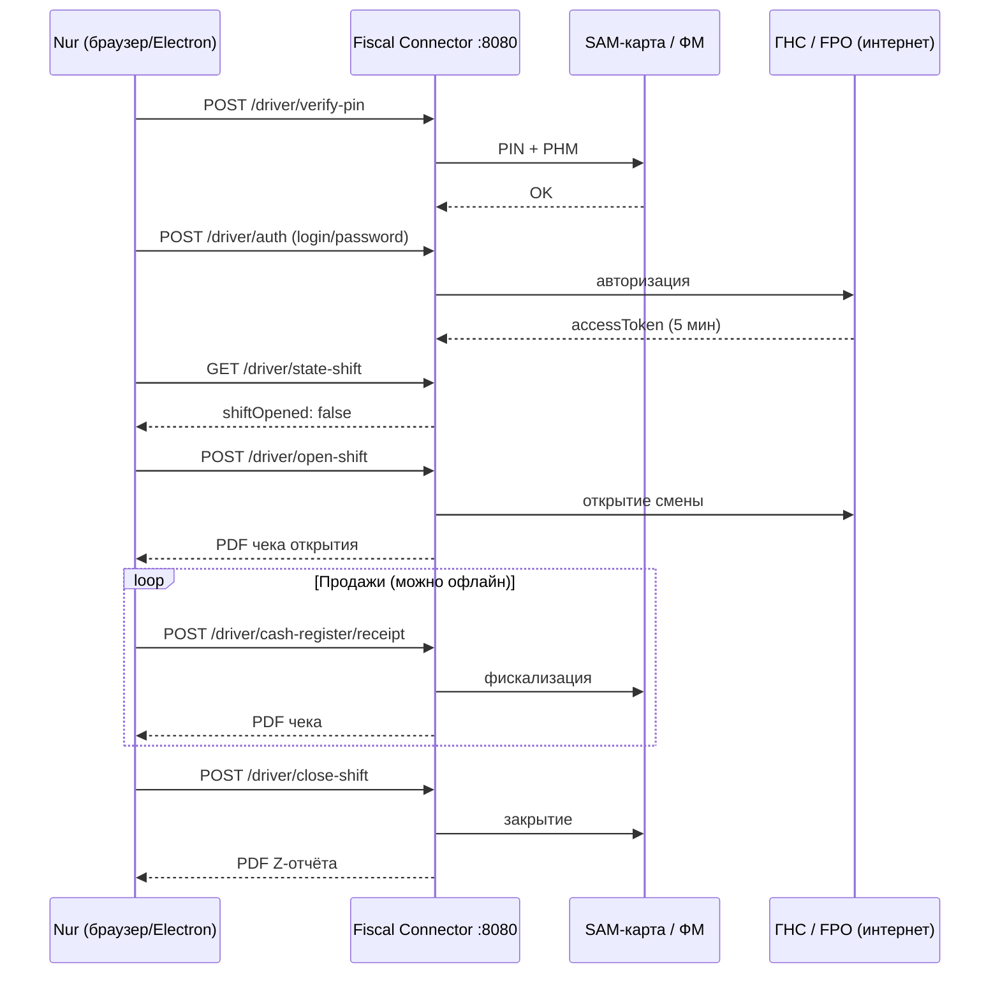

# Fiscal Connector — интеграция со сферой «Кафе»

Документ описывает, как локальный драйвер фискальной кассы (Fiscal Connector) будет подключён к модулю кафе в Nur.

---

## 1. Что это за сервис

**Fiscal Connector** — локальный драйвер фискальной кассы, работающий на кассовом ПК:

- Базовый URL: `http://localhost:8080`
- Перед работой нужно установить и запустить `FiscalConnectorSetup.exe`
- Физически работает с **SAM-картой** в кардридере и **фискальным модулем (ФМ)**

Сейчас в Nur фискализация идёт через **backend** (`ekassa_fiscal` в ответе checkout). Новый драйвер — **прямой локальный слой** между приложением и кассой, без обязательного участия Django-сервера на каждом чеке.

---

## 2. Текущее состояние кафе

```
Открытие смены → Nur backend (openShiftAsync)
Оплата заказа  → POST /cafe/orders/{id}/pay/
Чек            → свой ESC/POS-принтер (нефiscal, OrdersPrintService.js)
Офлайн         → заказ в очередь (CLOSE_ORDER), чек не бьётся
```

Ключевые файлы:

| Файл | Роль |
|------|------|
| `src/Components/Sectors/cafe/CafeOpenShift/CafeOpenShift.jsx` | Открытие смены |
| `src/Components/Sectors/cafe/Orders/Orders.jsx` | Заказы, оплата (`submitCheckoutPay`) |
| `src/Components/Sectors/cafe/Orders/OrdersPrintService.js` | Печать ESC/POS чеков |
| `src/services/cafeOfflineService.js` | Офлайн-очередь и snapshot |
| `src/hooks/useCafeSync.js` | Синхронизация при появлении сети |
| `src/Components/Sectors/cafe/kassaCafe/kassa.jsx` | Экран кассы |

---

## 3. Целевая архитектура

С Fiscal Connector появляются **два параллельных слоя**:

- **Nur backend** — учёт заказов, клиенты, долги, офлайн-синк, отчёты
- **Fiscal Connector** — юридически значимая фискализация (SAM + ФМ + чеки)

```
┌─────────────────────────────────────────┐
│              Кафе (Nur)                 │
│  Заказы → Оплата → Кухня → Касса        │
└──────────────┬──────────────────────────┘
               │
     ┌─────────┴──────────┐
     ▼                    ▼
 Nur Backend         Fiscal Connector
 (учёт, офлайн,       localhost:8080
  клиенты, долги)    (SAM + ФМ + чеки)
     │                    │
     │  синк когда        │  чеки всегда
     │  есть сеть         │  после open-shift
     └────────────────────┘
```

**Точки подключения:** `CafeOpenShift` (открытие/закрытие смены) и `submitCheckoutPay` в `Orders.jsx` (оплата). Новый модуль: `fiscalDriverService.js`.

---

## 4. API драйвера — справочник

Все запросы на `localhost:8080`.

### 4.1. Верификация SAM-карты

`POST /driver/verify-pin`

```json
{
  "registrationNumber": "16 символов РНМ",
  "pin": "12345"
}
```

**Ответ:** `registrationNumber`, `fiscalModuleNumber`, `fmExpirationDate`

- Вызывается **один раз** при старте работы с SAM-картой
- Повторно — при извлечении/вставке карты, ошибках `40417` (NOT_VERIFY_PIN), `4008` (неверный PIN) и других ошибках SAM

### 4.2. Авторизация

`POST /driver/auth`

```json
{
  "login": "email",
  "password": "password"
}
```

**Ответ:** `accessToken` (срок **5 минут**), `fullName`, `cashierName`, `tin`, `registrationNumber`, `fiscalMemoryNumber`, `taxSystemCodes`, `calcItemAttrCodes` и др.

- Требует **интернет**
- После auth нужно **сразу открыть смену**, иначе токен протухнет
- После закрытия смены токен недействителен — нужна новая auth
- При `4011 REAUTHORIZATION_REQUIRED` — повторная auth

### 4.3. Состояние смены

`GET /driver/state-shift`  
Header: `Authorization: accessToken`

**Ответ:** `shiftOpened`, `openShiftDateTime`, `fmExpirationDate`

- Если смена открыта **> 24 часов** → `40920 NEED_TO_CLOSE_SHIFT`

### 4.4. Открытие смены

`POST /driver/open-shift`  
Headers: `Authorization`, `Response-Type: PDF|JSON`, `WIDTH-RECEIPT: 384`

- Требует **интернет**
- Ответ — PDF чека об открытии смены
- Без открытой смены чеки не пробиваются (`40918 SHIFT_NOT_OPENED`)

### 4.5. X-отчёт

`GET /driver/x-report`  
Headers: `Authorization`, `Response-Type`, `WIDTH-RECEIPT`

- Интернет **не обязателен**
- Ошибка `40918` — смена не открыта

### 4.6. Деньги в кассе

`GET /driver/cash-transaction`  
Header: `Authorization`

**Ответ:** `totalAmount`, `withdrawTotal`, `withdrawCount`, `depositTotal`, `depositCount`

### 4.7. Налоговые ставки

`GET /driver/cash-register/available-tax-rates`  
Header: `Authorization`

**Ответ:** `vatRate` (VAT_12, VAT_0), `stRate` (ST_0…ST_5), `calculationItemAttributeCode`

### 4.8. Внесение наличных

`POST /driver/cash-transaction/deposit`  
Body: `{ "amount": 1000.0 }`  
Headers: `Authorization`, `Response-Type`, `WIDTH-RECEIPT`

### 4.9. Изъятие наличных

`POST /driver/cash-transaction/withdraw`  
Body: `{ "amount": 500.0 }`

- Ошибка `40917` — не хватает наличных

### 4.10. Пробитие чека

`POST /driver/cash-register/receipt`

```json
{
  "operationType": "INCOME",
  "paySum": 500.0,
  "deliverySum": 0.0,
  "totalSum": 500.0,
  "totalCashSum": 500.0,
  "totalCashlessSum": 0.0,
  "originFdNumber": null,
  "originFnSerialNumber": null,
  "positions": [
    {
      "calcItemAttributeCode": 1,
      "sgtin": null,
      "name": "Капучино",
      "price": 250.0,
      "quantity": 2.0,
      "cost": 500.0,
      "measure": "шт",
      "vat": 1,
      "st": 0
    }
  ]
}
```

**Типы операций:**

| operationType | Назначение |
|---------------|------------|
| `INCOME` | Продажа |
| `INCOME_RETURN` | Возврат продажи |
| `EXPENDITURE` | Расход |
| `EXPENDITURE_RETURN` | Возврат расхода |

- Интернет **не обязателен** (после открытия смены)
- Ответ — PDF чека (или JSON при `Response-Type: JSON`)

### 4.11. Закрытие смены

`POST /driver/close-shift`  
Headers: `Authorization`, `Response-Type`, `WIDTH-RECEIPT`

- Интернет **не обязателен**
- Ошибка `40919 UNABLE_CLOSE_SHIFT` — нужно изъять наличные перед закрытием
- Ответ — PDF Z-отчёта

---

## 5. Жизненный цикл дня кассира



---

## 6. Интеграция по сценариям кафе

### 6.1. Утро — открытие смены

Кассир: **Кафе → Открыть смену** (`CafeOpenShift.jsx`)

| Шаг | Куда | Интернет |
|-----|------|----------|
| 1. verify-pin | Fiscal Connector | не обязателен |
| 2. auth | Fiscal Connector | **нужен** |
| 3. open-shift | Fiscal Connector | **нужен** |
| 4. openShiftAsync | Nur backend | нужен |
| 5. offline-snapshot | Nur backend → IndexedDB | нужен |

Печать PDF «смена открыта» с драйвера.

### 6.2. День — заказы и оплата

Поток заказов **не меняется**: стол, позиции, кухня, официант.

Меняется **момент оплаты** (`submitCheckoutPay` в `Orders.jsx`):

```
Кассир нажимает «Оплатить»
        ↓
Собрать positions из позиций заказа
(название, цена, qty, НДС/НСП из меню)
        ↓
POST localhost:8080/driver/cash-register/receipt
        ↓
PDF фискального чека → печать
        ↓
POST /cafe/orders/{id}/pay/  (учёт в Nur)
        ↓
finishPaySuccess → освободить стол, обновить список
```

**Маппинг способов оплаты:**

| Способ в кафе | Поля в receipt |
|---------------|----------------|
| Наличные (`cash`) | `totalCashSum` |
| Карта / QR (`card`, `cashless`) | `totalCashlessSum` |
| Split | оба поля пропорционально |
| Долг / частичная оплата | `paySum` = фактически оплаченная сумма |
| Возврат | `operationType: INCOME_RETURN` + `originFdNumber`, `originFnSerialNumber` |

Сейчас `printOrder` рисует **свой** чек через `OrdersPrintService.js`. С драйвером **основной чек** — PDF от Fiscal Connector. **Кухонные чеки** остаются отдельно (Cook, kitchen printers).

### 6.3. Офлайн-режим

**Сейчас** (без Fiscal Connector): при `!isOnline` заказ уходит в очередь `CLOSE_ORDER`, стол освобождается, **чек не бьётся**.

**С Fiscal Connector** после утреннего open-shift:

| Действие | Интернет | Результат |
|----------|----------|-----------|
| Пробить чек | **не нужен** | драйвер → SAM локально |
| Закрыть заказ в Nur | не нужен | очередь `CLOSE_ORDER` |
| Открыть смену | **нужен** | auth + open-shift |
| Синк на сервер | нужен | `useCafeSync` |

Офлайн-кафе **может бить фiscalные чеки**, если смена была открыта при наличии интернета.

### 6.4. Касса — внесения и изъятия

Экран **Кафе → Касса** (`kassa.jsx`):

| Операция | API драйвера |
|----------|--------------|
| Баланс наличных | `GET /driver/cash-transaction` |
| Внесение | `POST /driver/cash-transaction/deposit` |
| Изъятие | `POST /driver/cash-transaction/withdraw` |
| X-отчёт | `GET /driver/x-report` |

Nur backend продолжает вести свои cashflow; драйвер отражает **фактическую** кассу по ФМ.

### 6.5. Вечер — закрытие смены

1. `GET /driver/cash-transaction` — если есть наличные, **изъять** (`withdraw`)
2. `POST /driver/close-shift` → PDF Z-отчёт
3. Закрыть смену в Nur backend (как сейчас)

---

## 7. Настройки

В **Настройки → Печать** (рядом с `cafe_receipt_printer`):

| Параметр | Описание |
|----------|----------|
| URL драйвера | `http://localhost:8080` |
| РНМ кассы | 16 символов |
| PIN SAM-карты | 5 символов |
| Логин / пароль | для `/driver/auth` |
| «Использовать фiscalную кассу» | вкл/выкл |

При выключенной опции — текущее поведение (ESC/POS без фiscal).

---

## 8. Маппинг positions из меню кафе

Для каждой позиции заказа в `receipt.positions`:

| Поле API | Источник в Nur |
|----------|----------------|
| `name` | название блюда из меню |
| `price` | цена за единицу |
| `quantity` | количество |
| `cost` | price × quantity |
| `measure` | единица (шт, порция и т.д.) |
| `vat` | код НДС (из меню или `/available-tax-rates`) |
| `st` | код НСП |
| `calcItemAttributeCode` | признак предмета расчёта (из auth или справочника) |
| `sgtin` | ТНВЭД (если есть) |

Перед первым чеком рекомендуется вызвать `/driver/cash-register/available-tax-rates` и смаппить товары меню на коды `vat`, `st`, `calcItemAttributeCode`.

---

## 9. Ошибки — что показывать кассиру

| Код | HTTP | Сообщение для UI |
|-----|------|------------------|
| `40416` | 404 | SAM-карта не выбрана. Выберите SAM-карту в Fiscal Connector |
| `40417` | 404 | SAM-карта не верифицирована. Введите PIN |
| `4008` | 400 | Неверный PIN |
| `4005` | 400 | Неверный логин или пароль |
| `4011` | 401 | Требуется повторная авторизация |
| `40918` | 409 | Смена не открыта — откройте смену |
| `40920` | 409 | Смена открыта более 24 часов — закройте смену |
| `40917` | 409 | Недостаточно наличных в кассе |
| `40919` | 409 | Изымите наличные перед закрытием смены |
| `4038` | 403 | Доступ к кассе заблокирован — оплатите подписку |
| `4039` | 403 | Касса временно заблокирована — обратитесь в поддержку |
| `40310` | 403 | Невозможно открыть смену — касса или пользователь неактивны |
| `5002` | 500 | Сервис FPO недоступен |
| `5040` | 504 | Превышено время ожидания |

---

## 10. Ограничения и подводные камни

1. **Токен 5 минут** — между `auth` и `open-shift` не должно быть долгих пауз (форма начальной суммы, модалки).

2. **Интернет только для auth + open-shift** — если интернет пропал до открытия смены, работать нельзя. После open-shift чеки можно бить офлайн.

3. **SAM-карта** — при извлечении/вставке нужен повторный `verify-pin`. UI должен это отслеживать.

4. **Два источника правды о смене** — Nur backend и драйвер могут разойтись. Синхронизация через `GET /driver/state-shift` при старте приложения.

5. **CORS / localhost** — браузер может блокировать запросы на `localhost:8080` с другого origin. Решения: Electron/Tauri, локальный proxy, или тот же `printer-bridge` на `127.0.0.1`.

6. **PDF vs термопринтер** — драйвер отдаёт PDF. Для ESC/POS (как в `OrdersPrintService.js`) нужен конвертер PDF→ESC или `Response-Type: JSON` + свой шаблон печати.

7. **Частичная оплата и долг** — в fiscal чек попадает только фактически оплаченная сумма (`paySum`), не весь заказ.

8. **Split-оплата** — корректно заполнять `totalCashSum` и `totalCashlessSum`.

---

## 11. План реализации (черновик)

| # | Задача | Файл |
|---|--------|------|
| 1 | Сервис-обёртка над API драйвера | `src/services/fiscalDriverService.js` |
| 2 | Настройки fiscal в UI | Настройки → Печать |
| 3 | verify-pin + auth + open-shift при открытии смены | `CafeOpenShift.jsx` |
| 4 | receipt перед/после pay | `Orders.jsx` → `submitCheckoutPay` |
| 5 | Офлайн: fiscal receipt без backend | `Orders.jsx` (ветка `!isOnline`) |
| 6 | close-shift при закрытии смены | экран закрытия смены кафе |
| 7 | deposit/withdraw/x-report | `kassa.jsx` |
| 8 | Печать PDF с драйвера | новый helper или расширение `OrdersPrintService.js` |
| 9 | Хранение accessToken + авто-reauth | `fiscalDriverService.js` |
| 10 | Обработка ошибок SAM/смены | общий modal/toast |

---

## 12. Итог

| Слой | Ответственность |
|------|-----------------|
| **Nur backend** | Заказы, столы, клиенты, долги, офлайн-очередь, отчёты |
| **Fiscal Connector** | SAM, ФМ, фiscalные чеки, смена, Z-отчёт |
| **OrdersPrintService** | Кухонные чеки, неfiscal ESC/POS (если fiscal выключен) |

Подключение **не заменяет** backend, а **дополняет** его локальной фiscalизацией. Главное преимущество для ветки `cafe/offline` — **фiscalные чеки без интернета** после утреннего open-shift.
