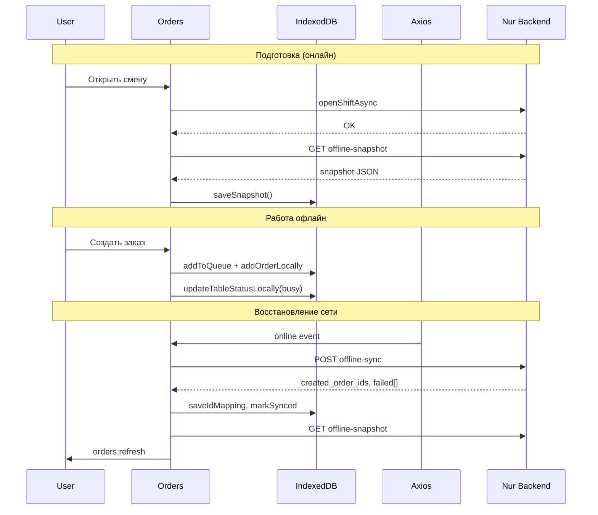

# Офлайн-режим сферы «Кафе» — полный анализ (A–Z)

Документ описывает **всю** офлайн-функциональность модуля кафе в Nur CRM: архитектуру, хранилище, сетевой слой, синхронизацию, покрытие по страницам, фискализацию, риски и пробелы. Основан на актуальном коде фронтенда (июнь 2026).

> **Связанные документы:** `docs/cafe-offline.md` (краткая справка), `docs/cafe_fiscal_connector.md` (§6.3 — фискализация офлайн), `docs/back.md` (контракт API не менять без согласования).

---

## Содержание

1. [Зачем нужен офлайн](#1-зачем-нужен-офлайн)
2. [Архитектура и слои](#2-архитектура-и-слои)
3. [Зависимости и конфигурация](#3-зависимости-и-конфигурация)
4. [Определение офлайна](#4-определение-офлайна)
5. [IndexedDB — схема и эволюция](#5-indexeddb--схема-и-эволюция)
6. [Сервис `cafeOfflineService`](#6-сервис-cafeofflineservice)
7. [Снимок данных (snapshot)](#7-снимок-данных-snapshot)
8. [Axios fallback](#8-axios-fallback)
9. [Очередь действий](#9-очередь-действий)
10. [Синхронизация](#10-синхронизация)
11. [Маппинг offline-ID → server UUID](#11-маппинг-offline-id--server-uuid)
12. [UI и индикация](#12-ui-и-индикация)
13. [Redux и кухня (Cook)](#13-redux-и-кухня-cook)
14. [Заказы — полный офлайн-цикл (`Orders.jsx`)](#14-заказы--полный-офлайн-цикл-ordersjsx)
15. [Покрытие по страницам](#15-покрытие-по-страницам)
16. [Фискализация офлайн](#16-фискализация-офлайн)
17. [WebSocket и реальное время](#17-websocket-и-реальное-время)
18. [Обработка ошибок](#18-обработка-ошибок)
19. [Риски, баги и ограничения](#19-риски-баги-и-ограничения)
20. [Операционные сценарии](#20-операционные-сценарии)
21. [Приоритетные доработки](#21-приоритетные-доработки)
22. [Реестр файлов](#22-реестр-файлов)
23. [Backend API — контракт](#23-backend-api--контракт)

---

## 1. Зачем нужен офлайн

Кафе должно продолжать принимать заказы при кратковременном обрыве интернета. Реализация — **не полноценный offline-first**, а **snapshot + явная очередь мутаций**:

- Пока есть сеть — скачивается снимок данных (меню, столы, открытые заказы, смена, задачи кухни).
- При обрыве — чтение из IndexedDB, критичные операции в разделе «Заказы» пишутся локально и в очередь.
- При восстановлении сети — очередь отправляется на бэкенд, offline-ID заменяются на серверные UUID, snapshot обновляется.

**Главный рабочий экран офлайн:** `/crm/cafe/orders`.

---

## 2. Архитектура и слои

```
┌──────────────────────────────────────────────────────────────────┐
│  UI                                                              │
│  CafeLayout → OfflineStatusBar (глобально)                       │
│  Orders.jsx (полный офлайн) · Cook.jsx (частично) · Tables.jsx   │
└────────────────────────────┬─────────────────────────────────────┘
                             │
┌────────────────────────────▼─────────────────────────────────────┐
│  Хуки                                                            │
│  useNetworkStatus — navigator.onLine + события online/offline     │
│  useCafeSync — auto-sync при переходе offline → online           │
└────────────────────────────┬─────────────────────────────────────┘
                             │
┌────────────────────────────▼─────────────────────────────────────┐
│  Локальное хранилище                                             │
│  IndexedDB «NurCafeOffline» (Dexie) + localStorage               │
└────────────────────────────┬─────────────────────────────────────┘
                             │
┌────────────────────────────▼─────────────────────────────────────┐
│  Сетевой слой                                                    │
│  axios interceptor → cafeOfflineFallback (GET из snapshot)       │
│  Явные addToQueue() в Orders.jsx и cafeOrdersCreators.js         │
└────────────────────────────┬─────────────────────────────────────┘
                             │
┌────────────────────────────▼─────────────────────────────────────┐
│  Backend (не в этом репозитории)                                 │
│  GET  /api/cafe/offline-snapshot/                                │
│  POST /api/cafe/offline-sync/                                    │
└──────────────────────────────────────────────────────────────────┘
```

### Поток данных (жизненный цикл)



---

## 3. Зависимости и конфигурация

| Параметр | Значение | Где |
|----------|----------|-----|
| Dexie | `^4.4.3` | `package.json` |
| Имя БД | `NurCafeOffline` | `src/db/cafeOfflineDB.js` |
| API base URL | `VITE_API_URL` или `https://app.nurcrm.kg/api` | `src/api/index.js` |
| Timeout axios | 20 000 ms | `src/api/index.js` |
| Размер страницы меню офлайн | `OFFLINE_MENU_PAGE_SIZE` | `Orders.jsx` |

**Feature flags:** отдельного флага «включить офлайн» нет. Офлайн всегда активен для модуля кафе.

| Флаг / условие | Файл | Влияние |
|----------------|------|---------|
| `USE_MOCKS = false` | `cafeOrdersCreators.js` | Кухня использует реальный API / fallback |
| `fiscalSettings.enabled` | `Orders.jsx` | Попытка фискализации при оплате |
| Тариф «Старт» | `CafeCookRoute.jsx` | Редирект с `/cafe/cook` на orders — кухня недоступна |

**Утилита разработчика:** `resetOfflineDB()` в `cafeOfflineDB.js` — полный сброс IndexedDB. **Нигде в приложении не вызывается.**

---

## 4. Определение офлайна

В коде работают **два параллельных механизма**, которые могут расходиться.

### A. Состояние браузера (`useNetworkStatus`)

```js
// src/hooks/useNetworkStatus.js
navigator.onLine + события window "online" / "offline"
```

Используется в `Orders.jsx` для явного ветвления: `if (!isOnline) { ... локальная логика ... }`.

### B. Сетевая ошибка axios (`src/api/index.js`)

Интерцептор срабатывает при:

- `ERR_NETWORK`
- `ECONNABORTED`
- `message === "Network Error"`
- `!navigator.onLine`

Тогда вызывается `getOfflineFallback(config)` — для GET возвращает данные из snapshot, для мутаций — заглушку `{ offline: true, queued: true }`.

### C. Утилита `isOfflineNetworkError` / `suppressOfflineError`

`src/utils/cafeOfflineError.js` — те же условия, что в интерцепторе. `suppressOfflineError` логирует «Офлайн, операция в очереди» и **подавляет UI-ошибку**, даже если действие **не попало в очередь**.

### Расхождение механизмов

| Ситуация | `isOnline` | axios fallback | Поведение |
|----------|------------|----------------|-----------|
| Браузер offline | `false` | срабатывает | Orders идёт в локальную ветку ✅ |
| Сеть «есть», API недоступен | `true` | срабатывает | Orders может идти в «онлайн»-ветку, мутации получат fake `{ queued: true }` без реальной очереди ⚠️ |

---

## 5. IndexedDB — схема и эволюция

**Файл:** `src/db/cafeOfflineDB.js`

Dexie-миграции (v1 → v4):

| Версия | Изменения |
|--------|-----------|
| v1 | Базовые stores |
| v2 | `sort_order` у категорий, `status` у столов |
| v3 | Store `id_mapping` |
| v4 | Store `kitchen_tasks` |

### Текущие stores

| Store | Primary key | Индексы | Назначение |
|-------|-------------|---------|------------|
| `menu_categories` | `id` | `sort_order` | Категории меню |
| `menu_items` | `id` | `category_id` | Позиции меню |
| `cafe_tables` | `id` | `hall_id`, `status` | Столы (`busy` / `free`) |
| `open_orders` | `id` | `table_id`, `status` | Активные заказы |
| `current_shift` | `id` | — | Текущая смена (одна запись) |
| `offline_queue` | `++id` (auto) | `type`, `created_at`, `synced` | Очередь синхронизации |
| `id_mapping` | `offline_id` | `server_id` | Маппинг временных ID |
| `kitchen_tasks` | `id` | `status`, `order_id` | Задачи кухни из snapshot |

### localStorage

| Ключ | Назначение |
|------|------------|
| `cafe_snapshot_at` | Время последнего snapshot |
| `userData` | ID/имя сотрудника для claim задач кухни (`getCurrentEmployeeInfo`) |
| `cafe_receipt_printed_{orderId}` | Дедупликация печати чеков |
| `accessToken` | Авторизация (не специфично для офлайн) |

### Формат элемента очереди

```js
{
  id: number,           // auto-increment
  type: string,         // CREATE_ORDER, CLOSE_ORDER, ...
  payload: object,
  created_at: string,   // ISO 8601
  synced: false | true
}
```

Синхронизированные записи помечаются `synced: true`, но **не удаляются** из `offline_queue`.

---

## 6. Сервис `cafeOfflineService`

**Файл:** `src/services/cafeOfflineService.js`

### Snapshot

| Функция | Описание |
|---------|----------|
| `saveSnapshot(snapshot)` | Транзакция: clear всех stores → bulkPut данных; пишет `cafe_snapshot_at` |
| `getSnapshot()` | Параллельное чтение всех stores; `current_shift` = первый элемент |

### Очередь

| Функция | Описание |
|---------|----------|
| `addToQueue(type, payload)` | Добавить действие с `synced: false` |
| `getPendingQueue()` | Фильтр `synced === false`, сортировка по `created_at` |
| `markSynced(ids)` | Пометить успешные действия |
| `removeQueueAction(id)` | Удалить запись (кнопка «Убрать» в UI) |
| `getFailedQueueDetails(failed, queue)` | Обогатить ответ бэкенда данными очереди |
| `pruneDeadQueueActions()` | Удалить «мёртвые» `REMOVE_ITEM_FROM_ORDER` для несинхронизированных offline-позиций |

### Маппинг ID

| Функция | Описание |
|---------|----------|
| `saveIdMapping(offlineId, serverId)` | Запись в `id_mapping` |
| `resolveOrderId(id)` | Если `offline-*` — вернуть server ID или исходный |
| `remapQueueOrderIds(offlineId, serverId)` | Обновить `payload.order_id` в pending-записях |

### Локальные мутации

| Функция | Описание |
|---------|----------|
| `addOrderLocally(order)` | PUT в `open_orders` |
| `updateOrderLocally(orderId, updates)` | Merge и PUT |
| `removeOrderLocally(orderId)` | DELETE |
| `getOpenOrdersLocally()` | Все открытые заказы |
| `updateTableStatusLocally(tableId, status)` | Обновить статус стола |
| `createOrderLocally(orderData)` | **Не используется** в `Orders.jsx` (дублирует inline-логику) |
| `getKitchenTasksLocally()` | Все задачи кухни |
| `updateKitchenTasksLocally(taskIds, updates)` | Обновить задачи (claim/ready) |
| `getCurrentEmployeeInfo()` | `{ id, label }` из `userData` |

---

## 7. Снимок данных (snapshot)

### Эндпоинт

```
GET /api/cafe/offline-snapshot/
```

### Когда сохраняется

1. **Открытие смены** — `CafeOpenShift.jsx` после успешного `openShiftAsync`
2. **После успешной синхронизации** — `useCafeSync.js` (best-effort, ошибка не блокирует)

### Содержимое

```json
{
  "snapshot_at": "2026-06-15T08:00:00.000Z",
  "menu": {
    "categories": [...],
    "items": [...]
  },
  "tables": [...],
  "open_orders": [...],
  "current_shift": { "id": "...", "status": "open", ... },
  "kitchen_tasks": [...]
}
```

### Что **не** входит в snapshot

- Зоны зала (`/cafe/zones/`)
- Сотрудники (`/users/employees/`)
- Клиенты
- Кассы / cashflow
- Склад, инвентарь, аналитика
- История заказов

**Без snapshot офлайн практически неработоспособен** — IndexedDB пустая, fallback отдаёт пустые массивы.

---

## 8. Axios fallback

**Файлы:** `src/api/index.js`, `src/services/cafeOfflineFallback.js`

### Область действия URL

Срабатывает, если URL содержит:

- `/cafe/`
- `/orders/`
- `/tables/`
- `/menu/`

### GET-запросы

| Паттерн URL | Ответ |
|-------------|-------|
| `offline-snapshot` | Полный snapshot из IndexedDB + `snapshot_at` |
| `/menu/`, `/categories/` | `{ results: categories, count }` |
| `/menu-items/` (список) | `{ results: items, count }` |
| `/menu-items/{uuid}/` | Одна позиция или `null` |
| `/tables/` | `{ results: tables, count }` |
| `/kitchen/tasks` | Фильтрация snapshot `kitchen_tasks` по `status`, `search`; сортировка `-created_at` |
| `/orders/` (список) | `{ results: open_orders, count }` |
| `/orders/{uuid}/` | Один заказ — **только UUID** (regex `[0-9a-f-]{36}`) |
| `/shifts/` | `current_shift` |
| Прочие GET | `{ results: [], count: 0 }` |

### POST / PATCH / PUT / DELETE

```json
{ "offline": true, "queued": true }
```

**Критично:** заглушка **не ставит** действие в очередь. Очередь создаётся только при явном `addToQueue()`.

### Известные проблемы fallback

1. **`offline-*` ID** — `/cafe/orders/offline-123-abc/` не матчится regex → возвращается **список** заказов, не один заказ.
2. **Fiscal URL** — `/cafe/fiscal/orders/{id}/receipt-payload/` попадает под ветку `/orders/` → некорректный ответ.
3. **Зоны** — `/cafe/zones/` → пустой `{ results: [], count: 0 }`.
4. **Сотрудники** — `/users/employees/` вне scope fallback.

---

## 9. Очередь действий

### Типы, поддерживаемые на фронте

| Тип | Где ставится | Payload (ключевые поля) |
|-----|--------------|-------------------------|
| `CREATE_ORDER` | `Orders.jsx` | `client_id` (offline ID), `table_id`, `items[]` |
| `ADD_ITEM_TO_ORDER` | `Orders.jsx` | `order_id`, `menu_item_id`, `quantity` |
| `REMOVE_ITEM_FROM_ORDER` | `Orders.jsx` | `order_id`, `order_item_id` |
| `CLOSE_ORDER` | `Orders.jsx` | `order_id`, `payment_method`, `amount` |
| `CANCEL_ORDER` | `Orders.jsx` | `order_id` |
| `CLAIM_TASK` | `cafeOrdersCreators.js` | `task_ids[]` |
| `READY_TASK` | `cafeOrdersCreators.js` | `task_ids[]` |

`CLAIM_TASK` / `READY_TASK` **не описаны** в `docs/cafe-offline.md` и **не обрабатываются** специально в `useCafeSync` (нет ID-маппинга для задач). Поддержка на бэкенде должна быть проверена отдельно.

### Offline ID

**Заказы:**
```
offline-{timestamp}-{randomBase36}
```

**Позиции в заказе:**
```
{offlineOrderId}-item-{index}
```

### Очистка «мёртвых» действий

`pruneDeadQueueActions()` перед sync удаляет `REMOVE_ITEM_FROM_ORDER`, если:

- `order_id` начинается с `offline-` и позиция тоже offline, или
- `order_item_id` начинается с `offline-`

Это предотвращает отправку на сервер удаления позиций, которых на сервере никогда не было.

---

## 10. Синхронизация

**Хук:** `src/hooks/useCafeSync.js`  
**Эндпоинт:** `POST /api/cafe/offline-sync/`

### Триггер

Только переход **`offline → online`** (`prevOnline === false && isOnline === true`).

Нет:

- периодического sync по таймеру;
- sync при уже-online с pending-записями;
- sync при «сеть есть, API лежит».

`pendingCount` обновляется каждые 5 секунд, но UI-полоска скрыта в online без ошибок (см. §12).

### Алгоритм `syncQueue()`

1. `pruneDeadQueueActions()`
2. `getPendingQueue()` — если пусто, выход
3. `POST /cafe/offline-sync/` с массивом `{ type, payload, created_at }`
4. Обработка ответа:
   - `created_order_ids[i]` ↔ `CREATE_ORDER[i].payload.client_id` → `saveIdMapping` + `remapQueueOrderIds`
   - `failed[].action_index` → остаются pending
5. `markSynced` для успешных индексов
6. Best-effort `GET offline-snapshot` → `saveSnapshot`
7. `window.dispatchEvent(new Event("orders:refresh"))`

### Ручной повтор

Кнопка «Повторить» в `OfflineStatusBar` при `syncError` (красная полоска).

### Конфликты

Стратегии merge **нет**. Частичный сбой → оранжевая полоска, пользователь может удалить failed actions кнопкой «Убрать».

---

## 11. Маппинг offline-ID → server UUID

После успешного `CREATE_ORDER` на бэкенде:

```js
// useCafeSync.js
const offlineId = createOrderItems[i].payload?.client_id || createOrderItems[i].payload?.order_id;
const serverId = created_order_ids[i];
await saveIdMapping(offlineId, serverId);
await remapQueueOrderIds(offlineId, serverId);
```

`resolveOrderId(id)` используется при редактировании, оплате и отмене offline-заказа **до sync** — подставляет server ID, если маппинг уже есть (например, после частичного sync).

---

## 12. UI и индикация

### `OfflineStatusBar`

**Файл:** `src/Components/Sectors/cafe/common/OfflineStatusBar.jsx`  
**Подключение:** `CafeLayout.jsx` — фиксированная полоска сверху (`z-index: 9999`).

| Состояние | Цвет | Содержание |
|-----------|------|------------|
| Офлайн | Жёлтый `#f59e0b` | «Офлайн — работаем локально · N заказов ожидают синхронизации» |
| Синхронизация | Синий `#3b82f6` | «Синхронизация...» |
| Успех | Зелёный `#22c55e` | «Синхронизировано» (3 сек) |
| Частичный сбой | Оранжевый `#f97316` | Детали failed actions + «Убрать» |
| Ошибка sync | Красный `#ef4444` | Сообщение + «Повторить» |

### Скрытие полоски

Полоска **не показывается**, если одновременно:

- `isOnline === true`
- не идёт sync
- нет `justSynced`, `syncError`, `lastFailed`

→ При online с `pendingCount > 0` полоска **скрыта** (нет индикации «ожидают синхронизации»).

### События

| Событие | Кто слушает | Назначение |
|---------|-------------|------------|
| `orders:refresh` | `Orders.jsx` | Перезагрузка списка заказов после sync |

---

## 13. Redux и кухня (Cook)

### Creators (`cafeOrdersCreators.js`)

| Thunk | Офлайн-поведение |
|-------|------------------|
| `fetchKitchenTasksAsync` | GET через axios → fallback отдаёт `kitchen_tasks` из snapshot с фильтрами |
| `claimKitchenTaskAsync` | Если `response.offline` → `addToQueue("CLAIM_TASK")` + `updateKitchenTasksLocally` (status `in_progress`, cook из `userData`) |
| `readyKitchenTaskAsync` | Если `response.offline` → `addToQueue("READY_TASK")` + local status `ready` |

### Slice (`cafeOrdersSlice.js`)

- Claim offline: payload `{ claimed: updated[] }`
- Ready offline: payload — массив задач напрямую

### Ограничения кухни офлайн

- Задачи только из **последнего snapshot** — новые заказы офлайн **не создают** kitchen tasks локально
- WebSocket-обновления недоступны
- Складские списания при ready — только на сервере
- `KitchenCreateModal` — только `suppressOfflineError`, без очереди
- Тариф «Старт» — экран кухни недоступен (`CafeCookRoute.jsx`)

---

## 14. Заказы — полный офлайн-цикл (`Orders.jsx`)

**Файл:** `src/Components/Sectors/cafe/Orders/Orders.jsx` — **единственная страница с полной офлайн-логикой.**

### Чтение данных

| Данные | Офлайн-источник |
|--------|-----------------|
| Заказы | `getOpenOrdersLocally()` |
| Столы | `getSnapshot().tables` |
| Меню | `paginateOfflineMenu(snapshot.items, { page, search, categoryId })` |
| Смена | `snapshotShift` из IndexedDB + Redux `shifts` |
| Официанты | API (fallback не покрывает → ошибка подавляется) |

### `paginateOfflineMenu`

Локальная пагинация, поиск и фильтр по категории из snapshot. Фильтрует `is_available !== false`. Используется в `fetchMenu` и `handleMenuPageChange` при `!isOnline`.

### Создание заказа (`CREATE_ORDER`)

1. Генерация `offlineOrderId`
2. `addToQueue("CREATE_ORDER", { client_id, table_id, items })`
3. Сборка `localOrder` с позициями `{orderId}-item-{idx}`
4. `updateTableStatusLocally(tableId, "busy")`
5. `addOrderLocally` + обновление React state

### Редактирование

- Новые позиции → `ADD_ITEM_TO_ORDER` (по одной)
- Удалённые → `REMOVE_ITEM_FROM_ORDER`
- `resolveOrderId(editingId)` для order_id в очереди
- `updateOrderLocally` + обновление state

### Оплата (`CLOSE_ORDER`)

1. `runFiscalReceipt` (см. §16) — попытка, не блокирует
2. `addToQueue("CLOSE_ORDER", { order_id, payment_method, amount })`
3. `removeOrderLocally`, стол → `free`
4. Заказ исчезает из UI

### Отмена (`CANCEL_ORDER`)

При `!isOnline` или ID `offline-*`:

1. `addToQueue("CANCEL_ORDER")`
2. `removeOrderLocally`
3. Удаление из state

### Определение открытой смены

```js
hasOpenShift = snapshotShift?.id || currentShift?.status === "open" || shifts.some(s => s.status === "open")
```

Позволяет работать, если Redux устарел, но snapshot содержит смену.

---

## 15. Покрытие по страницам

| Страница | Маршрут | Уровень офлайн | Детали |
|----------|---------|----------------|--------|
| **Заказы** | `/cafe/orders` | ✅ Полный | CRUD заказов, оплата, очередь, локальное меню |
| **История заказов** | `/cafe/orders/history` | ❌ | `suppressOfflineError` only |
| **Столы** | `/cafe/tables` | ⚠️ Частично | Столы/заказы из snapshot; зоны пустые; CRUD не в очереди |
| **Меню (админ)** | `/cafe/menu` | ❌ | Подавление ошибок |
| **Кухня** | `/cafe/cook` | ⚠️ Частично | Просмотр/claim/ready из snapshot + очередь |
| **Касса** | `/cafe/kassa` | ❌ | Нет snapshot |
| **Клиенты** | `/cafe/clients` | ❌ | Не кэшируются |
| **Склад** | `/cafe/stock` | ❌ | Подавление ошибок |
| **Инвентарь** | `/cafe/inventory` | ❌ | Подавление ошибок |
| **Калькуляция** | `/cafe/costing` | ❌ | Подавление ошибок |
| **Аналитика** | `/cafe/analytics` | ❌ | Подавление ошибок |
| **Открытие смены** | в Orders | ❌ | Требует сеть + snapshot download |
| **Закупки, payroll, отчёты, брони** | — | ❌ | Нет поддержки |

### Страницы с `suppressOfflineError` (без локальной логики)

`Menu.jsx`, `CafeMenuItemPage.jsx`, `Stock.jsx`, `Costing.jsx`, `CafeInventory.jsx`, `HouseholdInventoryTab.jsx`, `CafeAnalytics.jsx`, `CafeOrdersHistory.jsx`, `ClientsModals.jsx`, `TablesHall.jsx`, `TablesZones.jsx`, `KitchenCreateModal.jsx`, `Cook.jsx` (для ошибок вне claim/ready).

---

## 16. Фискализация офлайн

### Цепочка (`runFiscalReceipt` в `Orders.jsx`)

1. `GET /cafe/fiscal/orders/{orderId}/receipt-payload/` — payload с бэкенда
2. `sendReceipt(fiscalSettings, body)` — локальный коннектор (`localhost:8080`)
3. `POST /cafe/fiscal/orders/{orderId}/receipt/` — сохранение ФД в Nur (фоново)

### Офлайн-ограничения

| Проблема | Последствие |
|----------|-------------|
| Payload требует бэкенд | Для `offline-*` ID без интернета fallback отдаёт **не fiscal payload** |
| Оплата офлайн всё равно проходит | Alert «Фискальный чек не пробит», заказ закрывается локально |
| После open-shift с fiscal | Коннектор может бить чеки без интернета, **если payload собран локально** — сейчас не реализовано |

См. `docs/cafe_fiscal_connector.md`: интернет нужен для auth + open-shift; после этого чеки теоретически возможны офлайн через коннектор.

---

## 17. WebSocket и реальное время

WebSocket-подключения (столы, заказы, кухня) требуют живой сети. Офлайн:

- Изменения с других терминалов **не приходят**
- После sync событие `orders:refresh` частично компенсирует
- Два источника правды: React state / Redux vs IndexedDB — возможны расхождения до refresh

---

## 18. Обработка ошибок

| Механизм | Где | Поведение |
|----------|-----|-----------|
| `suppressOfflineError` | Многие cafe-компоненты | Скрыть alert, залогировать «в очереди» |
| Sync error | `useCafeSync` | Красная полоска + повтор |
| Partial sync | `useCafeSync` + `OfflineStatusBar` | Оранжевая полоска + удаление failed |
| Fiscal error | `runFiscalReceipt` | Warn + alert, оплата не блокируется |
| Snapshot fail при open-shift | `CafeOpenShift` | `console.warn`, смена всё равно открыта |
| Snapshot fail при sync | `useCafeSync` | Игнорируется (не critical) |
| `hydrateOrdersDetails` | `Tables.jsx`, `Orders.jsx` (online) | `.catch(() => null)` — тихий провал для offline-ID |

### Auth interceptor

`createAuthResponseInterceptor` обрабатывает 401/token refresh **до** offline fallback — отдельный от офлайн-логики слой.

---

## 19. Риски, баги и ограничения

### Критические

1. **Fake `{ queued: true }`** — мутации вне `addToQueue` выглядят успешными, но не синхронизируются (зоны, меню, столы CRUD).
2. **Offline-ID в GET order detail** — regex только UUID; ломает fiscal, hydrate, автопечать.
3. **Fiscal URL в ветке orders** — некорректный fallback для `receipt-payload`.
4. **Два механизма офлайна** — `navigator.onLine` vs network error могут вести в разные ветки.

### Средние

5. **Snapshot устаревает** — только open-shift + post-sync.
6. **Нет UI pending при online** — `OfflineStatusBar` скрыт при `pendingCount > 0` и online.
7. **Зоны не в snapshot** — план зала в Tables пустой офлайн.
8. **`CLAIM_TASK` / `READY_TASK`** — не в документации API, нет проверки бэкенда в репо.
9. **Новые заказы офлайн → нет kitchen tasks** — кухня не видит новые позиции до sync.
10. **Синхронизированные записи очереди накапливаются** — не удаляются из IndexedDB.
11. **`createOrderLocally()` — мёртвый код** — дублирует inline в Orders.

### Низкие

12. **Нет ручного «Sync сейчас»** при online + pending.
13. **Нет conflict resolution** при одновременных изменениях на разных устройствах.
14. **Employees/clients не кэшируются** — фильтр официантов офлайн пустой/ошибка.

---

## 20. Операционные сценарии

### Подготовка (обязательно онлайн)

1. Авторизоваться в Nur.
2. Открыть смену в «Заказах».
3. Убедиться в консоли: `Snapshot обновлён при открытии смены`.
4. Проверить загрузку меню и столов.
5. (Опционально) Открыть фискальную смену на коннекторе.

### Работа офлайн

1. Работать в **«Заказах»**.
2. Создавать/редактировать/оплачивать заказы — жёлтая полоска сверху.
3. **Не полагаться** на кухню для новых offline-заказов.
4. **Не редактировать** меню, столы, зоны.
5. Фискальные чеки для offline-заказов, скорее всего, не пробьются до sync.

### После восстановления сети

1. Дождаться auto-sync (синяя → зелёная полоска).
2. Проверить оранжевую полоску на partial failures.
3. Удалить или повторить проблемные действия.
4. Сверить заказы и столы с сервером.
5. Пробить фискальные чеки для заказов, если нужно, **после** появления server UUID.

### Чего не делать офлайн

- Открывать новую смену
- Вести кассу и финансовую отчётность
- Редактировать справочники
- Ожидать актуальные данные аналитики/склада
- Полагаться на WebSocket и мультиустройственную синхронизацию в реальном времени

---

## 21. Приоритетные доработки

### Высокий приоритет

1. Fallback для `offline-*` в `GET /cafe/orders/{id}/`
2. Исключить `/cafe/fiscal/` из ветки orders в `cafeOfflineFallback.js`
3. Убрать ложный success для мутаций без `addToQueue` (возвращать ошибку или явно ставить в очередь)
4. Документировать и согласовать `CLAIM_TASK` / `READY_TASK` с бэкендом

### Средний приоритет

5. Расширить snapshot: `zones`, `employees`, `kitchens`
6. Показывать pending count / кнопку «Синхронизировать» при online
7. Локальная сборка fiscal payload из `open_orders` без бэкенда
8. Создание kitchen tasks при offline `CREATE_ORDER` (локально)

### Низкий приоритет

9. Sync по таймеру при pending + online
10. Удаление `synced` записей из `offline_queue`
11. Conflict resolution при partial sync
12. Унификация `isOnline` и network-error веток в Orders
13. Использовать или удалить `createOrderLocally()`

---

## 22. Реестр файлов

### Ядро офлайн

| Файл | Роль |
|------|------|
| `src/db/cafeOfflineDB.js` | Dexie-схема IndexedDB |
| `src/services/cafeOfflineService.js` | Snapshot, очередь, маппинг, локальные CRUD |
| `src/services/cafeOfflineFallback.js` | Axios GET fallback + заглушки мутаций |
| `src/utils/cafeOfflineError.js` | Детекция сетевой ошибки, подавление UI |
| `src/hooks/useNetworkStatus.js` | `navigator.onLine` |
| `src/hooks/useCafeSync.js` | Auto-sync, состояние для UI |
| `src/api/index.js` | Интерцептор offline fallback |

### UI

| Файл | Роль |
|------|------|
| `src/Components/Sectors/cafe/common/OfflineStatusBar.jsx` | Глобальный статус |
| `src/Components/Sectors/cafe/CafeLayout.jsx` | Монтирование OfflineStatusBar |
| `src/Components/Sectors/cafe/Orders/Orders.jsx` | Основная офлайн-логика заказов |
| `src/Components/Sectors/cafe/CafeOpenShift/CafeOpenShift.jsx` | Snapshot при open-shift |
| `src/Components/Sectors/cafe/Tables/Tables.jsx` | Чтение snapshot |
| `src/Components/Sectors/cafe/Cook/Cook.jsx` | Кухня + suppressOfflineError |
| `src/Components/Sectors/cafe/Cook/CafeCookRoute.jsx` | Ограничение тарифа «Старт» |

### Redux

| Файл | Роль |
|------|------|
| `src/store/creators/cafeOrdersCreators.js` | Kitchen thunks + offline queue |
| `src/store/slices/cafeOrdersSlice.js` | Обработка offline claim/ready payload |

### Связанные (не офлайн, но взаимодействуют)

| Файл | Роль |
|------|------|
| `src/services/fiscalDriverService.js` | Локальный fiscal connector |
| `docs/cafe_fiscal_connector.md` | Фискализация + офлайн |
| `docs/back.md` | Запрет менять offline API без согласования |

---

## 23. Backend API — контракт

> Реализация бэкенда **не в этом репозитории**. Контракт зафиксирован для клиента.

### Snapshot

```
GET /api/cafe/offline-snapshot/
Authorization: Bearer <token>
```

Ответ — JSON с `menu`, `tables`, `open_orders`, `current_shift`, `kitchen_tasks`, `snapshot_at`.

### Sync

```
POST /api/cafe/offline-sync/
Authorization: Bearer <token>
Content-Type: application/json
```

**Тело запроса:**

```json
{
  "actions": [
    {
      "type": "CREATE_ORDER",
      "payload": {
        "client_id": "offline-1718448000000-abc123",
        "table_id": "uuid-table",
        "items": [
          { "menu_item_id": "uuid-item", "quantity": 2 }
        ]
      },
      "created_at": "2026-06-15T12:00:00.000Z"
    },
    {
      "type": "CLOSE_ORDER",
      "payload": {
        "order_id": "uuid-or-offline-id",
        "payment_method": "cash",
        "amount": 1500.00
      },
      "created_at": "2026-06-15T12:05:00.000Z"
    }
  ]
}
```

**Ожидаемый ответ:**

```json
{
  "failed": [
    {
      "action_index": 2,
      "type": "CLOSE_ORDER",
      "error": "Order not found"
    }
  ],
  "created_order_ids": [
    "server-uuid-for-create-1",
    "server-uuid-for-create-2"
  ]
}
```

**Семантика:**

- `created_order_ids` — порядок соответствует порядку `CREATE_ORDER` в отправленной очереди (не всем actions).
- `failed[].action_index` — индекс в массиве `actions` запроса.
- Успешные actions помечаются `synced` на фронте; failed остаются в очереди.

### Дополнительные типы (фронт отправляет, контракт уточнять с бэкендом)

```json
{ "type": "CLAIM_TASK", "payload": { "task_ids": ["uuid-1"] } }
{ "type": "READY_TASK", "payload": { "task_ids": ["uuid-1"] } }
```

---

## Итог

Офлайн в сфере кафе — это **snapshot + явная очередь**, сфокусированная на **разделе «Заказы»**. Остальные страницы в основном **не падают с ошибкой** (`suppressOfflineError`), но не сохраняют данные. Кухня получила **частичную** поддержку (claim/ready из snapshot). Главные риски: ложный success мутаций, offline-ID в fallback, фискализация без бэкенда и отсутствие sync при «сеть есть, API нет».

*Документ составлен по состоянию кодовой базы Nur CRM, модуль кафе, июнь 2026.*
