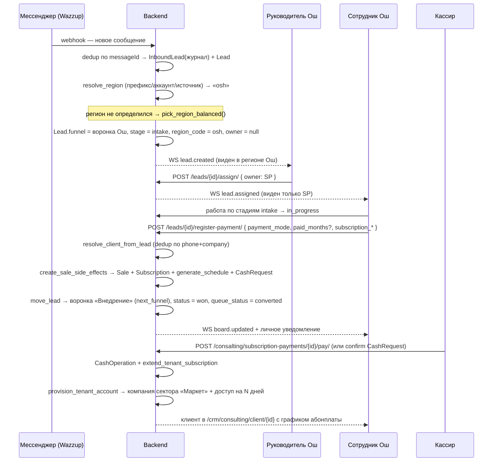

# Сценарий консалтинга — полный цикл (сентябрь 2026)

**Дата:** 09.09.2026
**Домен API:** `/api/consalting/` (историческое написание — не менять).
**Статус:** объединяющий сценарий поверх спек 06–13. Отражает целевое состояние
после ролевой модели `supervisor`, единой базы лидов и обязательных стадий.

Заменяет по смыслу устаревший [scenario-crm-automation.md](./scenario-crm-automation.md)
(тот описывал 2-дневное ТЗ без регионального руководителя и без объединения
`InboundLead`/`Lead`). Денежный контур и tenant — без изменений (блоки 01–05).

**Связанные спеки:**

| Этап сценария | Детальная спека |
|---|---|
| Приём лида, единая база | [13-unify-leads-single-model.md](./13-unify-leads-single-model.md), [../backend/01-leads.md](../backend/01-leads.md) |
| Региональные воронки, маршрутизация, деление поровну | [06-regional-funnels-routing.md](./06-regional-funnels-routing.md) |
| Роли `owner` / `supervisor` / `salesperson`, изоляция | [12-regional-supervisor-rbac.md](./12-regional-supervisor-rbac.md), [07-seller-access-isolation.md](./07-seller-access-isolation.md) |
| Обязательные стадии у каждой воронки | [06-regional-funnels-routing.md §6.5a](./06-regional-funnels-routing.md) |
| Оплата, несколько месяцев, абонентка | [01-subscription.md](./01-subscription.md) (§5.4a, §5.6) |
| Лид → клиент, дедуп | [08-lead-client-conversion.md](./08-lead-client-conversion.md) |
| Касса | [00-money-flow.md](./00-money-flow.md), [03-cash-confirmation.md](./03-cash-confirmation.md) |
| CRM-аккаунт (сектор «Маркет»), продление | [04-tenant-lifecycle.md](./04-tenant-lifecycle.md), [11-provision-market-sector.md](./11-provision-market-sector.md) |
| KPI | [05-analytics-kpi.md](./05-analytics-kpi.md) |
| Известные дефекты прод-бэка | [10-backend-issues.md](./10-backend-issues.md) |

---

## 1. Действующие лица

| Роль | Область видимости | Действия |
|---|---|---|
| **`owner` / `admin` / `rop`** (владелец) | Все воронки, все лиды, все регионы, настройки, касса, tenant | Всё. `isConsultingFunnelManager` |
| **`supervisor`** (руководитель региона) | Лиды и воронки **своих** регионов; внутри региона — лиды **любого** владельца | Заводит сотрудников своего региона (`role=salesperson`), назначает им лиды региона, ведёт доску региона. Нет глобальных настроек и чужих регионов |
| **`salesperson`** (сотрудник) | Только **свои** лиды (`owner=self`) в воронке своего региона | Работает со своими лидами. Не назначает, не видит чужих |
| **Кассир** | Заявки в кассу консалтинга | Подтверждает/отклоняет `CashRequest` |

Регион у `supervisor` — один или несколько (`consulting_region_codes`).
У `salesperson` — ровно один (наследует от создателя). У владельца — пусто = все.

Пример компании: регионы **Бишкек** и **Ош**. Руководитель А — только Ош,
руководитель Б — только Бишкек. Общий поток лидов делится по регионам поровну.

---

## 2. Предусловия (одноразовая настройка)

1. **Тариф** консалтинга с `crm_sector_id` = сектор «Маркет» и
   `subscription_amount > 0` (если продаём абонентку). См.
   [11-provision-market-sector.md](./11-provision-market-sector.md).
2. **`RegionalFunnelRouting.enabled = true`** + по одному `RegionalFunnelRule`
   на регион (`region_code`, `label`, `phone_prefixes`, `wazzup_account_ids`,
   `assign_role_ids`, `assign_strategy`).
3. **У каждой воронки — 3 системные стадии** (`intake` / `in_progress` /
   `completed`, у `completed` — `stage_type: "won"`, `is_success: true`).
   Создаются автоматически при создании воронки; для уже существующих
   региональных воронок (Ош/Бишкек, созданных пустыми) — бэкфилл.
   **Без этого:** доска без колонок, лиды с `stage=null` невидимы,
   `win/` → `400 «В воронке нет WON-стадии»`. См.
   [06 §6.5a](./06-regional-funnels-routing.md), [10 P0-6](./10-backend-issues.md).
4. **Касса консалтинга** активна (`construction_cashbox.is_active` заполнено —
   [10 P0-5](./10-backend-issues.md)).
5. Руководителям назначены регионы (owner в UI «Сотрудники»).

---

## 3. Сквозной happy-path



---

## 4. Этапы

### Э1. Приём лида — единая база

**Один источник правды — `Lead`.** «Лиды» (`/crm/consulting/leads`) и «Воронка»
(`/crm/consulting/funnel`) показывают **одни и те же** `Lead`.
`InboundLead` — только журнал приёма из мессенджеров (идемпотентность webhook,
сырой первый текст, канал, аккаунт), всегда с `lead_id`.

| Источник | Путь |
|---|---|
| Webhook мессенджера | создаёт `InboundLead(lead_id=…)` **и** `Lead` (маршрутизация — Э2) |
| Окно «Новый лид» на «Лидах» | `POST /consalting/leads/` (`channel` дефолт `manual`, `queue_status=new`) |
| «+ Добавить лид» в колонке воронки | тот же `POST /consalting/leads/` |

**Инвариант:** лид, созданный в любом из трёх мест, немедленно виден и на
«Лидах», и в воронке. Счётчики табов «Лиды» и число карточек в воронке по тем же
фильтрам совпадают.

`queue_status` (`new` → `assigned` → `in_work` → `deferred` → `converted` /
`rejected`) согласован со `status` сделки: `converted ⇔ won`, `rejected ⇔ lost`.

Детали, поля, миграция `InboundLead` без `lead_id` → [13](./13-unify-leads-single-model.md).

### Э2. Региональная маршрутизация и деление поровну

При создании `Lead` (webhook / ручное / redistribute):

```text
1. region = resolve_region(phone_prefix, wazzup_account_id, source)
      самый длинный совпавший префикс → аккаунт Wazzup → канал источника
2. region is None → region = pick_region_balanced(company)
      least-loaded по числу ОТКРЫТЫХ лидов региона; тай-брейк — порядок регионов
3. funnel = rule(region).funnel;  stage = первая стадия воронки (intake)
4. Lead(funnel, stage, region_code=region, owner=null)
5. assign_owner_within_region(lead, rule)   # RR по assign_role_ids, если задано
6. WS: lead.created (+ lead.assigned)
```

Повторное сообщение того же чата **не меняет** `region_code` / `funnel`.

**Разовое выравнивание базы** (owner/admin, кнопка «Разделить лиды по регионам»):
`POST /consalting/regional-funnel-routing/redistribute/`
`{ scope: "main_unassigned" | "all_open" | "inbound_new", regions?, dry_run }`.
100 лидов, 3 региона → `planned = {34, 33, 33}`, сумма = 100, разброс ≤ 1,
`converted`/`rejected` не трогаются, повторный запуск → `moved: 0`.
Алгоритм и инварианты — [12 §4](./12-regional-supervisor-rbac.md).

### Э3. Распределение внутри региона

- **Владелец** видит все регионы, чип «Регион» переключает выборку.
- **Руководитель** видит только свои регионы (чип зафиксирован либо
  переключает между его регионами). Внутри региона — лиды всех владельцев.
- Руководитель заводит сотрудников: `POST /users/employees/create/` — сервер
  **принудительно** ставит `role=salesperson`,
  `consulting_region_codes=[X]` (X из набора создателя; при >1 регионе поле
  `region_code` в запросе обязательно), все `can_view_all_*=false`,
  `funnel_grants` — только на воронку региона.
- Руководитель назначает лид: `POST /consalting/leads/{id}/assign/ { owner }` —
  получатель обязан быть сотрудником **того же региона**, что и лид, иначе `403`.
- **Сотрудник** видит только `owner=self` в воронке своего региона; назначать
  не может.

Матрица доступа по эндпоинтам (источник правды — сервер) — [12 §5](./12-regional-supervisor-rbac.md).

### Э4. Работа с лидом в воронке

Доска воронки = колонки по стадиям + «Без стадии» (`unassigned`) для
`stage=null`. Действия карточки:

| Действие | Эндпоинт | Эффект |
|---|---|---|
| Взять из пула | `POST /leads/{id}/claim/` | `owner=self`, гонка → `409` |
| Вернуть в пул | `POST /leads/{id}/release/` | `owner=null` (владелец/руководитель) |
| Назначить | `POST /leads/{id}/assign/ { owner }` | `owner`, `queue_status=assigned` |
| Отложить | `POST /leads/{id}/defer/ { remind_at, reason, comment? }` | `queue_status=deferred`, `defer_count+=1` |
| Вернуть в работу | `POST /leads/{id}/resume/` | `queue_status=in_work`, `remind_at=null` |
| Переставить стадию | `POST /leads/{id}/move-stage/` | проверка `allowedTransitions` |

Первый исходящий ответ менеджера → `first_reply_at` (один раз),
`queue_status: new/assigned → in_work`. Завершённый лид (won/lost или системная
`completed`) повторно двигает только руководитель/владелец.

### Э5. Оплата по лиду — разовая

`POST /consalting/leads/{id}/register-payment/`
`{ payment_mode: cash|transfer|debt|installment, amount, note?, prepayment?, debt_months? }`.

Сервер атомарно (`create_sale_side_effects`, идемпотентно по `lead_id`):

1. `resolve_client_from_lead` — находит/создаёт `Client` (dedup по
   `phone` + `company`). Нет телефона → `400` с понятным `detail`.
2. `Sale` на сумму по услуге/тарифу с учётом роли
   ([../services-role-pricing.md](../services-role-pricing.md)).
3. `debt`/`installment` → `generate_schedule` (расписание платежей).
4. Начисление зарплаты продавцу ([../salary-auto-accrual.md](../salary-auto-accrual.md)).
5. `CashRequest kind=sale` (или `subscription`) — деньги ждут кассира.
6. Запись в аналитику (`/consalting/sales/`).
7. `move_lead` → `next_funnel` воронки («Внедрение»), первая стадия;
   `status=won`, `queue_status=converted`, `converted_at`, `closed_at`.
8. WS: `board.updated` + личное уведомление владельцу лида.

**Инвариант:** ровно одна `Sale` и одно начисление зарплаты на лид; повторный
`register-payment`/`win` не дублирует.

> **Не вызывать `win/` отдельным запросом после `register-payment`.** Перенос
> лида и `status=won` — часть `register-payment`. Фронт держит фолбэк `winLead`
> только для старого бэка и **только** если у воронки есть WON-стадия
> (`funnelHasWonStage`), иначе получаем `400` и «лид пропадает». См.
> [10 P0-6](./10-backend-issues.md), [06 §6.5a](./06-regional-funnels-routing.md).

### Э6. Оплата за несколько месяцев / абонентка

Из `LeadPaymentModal` возможны три варианта (спека
[01-subscription.md §5.6](./01-subscription.md)):

| Вариант | Тело запроса (доп. поля) | Результат |
|---|---|---|
| **A. Тарифная абонентка, оплатить вперёд** | `subscription_enabled`, `subscription_amount`, `subscription_period`, `subscription_start`, `subscription_prepaid_periods: N` | `Subscription` + расписание на 12 мес; первые `N` периодов помечены оплаченными; `end_date += N` |
| **B. Вести как абонентку (нет тарифа)** | `subscription_enabled: true`, `subscription_amount`, `subscription_period: "month"`, `subscription_start`, `subscription_prepaid_periods: N` | то же, что A, но подписка заводится с нуля |
| **C. Разовый множитель месяцев** | `paid_months: N` | `Sale.amount = amount × N`; одна `CashRequest`; расписание не создаётся |

**Оплата нескольких периодов из карточки клиента** (`ConsultingClientDetail`,
блок «Абонентские платежи»): пресеты `2 / 3 / 6 / 12` → последовательный вызов
`POST /consalting/subscription-payments/{id}/pay/` по каждому периоду
(одна `CashRequest` на период). Батч-эндпоинт
`POST /consalting/subscriptions/{id}/pay-periods/ { count, payment_mode, note? }`
специфицирован в [01 §5.4a](./01-subscription.md) — уменьшит N заявок до одной.

**Известное ограничение:** прод-бэк пока **игнорирует**
`subscription_prepaid_periods` и `paid_months` — вперёд отмечается только 1
период. До фикса — платить через карточку клиента (Э6, второй абзац).

### Э7. Лид → клиент

`resolve_client_from_lead` (шаг Э5.1) — единственная точка конверсии:

- dedup по нормализованному `phone` + `company`; совпал существующий `Client` —
  используется он, не плодим дубли;
- `Lead.client` проставляется; `Lead.status=won`, `queue_status=converted`;
- клиент доступен на `/crm/consulting/client/{id}` с карточкой сделки и
  (для абонентки) графиком платежей.

Детали слияния/дедупа — [08](./08-lead-client-conversion.md).

### Э8. Касса

`CashRequest` (`kind=sale` / `subscription`) → кассир подтверждает →
`CashOperation` в кассе консалтинга, `CashRequest.status=paid`.
Отклонение — `rejected`, сделка остаётся неоплаченной, лид не откатывается.
Полный контур и enum — [03-cash-confirmation.md](./03-cash-confirmation.md),
[00-money-flow.md](./00-money-flow.md).

### Э9. CRM-аккаунт (сектор «Маркет») и продление

При подтверждении оплаты (`confirm` `CashRequest` или `pay` первого
абонентского периода):

1. `extend_tenant_subscription` — продлевает `end_date` тенанта на оплаченные
   периоды.
2. `provision_tenant_account` (`@transaction.atomic`):
   `create_company_with_owner(sector_id = tariff.crm_sector_id, …)` —
   `crm_sector_id` тарифа должен указывать на сектор **«Маркет»**;
   `initial_access_days` из тарифа.
3. Ошибки провижена (`EmailAlreadyExists`,
   `construction_cashbox.is_active NOT NULL`) — [10 P0-5](./10-backend-issues.md),
   [11-provision-market-sector.md](./11-provision-market-sector.md).
   Фронт даёт override сектора в карточке клиента (по умолчанию «Маркет») и
   кнопку «Повторить провижен».
4. Абонентские платежи следующих периодов:
   `POST /consalting/subscription-payments/{id}/pay/` → `CashRequest
   kind=subscription` → confirm → `paid` + `extend_tenant_subscription`.

Жизненный цикл тенанта — [04-tenant-lifecycle.md](./04-tenant-lifecycle.md).

---

## 5. Сквозные инварианты

- **Один лид — одна запись.** «Лиды» и «Воронка» — представления над `Lead`.
  `InboundLead` всегда с `lead_id`, в списках UI не участвует.
- **Регион на лиде.** `Lead.region_code` проставлен при создании; меняется
  только при `transfer` в воронку другого региона и при `redistribute`.
- **Изоляция — на сервере.** Фронт дублирует для UX; выдача `/funnels/`,
  `/board/`, `/leads/`, `/sales/`, `/employees/` урезается по роли и региону.
- **У каждой воронки — 3 системные стадии.** Иначе доска пуста, `win/` → `400`.
- **Деньги атомарны.** `create_sale_side_effects` — одна транзакция;
  идемпотентно по `lead_id`. Одна `Sale` и одно начисление на лид.
- **`register-payment` сам переносит лид** в `next_funnel` и ставит `won`.
  Отдельный `win/` не нужен.
- **Провижен — сектор «Маркет».** `tariff.crm_sector_id` → market.

---

## 6. Definition of Done

- [ ] Лид из воронки виден на «Лидах» и наоборот; счётчики совпадают ([13](./13-unify-leads-single-model.md))
- [ ] Webhook: один `Lead` + `InboundLead(lead_id)`; повтор `messageId` не плодит
- [ ] Inbound без региона → наименее загруженный регион; гонка не кладёт оба в один ([12 §4](./12-regional-supervisor-rbac.md))
- [ ] `redistribute` при 100/3 → `{34,33,33}`, повтор → `moved: 0`
- [ ] `supervisor` Ош видит только воронку/лиды Ош; `board/` Бишкека → `403` ([12 §5](./12-regional-supervisor-rbac.md))
- [ ] `supervisor` создаёт только `salesperson` своего региона; эскалация прав игнорируется
- [ ] `salesperson` видит только `owner=self`
- [ ] У каждой воронки (вкл. Ош/Бишкек) есть `intake`/`in_progress`/`completed`; `board/` отдаёт `stage=null` в `unassigned` ([06 §6.5a](./06-regional-funnels-routing.md))
- [ ] `register-payment` → `Client` без дублей, лид в «Внедрение», `status=won` — **без** отдельного `win/` ([08](./08-lead-client-conversion.md))
- [ ] `subscription_prepaid_periods` / `paid_months` действительно отмечают N периодов ([01 §5.6](./01-subscription.md))
- [ ] `pay-periods/` батчит N периодов в одну заявку ([01 §5.4a](./01-subscription.md))
- [ ] `Sale` → `CashRequest` → confirm → `CashOperation` в кассе консалтинга ([03](./03-cash-confirmation.md))
- [ ] confirm → `provision_tenant_account` в сектор «Маркет»; абонплата → `extend` ([04](./04-tenant-lifecycle.md), [11](./11-provision-market-sector.md))
- [ ] KPI: revenue / paid_income / pending_cash по региону ([05](./05-analytics-kpi.md))
- [ ] Регрессия: `owner`/`admin`/`rop` и компании без региональных правил — как раньше

---

## 7. Фронт (готов, ждёт бэк)

| Область | Модули | Готовность |
|---|---|---|
| Единая база лидов | `api/consultingLeads.js` (`ensureFunnelLeadForInbound`, `ensureInboundLeadForFunnelLead` — зеркала до §3), `leads/LeadsInbox.jsx`, `leads/modals/CreateLeadModal.jsx`, `Funnel/Funnel.jsx` (`LeadCreateForm`) | Зеркала работают на текущем бэке; переключение на `/leads/?queue=` — авто по фолбэку |
| Роли / регионы | `utils/consultingFunnelAccess.js` (+`.test.js`), `api/consultingRegions.js`, `common/useConsultingRegions.js`, `common/RegionFilter.jsx`, `Sidebar/hooks/useMenuPermissions.js`, `leads/{Leads,LeadsInbox,LeadsDistribution}.jsx`, `leads/modals/AssignLeadModal.jsx`, `Teachers/Teachers.jsx` | Активируется при `role:"supervisor"` + `consulting_region_codes` в профиле и `/consalting/regions/` |
| Пустая воронка / нет WON-стадии | `Funnel/Funnel.jsx` (`funnelHasWonStage`), `Funnel/FunnelBoardRow.jsx` (заглушка со счётчиком лидов) | Не даёт словить `400` и «потерять» лид |
| Оплата: месяцы / абонентка | `Funnel/LeadPaymentModal.jsx`, `store/creators/funnelThunk.js` (`subscription_prepaid_periods`, `paid_months`) | Тело запроса готово; ждёт бэк §5.6 |
| Оплата нескольких периодов из карточки | `client/ConsultingClientDetail.jsx` (`handleBulkPay`, `SubBulkPaymentModal`) | Работает сейчас (N заявок); батч — по §5.4a |
| Доп. продажа свободными позициями | карточка клиента (`AddSaleModal` → `POST /consalting/sales/` `items[]`) и оплата лида (`LeadPaymentModal` блок «Доп. услуги» → `register-payment` `items[]`) | Готово; ждёт бэк [14](./14-client-upsell-sale.md) (`items[]` в обоих эндпоинтах, `kind=addon`, `amount` уже с позициями) |
| Услуги + доп. услуги | `Consulting/services/services.jsx` (`AdditionalServicesEditor`) | Готово |
| Провижен сектора «Маркет» | `client/ConsultingClientDetail.jsx` (override сектора, retry), `api/consultingTenant.js` (`crm_sector`) | Готово; ждёт бэк [11](./11-provision-market-sector.md) |
