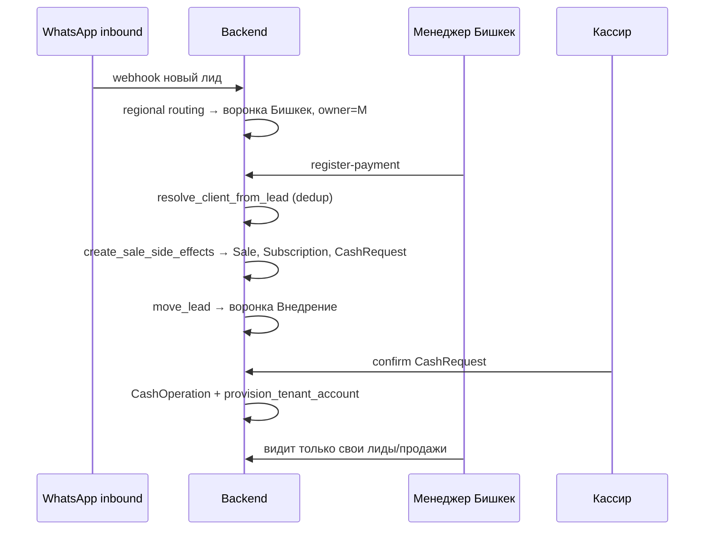

# Сценарий: автоматизация CRM (ТЗ на 2 дня)

**Срок:** 2 рабочих дня (бизнес-ТЗ).  
**Цель:** изоляция видимости, региональные воронки, лид→клиент, деньги в кассе.

Консалтинг — **внутренний** канал продаж NUR. Денежный контур и tenant — в блоках
01–05; процессные блоки — 06–08.

---

## План работ

| День | Блок | Спека | Результат |
|---|---|---|---|
| **1** | Воронки, доступы, маршрутизация | [06-regional-funnels-routing.md](./06-regional-funnels-routing.md), [07-seller-access-isolation.md](./07-seller-access-isolation.md) | Менеджеры видят только свои лиды в своих городах; после оплаты лид уходит во «Внедрение» |
| **2** | Конверсия, касса, тесты | [08-lead-client-conversion.md](./08-lead-client-conversion.md), [01-subscription.md](./01-subscription.md), [03-cash-confirmation.md](./03-cash-confirmation.md), [04-tenant-lifecycle.md](./04-tenant-lifecycle.md) | Оплатившие → Client; деньги в CashRequest/CashOperation; CRM-аккаунт после confirm |

---

## Сквозной сценарий (happy path)

---

## Матрица блоков ТЗ → документы

| # | Блок бизнес-ТЗ | Документ |
|---|---|---|
| 1 | Региональные воронки, RR, «Внедрение» | [06-regional-funnels-routing.md](./06-regional-funnels-routing.md) |
| 2 | Изоляция продавцов | [07-seller-access-isolation.md](./07-seller-access-isolation.md) |
| 3 | Лид → клиент, дедуп | [08-lead-client-conversion.md](./08-lead-client-conversion.md) |
| 4 | Касса при оплате | [00-money-flow.md](./00-money-flow.md), [03-cash-confirmation.md](./03-cash-confirmation.md) |
| 4+ | CRM-аккаунт, абонплата | [04-tenant-lifecycle.md](./04-tenant-lifecycle.md), [01-subscription.md](./01-subscription.md) |

---

## Definition of Done (сквозной)

- [ ] Inbound → региональная воронка + owner ([06](./06-regional-funnels-routing.md))
- [ ] Продавец не видит чужие лиды/продажи ([07](./07-seller-access-isolation.md))
- [ ] `register-payment` → Client без дублей ([08](./08-lead-client-conversion.md))
- [ ] Лид во «Внедрение» после оплаты ([06](./06-regional-funnels-routing.md))
- [ ] Sale → CashRequest → confirm → CashOperation ([03](./03-cash-confirmation.md))
- [ ] Confirm → tenant + extend по абонплате ([04](./04-tenant-lifecycle.md))
- [ ] KPI: revenue / paid_income / pending_cash ([05-analytics-kpi.md](./05-analytics-kpi.md))

---

## Фронт (готов)

| Блок | Модули |
|---|---|
| Регионы | `LeadsDistribution.jsx`, `consultingLeads.js` |
| RBAC | `consultingFunnelAccess.js`, `hideRules.js` |
| Оплата / клиент | `LeadPaymentModal.jsx`, `ConsultingClientDetail.jsx` |
| Касса V2 | `Kassa.jsx`, `consultingCashbox.js` |
| Tenant | `consultingTenant.js`, badge в `Funnel.jsx` |
