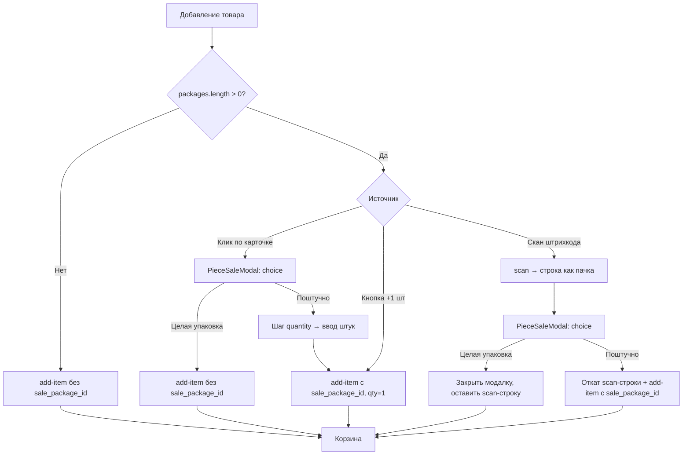

# Маркет — Поштучная продажа из упаковки

**Экран:** `/crm/market/cashier`  
**Фронт:** `src/Components/Sectors/Market/CashierPage/CashierPage.jsx`  
**Эндпоинты:** `POST /main/pos/sales/{cart_id}/add-item/`, `PATCH /main/pos/carts/{cart_id}/items/{item_id}/`, `POST /main/pos/sales/{cart_id}/scan/`, `GET /main/products/{id}/`  
**Статус:** ✅ Реализовано на фронте (веб-касса). Поведение зафиксировано в `tools/marketPackPieceSale.js`.

**См. также:**

| Документ | Содержание |
|---|---|
| [add-product-to-warehouse.md](./add-product-to-warehouse.md) | Создание товара, поле `packages_input` |
| [../market_cashier_mobile_piece_sale.md](../market_cashier_mobile_piece_sale.md) | Тот же контракт для мобильной кассы (чеклист паритета 1:1) |
| [scales-weight-products.md](./scales-weight-products.md) | Весовые товары — **другой** механизм, не путать с поштучной продажей |
| [service-kind-no-quantity.md](./service-kind-no-quantity.md) | Услуги — `packages_input` не применяется |

---

## 1. Бизнес-смысл

Типичный кейс — **сигареты**, напитки в блоках, любой товар, который:

- на **складе** учитывается **упаковками** (`unit = "упак."`, `"блок"`, `"ящик"`);
- на **кассе** нужно продавать:
  - **целую упаковку** (пачку, блок);
  - **отдельные штуки** из этой упаковки.

Это **не** весовой товар (`is_weight = true`) и **не** обычный штучный товар с `unit = "шт"`. Признак на кассе — у карточки товара непустой массив `packages`.

Пример: на складе **12 пачек** по **20 сигарет**, цена пачки **300 сом**, цена одной сигареты **15 сом**. Кассир может добавить в корзину «2 пачки» и «7 штук» **одновременно** — это две разные строки с разным списанием остатка.

---

## 2. Настройка товара (склад)

Включение поштучной продажи — на странице добавления/редактирования товара (`AddProductPage.jsx`):

1. Тип позиции: **товар** (`kind = product`), не услуга и не комплект.
2. Включить тумблер **«Поштучная продажа»** (`enablePieceSale`).
3. Добавить одну или несколько **упаковок** (`packagings` → `packages_input` при сохранении).

Поля упаковки при сохранении (`packages_input[]`):

| Поле | Описание |
|---|---|
| `name` | Подпись («Пачка», «Блок») |
| `quantity_in_package` | Сколько **штук** в одной учётной единице склада, > 0 |
| `unit` | Единица штуки (обычно `"шт."`) |
| `piece_unit_price` | Розничная цена **одной штуки** на кассе |

Цена и закупка **товара** (`price`, `purchase_price`) задаются **за учётную единицу склада** (за пачку). Если `piece_unit_price` не указан, на кассе используется расчёт `price / quantity_in_package`.

Подробный контракт создания товара — [add-product-to-warehouse.md](./add-product-to-warehouse.md), §2.4.

---

## 3. Модель данных

### 3.1. Товар (ответ API)

| Поле | Смысл |
|---|---|
| `unit` | Учётная единица склада (`"упак."`, `"блок"`) |
| `quantity` | Остаток **в учётных единицах** (число пачек, не штук) |
| `price` | Розница **за одну учётную единицу** |
| `purchase_price` | Закупка **за одну учётную единицу** |
| `packages` | Массив упаковок (read-only) |

### 3.2. Упаковка (`packages[]`)

| Поле | Тип | Описание |
|---|---|---|
| `id` | uuid | Передаётся на кассе как `sale_package_id` |
| `name` | string | Подпись для UI («Пачка») |
| `quantity_in_package` | decimal | Штук в одной учётной единице (например `"20.000"`) |
| `unit` | string | Единица штуки; если пусто — `"шт."` |
| `piece_unit_price` | decimal \| null | Розничная цена одной штуки |

Пример:

```json
{
  "id": "a1b2c3d4-e5f6-7890-abcd-ef1234567890",
  "name": "Сигареты Example",
  "unit": "упак.",
  "quantity": "12.000",
  "price": "300.00",
  "purchase_price": "240.00",
  "packages": [
    {
      "id": "pkg-uuid-1111-2222-3333-444455556666",
      "name": "Пачка",
      "quantity_in_package": "20.000",
      "unit": "шт.",
      "piece_unit_price": "15.00"
    }
  ]
}
```

### 3.3. Два режима строки корзины

| Режим | `sale_package` | `quantity` означает | `unit_price` |
|---|---|---|---|
| **Упаковка** | `null` | число **пачек** (учётных единиц) | цена за пачку (`product.price`) |
| **Поштучно** | uuid упаковки | число **штук** | цена за штуку (`piece_unit_price`) |

**Строки одного товара не сливаются между режимами.** Склейка происходит только при совпадении `(product_id, sale_package)`.

Уникальный ключ строки в UI — **`itemId`** (id позиции в корзине), **не** `productId`.

Маппинг из ответа API:

```javascript
const salePackage = item.sale_package ?? item.sale_package_id ?? null;
```

---

## 4. Архитектура на фронте

### 4.1. Файлы

| Файл | Роль |
|---|---|
| `CashierPage.jsx` | Основная логика: добавление, скан, валидация остатка, синхронизация корзины |
| `components/PieceSaleModal.jsx` | Модалка «Целая упаковка / Поштучно» + ввод количества штук |
| `components/HotkeyProductsModal.jsx` | Горячие клавиши F1–F12; кнопка «+1 шт из упаковки» |
| `tools/marketPackPieceSale.js` | Общие утилиты (цена штуки, остаток, метки единиц) |
| `tools/marketPackPieceSale.test.js` | Тесты склейки строк и суффикса `(штуч)` |
| `store/creators/saleThunk.js` | `manualFilling` → `POST add-item` с `sale_package_id` |

### 4.2. Ключевые утилиты (`marketPackPieceSale.js`)

```javascript
// Товар поддерживает поштучную продажу?
supportsPieceFromPack(product)  // packages.length > 0

// Упаковка по умолчанию — первая с quantity_in_package > 0
getDefaultPackage(product)

// Цена одной штуки для UI и превью
pieceUnitPrice(product, pkg)

// Максимум штук с учётом остатка и других строк корзины
maxPiecesAvailable(stockPacks, otherConsumePacks, pkg)

// Перевод количества штук в «условные пачки» для списания
consumePacks(qty, salePackageId, packages)

// Метки в корзине
isPieceSaleCartLine(item)           // salePackage != null
formatCartLineNameSuffix(item)      // " (штуч)" или ""
cartItemUnitLabel(item, product)    // "шт." vs "упак."
cartLinesMatchProductAndPackage()   // склейка строк
```

---

## 5. Потоки в веб-кассе

### 5.1. Сводная схема



### 5.2. Клик по карточке товара

`handleProductCardClick` → `openPieceSaleChoice(product, "click")`:

- если `packages` пуст — сразу `addToCart(product)` (обычная продажа);
- иначе открывается `PieceSaleModal` с шагом **choice**.

Клики игнорируются в течение **700 мс** после сканирования и во время обработки штрих-кода (защита от «ghost click» сканера).

### 5.3. Модалка `PieceSaleModal`

**Шаг 1 — choice:** «Как добавить в корзину?»

| Вариант | Действие |
|---|---|
| **Целая {pkg.name}** | `handlePieceSaleChoosePack` → `addToCart` (пачка, qty=1) |
| **Поштучно** | переход на шаг **quantity** |

**Шаг 2 — quantity:** ввод целого числа штук, превью `piecePrice × qty`, лимит «Доступно до N шт.»

Подтверждение → `handlePieceSaleConfirmPieces` → `addToCartWithPackage(product, salePackageId, qty)`.

### 5.4. Быстрая кнопка «+1 шт» (без модалки)

На карточке товара в каталоге и в `HotkeyProductsModal` — кнопка:

```text
+1 шт / {quantity_in_package}
```

Сразу вызывает:

```javascript
addToCartWithPackage(product, piecePackage.id); // qty = 1 штука
```

Модалка выбора **не показывается** — это осознанный UX для частого сценария «одна сигарета».

### 5.5. Скан штрих-кода

1. `POST /main/pos/sales/{cart_id}/scan/` **всегда** добавляет товар **без** `sale_package` — как **целую упаковку** (qty=1 в учётных единицах).
2. Если у товара есть `packages`, открывается та же модалка с `source: "scan"`.
3. При выборе **«Целая упаковка»** (`handlePieceSaleChoosePack`, `source === "scan"`) — модалка закрывается, scan-строка **остаётся**.
4. При выборе **«Поштучно»**:
   - вызывается `revertScanPackLine(scanCartItemId)` — откат только что добавленной пачки:
     - если qty = 1 → `DELETE` позиции;
     - если qty > 1 → `PATCH quantity - 1`;
   - затем `addToCartWithPackage` с введённым количеством штук.

В модалку при скане передаётся `maxQuantity` — лимит штук с учётом уже добавленных строк этого товара (минус одна пачка от scan).

### 5.6. Альтернативный штрих-код

Если POS-скан не нашёл товар по основному штрих-коду, фронт ищет по `alternate_barcodes` (`addProductByAlternateBarcode`). При нахождении товара с `packages` — снова показывается модалка выбора.

### 5.7. Склейка строк при повторном добавлении

`addToCartWithPackage` перед `POST add-item` ищет в локальной корзине строку:

```javascript
cart.find(
  (line) =>
    !line.isCustom &&
    String(line.productId) === String(product.id) &&
    String(line.salePackage ?? "") === String(salePackageId ?? ""),
);
```

- строка найдена → `PATCH` с `quantity = current + qtyToAdd`;
- не найдена → `POST add-item`.

Дефолтное количество:

- **упаковка** (`salePackageId = null`): `1` пачка (для весовых с остатком < 1 — весь остаток);
- **поштучно**: `1` штука или переданный `quantityOverride`.

### 5.8. Подгрузка `packages`

Список товаров на кассе — **постраничный** (`PAGE_SIZE`). Товар, добавленный сканером, может отсутствовать на текущей странице.

| Функция | Когда | Эндпоинт |
|---|---|---|
| `resolveProductWithPackages` | Перед модалкой / после скана | `GET /main/products/{id}/` |
| `resolveCartLineProduct` | При изменении qty в корзине | `GET /main/products/{id}/` (кэш 5 с) |

Без `packages` валидация остатка для поштучных строк считается некорректно — фронт догружает полную карточку.

---

## 6. API POS

### 6.1. Добавление — `POST /main/pos/sales/{cart_id}/add-item/`

**Упаковка:**

```json
{
  "product_id": "a1b2c3d4-…",
  "quantity": "1"
}
```

**Поштучно:**

```json
{
  "product_id": "a1b2c3d4-…",
  "quantity": "7",
  "sale_package_id": "pkg-uuid-…"
}
```

| Поле | Обязательное | Описание |
|---|---|---|
| `product_id` | да | UUID товара |
| `quantity` | нет (default `1`) | Без `sale_package_id` — **пачки**; с `sale_package_id` — **штуки** |
| `sale_package_id` | нет | UUID из `product.packages[].id` |
| `unit_price` | нет | Переопределение цены за единицу строки |
| `discount_total` | нет | Скидка на строку (сумма) |

Redux-обёртка: `manualFilling` в `saleThunk.js` (поле `salePackageId` → `sale_package_id`).

### 6.2. Ответ позиции корзины

```json
{
  "id": "item-uuid",
  "product": "a1b2c3d4-…",
  "product_name": "Сигареты Example",
  "quantity": "7.000",
  "unit_price": "15.00",
  "line_discount": "0.00",
  "sale_package": "pkg-uuid-…",
  "line_total": "105.00"
}
```

```text
line_total = unit_price × quantity − line_discount
```

### 6.3. Обновление — `PATCH /main/pos/carts/{cart_id}/items/{item_id}/`

```json
{ "quantity": "10" }
```

**`sale_package` изменить нельзя** — для смены режима (пачка ↔ штуки) удалите строку и добавьте заново.

Обновление цены и скидки — те же PATCH, что для обычных товаров (`unit_price`, `discount_total`). См. [receipt-price-edit-discount.md](./receipt-price-edit-discount.md).

### 6.4. Ограничение контекста

| Контекст | Поштучно из упаковки |
|---|---|
| POS (`/main/pos/…`) | **Да** |
| Агентская корзина (`/main/agents/me/carts/…`) | **Нет** — `sale_package_id` → 400 |

---

## 7. Валидация остатка

Склад хранит **пачки** (`product.quantity`). В корзине учитываются **все** строки одного `product_id`.

### 7.1. Суммарное потребление (`calcTotalConsumeForProduct`)

Для каждой строки корзины:

- без `sale_package` → `+ quantity` (пачки);
- с `sale_package` → `+ quantity / quantity_in_package` (дробные пачки).

Пример: 2 пачки + 5 штук (20 шт/пачка) = `2 + 5/20 = 2.25` условных пачек.

### 7.2. Максимум штук

```javascript
maxPiecesAvailable(stockPacks, otherConsumePacks, pkg)
// = floor((stockPacks - otherConsumePacks) × quantity_in_package)
```

Проверки выполняются:

- в `handlePieceSaleConfirmPieces` (модалка);
- в `updateQuantityDirect` и `onChange` инпута количества (поштучная строка);
- на бэкенде (400 при превышении).

При превышении — alert «Недостаточно товара» с доступным остатком в **учётных единицах** склада.

Если у упаковки `quantity_in_package <= 0` — ошибка «Для поштучной продажи не найдена корректная упаковка товара».

### 7.3. Минимальная цена

Для поштучной строки без скидки минимальная цена = `purchase_price / quantity_in_package` (логика бэкенда; на фронте проверка закупочной для patch цены использует `product.purchase_price` целиком — для поштучных строк при ручном изменении цены ориентироваться на лимит бэкенда).

---

## 8. Отображение в UI

### 8.1. Карточка товара в каталоге

| Элемент | Условие | Смысл |
|---|---|---|
| Бейдж количества (обычный) | строка **без** `salePackage` | qty в пачках |
| Бейдж «шт.» (стиль `--piece`) | строка **с** `salePackage` | qty в штуках |
| Подсветка карточки | любая из двух строк есть | товар в корзине |
| Кнопка `+1 шт / N` | `packages.length > 0` | быстрое добавление 1 штуки |

### 8.2. Строка корзины

```text
{item.name}{formatCartLineNameSuffix(item)}
→ «Сигареты Example (штуч)»
```

| Элемент | Упаковка | Поштучно |
|---|---|---|
| Суффикс имени | — | `(штуч)` |
| Подпись поля «Цена» | «Цена» | «Цена / {unit}» (напр. «Цена / шт.») |
| Единица в qty | `product.unit` | `pkg.unit` или «шт.» |
| Ввод qty | целые (дробные — только весовые) | **только целые** (`/^\d+$/`) |

Примеры строк:

```text
Сигареты Example — 2 упак. × 300.00 = 600.00 сом
Сигареты Example (штуч) — 7 шт. × 15.00 = 105.00 сом
```

### 8.3. Сохранение `salePackage` при синхронизации

После `add-item` бэкенд иногда возвращает строку **без** `sale_package` в промежуточном ответе. Фронт сохраняет локальное значение `salePackage` из предыдущего состояния корзины, пока API не вернёт корректное поле (см. `setCart` в `useEffect` синхронизации с `currentSale`).

---

## 9. Состояние модалки

```typescript
type PieceSaleModalState = {
  product: Product;
  step: "choice" | "quantity";
  source: "click" | "scan";
  scanCartItemId?: string;   // только при source = "scan"
  maxQuantity?: number | null;
} | null;
```

| `source` | «Целая упаковка» | «Поштучно» |
|---|---|---|
| `click` | `add-item` без `sale_package_id` | `add-item` с `sale_package_id` |
| `scan` | закрыть модалку, оставить scan-строку | откат scan + `add-item` с `sale_package_id` |

---

## 10. Пример end-to-end

**Исходные данные:** 12 пачек на складе, 20 шт/пачка, цена пачки 300, штука 15.

| # | Действие кассира | Результат в корзине | Списание |
|---|---|---|---|
| 1 | Клик → «Целая упаковка» | 1 строка, `sale_package=null`, qty=1 | −1 пачка |
| 2 | Кнопка «+1 шт» | 2-я строка, qty=1 штука | −0.05 пачки |
| 3 | В модалке «Поштучно» → 4 шт | qty=5 в поштучной строке (склейка) | −0.25 пачки |
| 4 | Скан → «Поштучно» 3 шт | scan откатился; итого 2 строки | суммарно −1.3 пачки |

Итоговая корзина:

```text
Сигареты Example — 1 упак. × 300.00
Сигареты Example (штуч) — 5 шт. × 15.00
```

---

## 11. Чек-лист приёмки (веб-касса)

### Настройка товара

- [ ] Тумблер «Поштучная продажа» + упаковка с `quantity_in_package > 0`
- [ ] `GET /main/products/{id}/` возвращает непустой `packages`

### Добавление

- [ ] Клик по карточке с `packages` → модалка choice → quantity
- [ ] «+1 шт» добавляет 1 штуку **без** модалки
- [ ] Скан → модалка; «пачка» оставляет scan-строку; «поштучно» откатывает scan
- [ ] Повторное добавление склеивает строку по `(product_id, sale_package)`

### Корзина

- [ ] Две строки одного товара (пачка + штуки) отображаются отдельно
- [ ] Суффикс `(штуч)` в имени поштучной строки
- [ ] Поле «Цена / шт.» для поштучной строки
- [ ] Валидация остатка с учётом **всех** строк товара
- [ ] Ввод qty поштучно — только целые числа

### Оплата

- [ ] Обе строки попадают в продажу с корректными `sale_package`, `unit_price`, `line_total`
- [ ] Чек печатает qty и цену в единицах строки (штуки vs пачки)

---

## 12. Smoke-тест (ручной)

1. Создать товар: `unit = упак.`, `packages_input` с `quantity_in_package: 20`, `piece_unit_price: 15`, остаток 12 пачек.
2. Открыть `/crm/market/cashier`, добавить 1 пачку через модалку.
3. Нажать «+1 шт» на карточке — вторая строка `(штуч)`.
4. Увеличить qty поштучной строки до лимита — alert при превышении.
5. Просканировать штрих-код → выбрать «Поштучно», 3 шт — scan-строка исчезает.
6. Оформить оплату — суммы строк сходятся с `subtotal`.

---

## 13. Отличия от других типов товаров

| Тип | Признак | Количество в корзине | `sale_package_id` |
|---|---|---|---|
| Обычный штучный | `unit = "шт"`, `packages = []` | штуки = склад | не передаётся |
| **Поштучно из упаковки** | `packages.length > 0` | штуки **или** пачки (две строки) | uuid упаковки для штук |
| Весовой | `is_weight = true` | кг, дробные qty | не передаётся |
| Услуга | `kind = service` | без ограничения остатка | не применяется |
