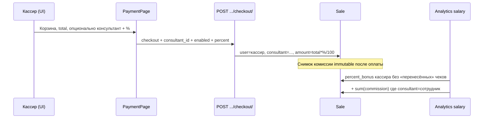

# Маркет — Консультант на продаже и процент от выручки

**Экраны фронта (план):**

- Касса / оплата: `/crm/market/cashier` → `PaymentPage`
- История продаж: `/crm/market/history`
- Карточка сотрудника: `/crm/employ/market/:employeeId`
- Аналитика (ЗП / пользователи): `/crm/market/analytics`
- Настройки кассы (опционально): `/crm/set` → вкладка «Касса»

**Статус:** спецификация для бэкенда + дизайн UX фронта. Реализация фронта — после согласования контракта API.

**Связанное уже существующее:**

- Профиль оплаты сотрудника: `GET/POST/PATCH /main/market-sale-employee-pay-profiles/` (`sales_percent`, схемы `percent` / `salary_plus_percent`)
- Сегодня процент в аналитике ЗП считается от **кассира** (`Sale.user` = кто пробил чек), без отдельного консультанта
- Checkout: `POST /main/pos/sales/{id}/checkout/`

---

## 0. Зачем

В магазине часто работают **два человека**:

| Роль в зале                     | Кто это в системе сейчас   | Что делает                                          |
| ------------------------------- | -------------------------- | --------------------------------------------------- |
| **Консультант / продавец зала** | нет отдельной сущности     | Подбирает товар, консультирует, «закрывает» клиента |
| **Кассир**                      | `Sale.user` + кассир смены | Пробивает чек на кассе                              |

Сейчас вся выручка и `% от продаж` уходят кассиру (`Sale.user`), хотя работу сделал консультант. Нужно:

1. При оплате **опционально** указать консультанта.
2. Указать **процент его выручки с этой продажи** (или не давать процент — кассир сам решает).
3. Жёстко **привязать** консультанта и процент к конкретной продаже (чек / `Sale`).
4. Чтобы ЗП / аналитика считали бонус консультанту по этим привязкам, а не только по «кто сидел на кассе».

---

## 1. Продуктовые правила (согласованное поведение)

### 1.1 Базовые правила

1. Консультант на продаже — **необязателен**. Если не указан — поведение как сейчас (чек только на кассира).
2. Кассир **сам выбирает**: давать процент или нет.

- Не указал консультанта → процента с этой продажи никому «как консультанту» нет.
- Указал консультанта, но **процент = 0 / выключил «начислять %»** → консультант **привязан к продаже** (видно в истории/чеке), но **сумма комиссии = 0**.
- Указал консультанта и процент > 0 → считается комиссия и пишется на продажу.

3. Один консультант на один чек (v1). Несколько консультантов на один чек — **не делаем** в первой версии.
4. Консультант ≠ кассир по смыслу, но **технически может совпадать** с текущим пользователем (если кассир сам консультировал). Разрешаем `consultant_id === cashier_id`.
5. База для процента — **итог чека к оплате** после скидок (то же число, что видит кассир как `total` / `grand_total` перед checkout). Не считать от себестоимости и не от суммы до скидки.
6. Комиссия считается **один раз в момент успешного checkout** и сохраняется на продаже как снимок (`commission_amount`). Поздняя смена профиля оплаты сотрудника **не пересчитывает** уже закрытые чеки.
7. Возврат / частичный возврат: комиссия должна **корректироваться пропорционально** возвращённой сумме (см. §5). Без этого аналитика ЗП разъедется.

### 1.2 Связь с существующим `sales_percent` профиля сотрудника

Сейчас профиль оплаты (`market-sale-employee-pay-profiles`) даёт `% от личных продаж`, где «личные» = чеки с `Sale.user = сотрудник`.

После введения консультанта нужна **одна ясная модель начисления %**, иначе двойная выплата:

| Сценарий                                              | Кому идёт `% с этой продажи`                                                                                    |
| ----------------------------------------------------- | --------------------------------------------------------------------------------------------------------------- |
| Консультант **не** указан                             | Как сейчас: `%` профиля **кассира** (`Sale.user`), если схема `percent` / `salary_plus_percent`                 |
| Консультант указан, начисление % **выкл** или `% = 0` | Никому процент с этой продажи (только факт привязки консультанта)                                               |
| Консультант указан и `% > 0`                          | Только **консультанту** по `% с чека`. В «личные продажи» кассира для `sales_percent` эта продажа **не входит** |

Итого: привязка консультанта с ненулевым % **переносит** процентную мотивацию с кассира на консультанта по этому чеку. Оклад кассира (схема `salary` / база в `salary_plus_percent`) не трогаем — меняется только база для `percent_bonus`.

Дефолт процента в UI: если у выбранного консультанта есть профиль со схемой `percent` или `salary_plus_percent` и заполненным `sales_percent` — подставляем его в поле. Кассир может изменить или обнулить.

### 1.3 Кто может быть консультантом

Список кандидатов — **активные сотрудники компании** (тот же пул, что `/users/employees/`), без отдельной «роли консультант» в v1.

Опционально (рекомендуется на бэке, но не блокер):

- query `?can_be_sale_consultant=1` или отдельный флаг на сотруднике / в профиле оплаты;
- либо просто отдавать всех активных — фильтр на фронте не критичен.

Владелец/админ могут ограничить доступ правом (см. §6).

---

## 2. UX на фронте (как должно выглядеть)

### 2.1 Где вводится — экран оплаты (`PaymentPage`)

Блок **после** выбора клиента и **до** кнопок способа оплаты / «Принять оплату». Не в корзине и не после успешной оплаты — решение кассира относится к оформлению чека.

```
┌─────────────────────────────────────────┐
│ Клиент: [Выбрать / Иван И.]             │
├─────────────────────────────────────────┤
│ ☐ Указать консультанта                  │  ← выкл по умолчанию
│                                         │
│   (если включено)                       │
│   Консультант: [ поиск / список ▼ ]     │
│   ☑ Начислять процент от продажи        │  ← вкл по умолчанию, если выбран консультант
│   Процент: [ 5 ] %                      │  ← префилл из профиля; editable
│   Комиссия ≈ 125.00 сом                 │  ← live preview: total * % / 100
│                                         │
│   подсказка: «Кассир чека — вы.         │
│   Процент получит консультант.»         │
├─────────────────────────────────────────┤
│ Способ оплаты …                         │
│ [ Принять оплату ]                      │
└─────────────────────────────────────────┘
```

**Поведение UI:**

1. Чекбокс «Указать консультанта» выключен → в checkout **не** уходят `consultant_id` / percent (или явно `null`).
2. Включили → обязателен выбор сотрудника; без выбора «Принять оплату» блокируется с понятной ошибкой.
3. «Начислять процент» выключен → уходит `consultant_id` + `consultant_commission_percent: 0` (или `commission_enabled: false` — см. контракт).
4. Процент: число `0…100`, шаг 0.01; пустое при включённом начислении = ошибка валидации.
5. Preview комиссии только на клиенте для удобства; **истина — расчёт на бэке** при checkout (фронт показывает то, что вернул бэк в ответе/чеке).
6. Горячие клавиши кассы не ломаем: блок не перехватывает Enter на «Принять оплату», пока фокус не в инпуте процента.
7. Состояние консультанта **привязано к активной корзине/sale_id** (как клиент): при смене вкладки корзины — своё значение; при успешной оплате — сброс.

### 2.2 История продаж

В таблице и в деталях чека добавить колонки/поля:

- Кассир (как сейчас `user_display`)
- Консультант (`consultant_display` или «—»)
- % / сумма комиссии (если > 0)

Фильтр (желательно): по консультанту — `?consultant=<uuid>`.

### 2.3 Чек / превью чека

Опционально (настраиваемо или всегда мелким шрифтом):

- строка «Консультант: ФИО»
- не печатать сумму комиссии клиенту (это внутренняя мотивация), только ФИО — если владелец не захочет светить %.

Рекомендация v1: в клиентский чек — **только ФИО консультанта** (если указан). Сумму комиссии — только во внутренних экранах (история, ЗП, аналитика).

### 2.4 Карточка сотрудника (маркет)

Блок ЗП / период:

- «Продажи как кассир» (чеки `Sale.user`)
- «Продажи как консультант» (чеки `Sale.consultant`)
- «Комиссия консультанта за период» = сумма `consultant_commission_amount`
- Совместимость со старым `percent_bonus`: пересчитать по правилам §1.2

### 2.5 Аналитика

- Вкладка salary / users: отдельные метрики по консультантам.
- Фильтр `consultant` рядом с существующим `cashier`.

### 2.6 Настройки (опционально, не блокер v1)

В «Касса» / настройках компании:

- `consultant_required_on_sale` — запрет оплаты без консультанта (для магазинов, где всегда есть консультант).
- `default_commission_from_profile` — всегда префиллить % из профиля (фронт и так так делает).
- `show_consultant_on_receipt` — печатать ФИО на чеке.

---

## 3. Модель данных (бэкенд)

### 3.1 Поля на `Sale` (POS-чек)

Добавить на модель продажи (имена можно уточнить, смысл фиксируем):

| Поле                            | Тип                                       | Описание                                                                            |
| ------------------------------- | ----------------------------------------- | ----------------------------------------------------------------------------------- |
| `consultant`                    | FK → User, `null=True`, `blank=True`      | Консультант по чеку                                                                 |
| `consultant_commission_percent` | `Decimal(5,2)`, `null=True`               | % на момент продажи; `null` если консультант не указан                              |
| `consultant_commission_amount`  | `Decimal(12,2)`, `null=True`, default `0` | Сумма комиссии, снимок на checkout                                                  |
| `consultant_commission_enabled` | `bool`, default `False`                   | Явный флаг «начислять %» (удобно отличать «указали 0%» от «не включали начисление») |

Инварианты:

- Если `consultant is null` → `consultant_commission_percent is null`, `amount = 0`, `enabled = false`.
- Если `consultant` задан и `enabled = false` → `percent` сохраняем как `0` или как введённое, но `amount = 0`.
- Если `enabled = true` → `0 <= percent <= 100`, `amount = round(sale_total * percent / 100, 2)`.
- `consultant.company == sale.company` (иначе 400).

Индексы: `(company, consultant, paid_at)` для аналитики ЗП.

### 3.2 Аудит (желательно)

Не обязательно отдельная таблица в v1. Достаточно полей на Sale + `updated` только до оплаты. После `status=paid` поля консультанта **immutable** (менять только через админский/сервисный эндпоинт при необходимости — вне v1).

### 3.3 Возвраты

При `SaleReturn` / возврате позиций:

- Пересчитать или хранить `consultant_commission_amount_refunded`.
- Чистая комиссия консультанта за период = `sum(amount) - sum(refunded)`.
- Пропорция: `refunded = original_amount * (returned_total / original_sale_total)`.

Если возвраты у вас уже уменьшают выручку кассира в salary — применить ту же логику к комиссии консультанта.

---

## 4. Контракт API

### 4.1 Checkout — расширить payload

`POST /main/pos/sales/{id}/checkout/`

**Новые опциональные поля:**

```json
{
  "print_receipt": true,
  "client_id": "...",
  "payment_method": "cash",
  "cash_received": "1000.00",

  "consultant_id": "uuid-or-null",
  "consultant_commission_enabled": true,
  "consultant_commission_percent": "5.00"
}
```

| Поле                            | Обязательность       | Правила                                                                      |
| ------------------------------- | -------------------- | ---------------------------------------------------------------------------- |
| `consultant_id`                 | нет                  | UUID сотрудника компании; отсутствие / `null` = без консультанта             |
| `consultant_commission_enabled` | нет, default `false` | Если `true`, обязателен `consultant_id` и валидный percent                   |
| `consultant_commission_percent` | нет                  | Строка/число decimal; игнорируется или принудительно 0, если `enabled=false` |

**Ошибки 400 (примеры** `detail` **/ field errors):**

- консультант не из этой компании / неактивен;
- `enabled=true` без `consultant_id`;
- percent вне `0…100`;
- если в настройках `consultant_required_on_sale=true` и консультант не передан.

**Ответ checkout / объект Sale** — добавить в сериализацию:

```json
{
  "id": "...",
  "user": "...",
  "user_display": "Кассир Кассович",
  "consultant": "uuid-or-null",
  "consultant_display": "Конс Ультант",
  "consultant_commission_enabled": true,
  "consultant_commission_percent": "5.00",
  "consultant_commission_amount": "125.00",
  "total": "2500.00"
}
```

Расчёт `consultant_commission_amount` **только на сервере** от финального `total` чека после всех скидок.

### 4.2 Получение продажи / список / история

`GET /main/pos/sales/` и `GET /main/pos/sales/{id}/` — те же поля консультанта.

Новый query-параметр списка:

| Параметр           | Описание                            |
| ------------------ | ----------------------------------- |
| `consultant`       | uuid — фильтр по консультанту       |
| `cashier` / `user` | как сейчас (если уже есть) — кассир |

### 4.3 Список кандидатов в консультанты

Вариант A (предпочтительный, без нового эндпоинта): фронт берёт `GET /users/employees/?is_active=1` (уже есть).

Вариант B: `GET /main/pos/sale-consultants/` → короткий список `{ id, full_name, default_commission_percent }` где `default_commission_percent` из pay-profile.

Если делаете B — удобнее для кассы (меньше данных, сразу дефолтный %).

### 4.4 Дефолтный % консультанта

Либо поле в варианте B, либо фронт сам ходит в:

`GET /main/market-sale-employee-pay-profiles/?user=<consultant_id>`

и читает `sales_percent` у схемы `percent` / `salary_plus_percent`.

Бэкенд может упростить жизнь полем на User/Employee read-only: `market_default_sales_percent`.

### 4.5 Аналитика ЗП

`GET /main/analytics/market/?tab=salary` (и при необходимости `tab=users`):

Для каждой строки сотрудника расширить смысл:

| Поле                           | Смысл                                                                                                                                                                                         |
| ------------------------------ | --------------------------------------------------------------------------------------------------------------------------------------------------------------------------------------------- |
| `employee_sales_period`        | Выручка чеков, где сотрудник = **кассир** и **нет** ненулевой комиссии консультанта **либо** по старому правилу — уточнить и зафиксировать: рекомендуется считать «кассовую» выручку отдельно |
| `cashier_sales_period`         | Сумма чеков как кассир (`Sale.user`)                                                                                                                                                          |
| `consultant_sales_period`      | Сумма чеков как консультант (`Sale.consultant`)                                                                                                                                               |
| `consultant_commission_period` | `sum(consultant_commission_amount) - refunds`                                                                                                                                                 |
| `percent_bonus`                | По §1.2: `% профиля` только с чеков без консультантской комиссии + `consultant_commission_period` (если сотрудник был консультантом). **Не суммировать дважды одну и ту же продажу**          |
| `total`                        | оклад + итоговый percent_bonus                                                                                                                                                                |

Минимально достаточный контракт для фронта v1:

```json
{
  "tables": {
    "rows": [
      {
        "user_id": "...",
        "name": "...",
        "pay_scheme": "salary_plus_percent",
        "monthly_base_salary": "20000.00",
        "sales_percent": "5.00",
        "cashier_sales_period": "100000.00",
        "consultant_sales_period": "40000.00",
        "consultant_commission_period": "2000.00",
        "employee_sales_period": "100000.00",
        "percent_bonus": "4500.00",
        "total": "24500.00"
      }
    ]
  }
}
```

Формула `percent_bonus` (рекомендация):

```
percent_bonus =
  (сумма totals чеков, где user=сотрудник И (consultant is null ИЛИ commission_amount=0))
    * sales_percent / 100
  + consultant_commission_period
```

Точные имена полей можно сохранить совместимыми: старый `employee_sales_period` = база для %-профиля кассира (уже без «перенесённых» на консультанта чеков).

Фильтр: `consultant=<uuid>` на вкладках sales/users по возможности.

### 4.6 Чек (receipt JSON)

Добавить:

```json
{
  "cashier": { "id": "...", "name": "..." },
  "consultant": { "id": "...", "name": "..." } | null
}
```

Без суммы комиссии в клиентском receipt (см. §2.3).

---

## 5. Возвраты и отмены — требования к бэку

1. Полный возврат чека → комиссия консультанта за этот чек в периодах становится 0 (или полностью в `refunded`).
2. Частичный возврат → пропорциональное уменьшение.
3. Отмена неоплаченной корзины — полей комиссии ещё нет, ничего делать не нужно.
4. Эндпоинты возврата, которые уже трогают аналитику кассира, должны так же учитывать консультанта.

---

## 6. Права доступа

| Право (предложение)                                          | Кто                   | Зачем                                                                                             |
| ------------------------------------------------------------ | --------------------- | ------------------------------------------------------------------------------------------------- |
| (существующее) `can_view_cashier`                            | кассир                | Достаточно, чтобы **указывать** консультанта на оплате                                            |
| `can_view_market_consultant_commission` (новое, опционально) | owner/admin / старший | Видеть суммы комиссии в истории/аналитике; кассиру на экране оплаты preview можно оставить всегда |
| настройки `consultant_required_on_sale`                      | только owner/admin    | Как cashier-settings                                                                              |

v1 можно обойтись без нового permission: любой с доступом к кассе может назначать консультанта; суммы комиссии видны там же, где сейчас видна ЗП (owner/admin + экран сотрудника).

---

## 7. Что не входит в v1

- Несколько консультантов на один чек / сплит % между ними.
- % на уровне позиции корзины (только на весь чек).
- Автовыбор «последнего консультанта» по клиенту.
- Отдельная системная роль «Консультант» (достаточно списка сотрудников).
- Ручное редактирование консультанта после оплаты.
- Документная продажа склада (`warehouse/documents/` `doc_type=SALE`) — отдельным этапом, если понадобится паритет с POS.

---

## 8. План работ на фронте (после готовности API)

1. `PaymentPage` — блок консультанта + валидация + передача полей в `productCheckout`.
2. `saleThunk.productCheckout` — прокинуть `consultant_id`, `consultant_commission_enabled`, `consultant_commission_percent`.
3. История — колонки и фильтр.
4. Receipt preview — ФИО консультанта.
5. Карточка сотрудника + Analytics salary — новые поля.
6. (Опционально) настройки кассы.

Мягкая деградация: пока бэк не принял новые поля, checkout без них работает как сейчас; после деплоя бэка поля начинают сохраняться.

---

## 9. Приёрочные сценарии

1. Оплата без консультанта → Sale без consultant, ЗП кассира как раньше.
2. Консультант + 5% + total 2000 → `commission_amount = 100.00`, в salary у консультанта +100, у кассира эта продажа не в базе его `sales_percent`.
3. Консультант указан, «начислять %» выкл → consultant заполнен, amount = 0, в истории ФИО есть.
4. Кассир = консультант, 3% → комиссия начисляется этому же user как консультанту; в базе кассирского % этот чек не дублируется.
5. Скидка на чек → % считается от суммы **после** скидки.
6. Возврат 50% чека → комиссия в аналитике уменьшается ~вдвое.
7. Неактивный / чужой user в `consultant_id` → 400, оплата не проходит.
8. Percent 101 → 400.

---

## 10. Краткая схема потока



---

## 11. Открытые вопросы к бэку (ответить в PR / комментарии)

1. Подтверждаете формулу §1.2 / §4.5 (при консультанте с % > 0 кассирский `sales_percent` по этому чеку не капает)?
2. Делаем отдельный `GET /main/pos/sale-consultants/` или хватает `/users/employees/` + pay-profiles?
3. Нужен ли флаг компании `consultant_required_on_sale` в v1?
4. Печатать ли ФИО консультанта на фискальном/обычном чеке сразу?
5. Как сейчас устроен возврат POS — есть ли уже пропорциональный пересчёт бонусов, куда встраивать комиссию?

---

**Контакты по фронту:** экран оплаты `src/Components/Sectors/Market/CashierPage/PaymentPage.jsx`, thunk `src/store/creators/saleThunk.js` → `productCheckout`, профили `%` — `MarketSaleEmployeePayProfileModal.jsx`.
