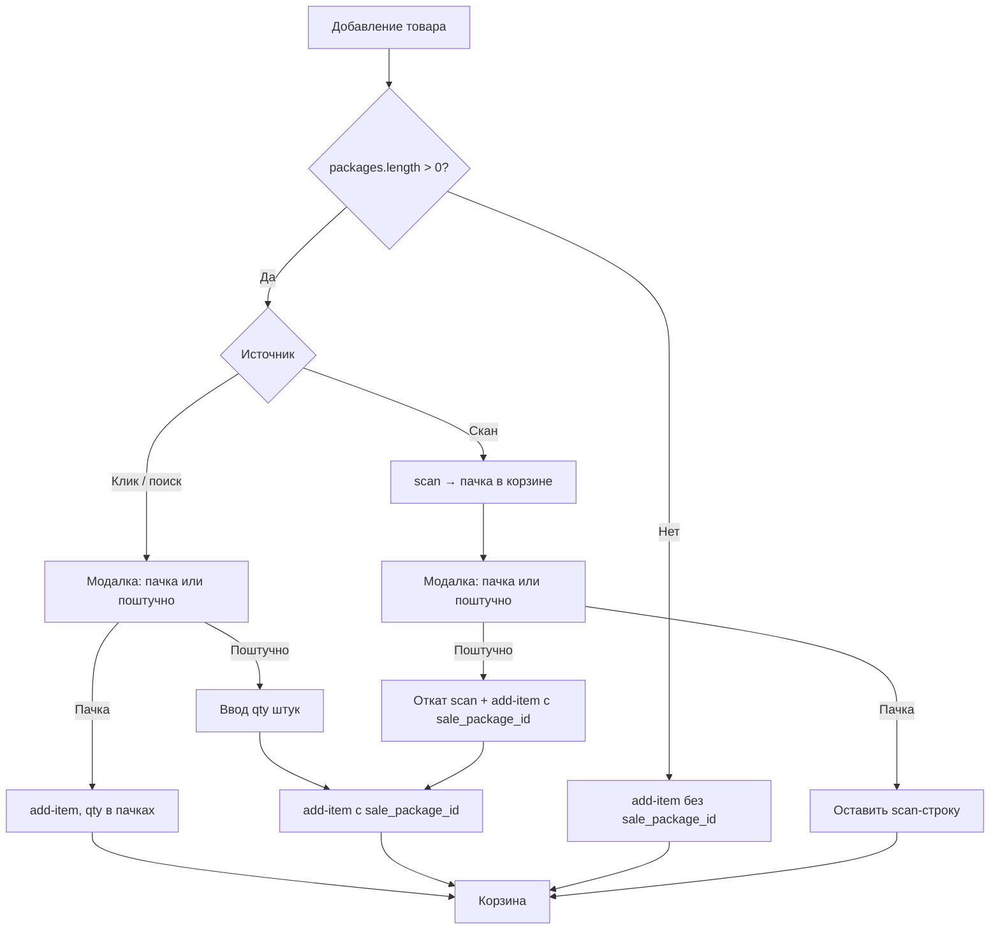

# Маркет: поштучная продажа из упаковки — спецификация для мобильной кассы

Документ описывает логику **пачка / поштучно** в кассе маркета так, как она реализована в веб-кассе (`CashierPage.jsx`), чтобы мобильный клиент повторил поведение 1:1.

**Связанные документы:**

| Документ | Содержание |
|----------|------------|
| [market_pack_piece_sale_frontend.md](./market_pack_piece_sale_frontend.md) | API бэкенда, поля товара, ошибки |
| [MARKET_POS_CART_FRONTEND_API.md](./MARKET_POS_CART_FRONTEND_API.md) | Корзина POS, PATCH, скидки |
| [pos_pack_piece_sale.md](./pos_pack_piece_sale.md) | Полная логика бэкенда |

**Базовый URL:** `/api/main/`  
**Авторизация:** `Authorization: Bearer <token>`

**Исходники веб-кассы:**

- `src/Components/Sectors/Market/CashierPage/CashierPage.jsx`
- `src/Components/Sectors/Market/CashierPage/components/PieceSaleModal.jsx`
- `tools/marketPackPieceSale.js`

---

## 1. Бизнес-смысл

Типичный кейс — **сигареты** и аналогичные товары:

- на **складе** остаток ведётся в **упаковках** (`unit = "упак."`, `"пачка"` и т.п.);
- на **кассе** нужно продавать:
  - **целую упаковку** (пачку);
  - **отдельные штуки** из этой упаковки.

Это не весовой товар и не обычный штучный товар. Признак — у товара есть непустой массив `packages`.

---

## 2. Когда включать логику «пачка / поштучно»

```javascript
const supportsPieceFromPack = (product) =>
  Array.isArray(product?.packages) && product.packages.length > 0;
```

Если `packages` пустой — товар добавляется как обычно, `sale_package_id` **не передаётся**.

Рекомендуется портировать утилиты из `tools/marketPackPieceSale.js` без изменений.

---

## 3. Модель данных товара

Источники: `GET /api/main/products/list/`, `GET /api/main/products/{id}/`, barcode-lookup.

### Основные поля

| Поле | Смысл |
|------|--------|
| `unit` | Учётная единица склада (`"упак."`, `"пачка"`) |
| `quantity` | Остаток **в учётных единицах** (число пачек, не штук) |
| `price` | Розница **за одну учётную единицу** (за пачку) |
| `purchase_price` | Закупка **за одну учётную единицу** (за пачку) |
| `packages` | Массив упаковок (read-only) |

### Упаковка (`packages[]`)

| Поле | Тип | Описание |
|------|-----|----------|
| `id` | uuid | Передаётся на кассе как `sale_package_id` |
| `name` | string | Подпись («Пачка», «Блок») |
| `quantity_in_package` | string decimal | Сколько **штук** в одной учётной единице (например `"20.000"`) |
| `unit` | string | Единица штуки (часто `"шт."`); если пусто — как у товара |
| `piece_unit_price` | string decimal \| null | Розничная цена **одной штуки** на кассе |

### Пример ответа

```json
{
  "id": "a1b2c3d4-…",
  "name": "Сигареты Example",
  "unit": "упак.",
  "quantity": "12.000",
  "price": "300.00",
  "purchase_price": "240.00",
  "packages": [
    {
      "id": "pkg-uuid-…",
      "name": "Пачка",
      "quantity_in_package": "20.000",
      "unit": "шт.",
      "piece_unit_price": "15.00"
    }
  ]
}
```

### Выбор упаковки по умолчанию

```javascript
function getDefaultPackage(product) {
  const pkgs = product?.packages;
  if (!Array.isArray(pkgs) || !pkgs.length) return null;
  return (
    pkgs.find((pkg) => Number(pkg?.quantity_in_package) > 0) || pkgs[0] || null
  );
}
```

### Цена за штуку (для UI)

```javascript
function pieceUnitPrice(product, pkg) {
  if (pkg?.piece_unit_price != null && pkg.piece_unit_price !== "") {
    return Number(pkg.piece_unit_price);
  }
  const ipp = Number(pkg?.quantity_in_package);
  if (ipp > 0) return Number(product?.price || 0) / ipp;
  return Number(product?.price || 0);
}
```

Если `piece_unit_price = null` (старые записи) — бэкенд считает `price / quantity_in_package`.

---

## 4. Два режима строки корзины

| Режим | `sale_package` | `quantity` означает | `unit_price` |
|-------|----------------|---------------------|--------------|
| **Пачка** | `null` | число **пачек** | цена за пачку (`product.price`) |
| **Поштучно** | UUID упаковки | число **штук** | цена за штуку (`piece_unit_price`) |

### Две строки одного товара

Допустимо одновременно:

| Строка | `sale_package` | `quantity` | Списание со склада |
|--------|----------------|------------|-------------------|
| 1 | `null` | `2` | −2 пачки |
| 2 | `pkg-uuid` | `5` | −5/20 = −0.25 пачки |

Строки **не объединяются** между собой — только при совпадении `(product_id, sale_package)`.

**Уникальный ключ строки на UI:** `itemId` (id позиции в корзине), **не** `productId`.

Маппинг из API:

```javascript
const salePackage = item.sale_package ?? item.sale_package_id ?? null;
```

---

## 5. API

### 5.1. Добавление в корзину

```http
POST /api/main/pos/sales/{cart_id}/add-item/
```

**Пачка (целая упаковка):**

```json
{
  "product_id": "a1b2c3d4-…",
  "quantity": "1"
}
```

**Поштучно:**

```json
{
  "product_id": "a1b2c3d4-…",
  "quantity": "7",
  "sale_package_id": "pkg-uuid-…"
}
```

| Поле | Обязательное | Описание |
|------|--------------|----------|
| `product_id` | да | UUID товара |
| `quantity` | нет | По умолчанию `1`. При `sale_package_id` — **штуки** |
| `sale_package_id` | нет | UUID из `product.packages[].id` |
| `unit_price` | нет | Переопределяет цену за штуку |
| `discount_total` | нет | Скидка на строку (сумма) |

**Без `sale_package_id`** — обычная продажа: `quantity` в единицах склада (пачки).  
**С `sale_package_id`** — поштучно: `quantity` = число штук.

### 5.2. Ответ позиции корзины

```json
{
  "id": "item-uuid",
  "product": "a1b2c3d4-…",
  "product_name": "Сигареты Example",
  "quantity": "7.000",
  "unit_price": "15.00",
  "line_discount": "0.00",
  "sale_package": "pkg-uuid-…",
  "display_name": "Сигареты Example",
  "line_total": "105.00"
}
```

Расчёт суммы строки:

```text
line_total = unit_price × quantity - line_discount
```

Для поштучной строки: 7 шт × 15 = 105.

### 5.3. Обновление количества

```http
PATCH /api/main/pos/carts/{cart_id}/items/{item_id}/
```

```json
{ "quantity": "10" }
```

`sale_package` **нельзя изменить** — для смены режима удалите строку и добавьте заново.

### 5.4. Скан штрихкода

```http
POST /api/main/pos/sales/{cart_id}/scan/
```

Скан **всегда** добавляет товар **без** `sale_package` — в **учётных единицах** (целая пачка).  
Поштучная продажа после скана — только через отдельный UI.

### 5.5. Подгрузка товара с packages

Если в списке товаров нет `packages` или массив пустой, но товар может поддерживать поштучную продажу:

```http
GET /api/main/products/{product_id}/
```

---

## 6. UX-потоки (как в веб-кассе)

### 6.1. Клик по карточке товара

```
Клик по товару
  ├─ packages пустой → add-item без sale_package_id, qty = 1
  └─ packages есть → модалка «Как добавить в корзину?»
       ├─ «Целая {pkg.name}» → add-item без sale_package_id, qty = 1
       └─ «Поштучно» → экран ввода количества штук → add-item с sale_package_id
```

Модалка (`PieceSaleModal`) — два шага:

1. **choice** — выбор «Целая пачка» / «Поштучно» с подсказками цен;
2. **quantity** — ввод целого числа штук, превью `piecePrice × qty`.

Тексты в модалке:

- Заголовок: имя товара;
- Подзаголовок: `Остаток: {product.quantity} {product.unit}`;
- Вариант «Пачка»: `{product.price} сом за {product.unit}`;
- Вариант «Поштучно»: `{piecePrice} сом за {pkg.unit} ({quantity_in_package} {unit} в {pkg.name})`;
- Лимит: `Доступно до {maxQty} {unit}`.

### 6.2. Скан штрихкода

```
Скан → add-item как пачка (sale_package = null)
  └─ если supportsPieceFromPack(product):
       показать модалку выбора
       ├─ «Пачка» → оставить результат скана (ничего не делать)
       └─ «Поштучно» →
            1) откатить добавленную пачку (revertScanPackLine):
               - если qty = 1 → DELETE item
               - если qty > 1 → PATCH quantity - 1
            2) add-item с sale_package_id и введённым qty
```

При скане в модалку передаётся `maxQuantity` — максимум штук с учётом уже добавленных в корзину строк этого товара.

### 6.3. Быстрая кнопка «+1 шт»

На карточке товара (если есть `packages`) — кнопка:

```text
+1 шт (из {quantity_in_package})
```

Сразу вызывает:

```javascript
addToCartWithPackage(product, piecePackage.id, 1);
// sale_package_id = pkg.id, quantity = 1 штука
```

Та же кнопка есть в модалке горячих клавиш (`HotkeyProductsModal`).

### 6.4. Поиск + Enter

Если найден товар с `packages` — показать модалку выбора, иначе добавить пачку.

### 6.5. Повторное добавление (склейка строк)

Перед `add-item` проверять локальную корзину:

```javascript
const existingLine = cart.find(
  (line) =>
    !line.isCustom &&
    String(line.productId) === String(product.id) &&
    String(line.salePackage ?? "") === String(salePackageId ?? ""),
);
```

- строка есть → `PATCH` с `quantity = current + qtyToAdd`;
- строки нет → `POST add-item`.

Дефолтное количество при добавлении:

- **пачка:** `1` (для весовых с остатком `< 1` — весь остаток);
- **поштучно:** `1` штука (или переданный `quantityOverride`).

---

## 7. Валидация остатка

Склад хранит **пачки** (`product.quantity`). В корзине учитываются **все** строки этого товара.

### Перевод штук в пачки

```javascript
function consumePacks(qty, salePackageId, packages) {
  const q = Number(qty);
  if (!salePackageId) return q;
  const pkg = (packages || []).find((p) => p.id === salePackageId);
  const ipp = Number(pkg?.quantity_in_package ?? 0);
  if (ipp <= 0) throw new Error("quantity_in_package must be > 0");
  return Math.round((q / ipp) * 1000) / 1000;
}
```

### Суммарное потребление по товару

```javascript
function calcTotalConsumeForProduct(items, productId, productsList) {
  const product = productsList.find((p) => p.id === productId);
  return items
    .filter((item) => (item.product || item.product_id) === productId)
    .reduce((sum, item) => {
      const qty = parseFloat(item.quantity) || 0;
      if (item.sale_package) {
        const pkg = product?.packages?.find((p) => p.id === item.sale_package);
        const qip = Number(pkg?.quantity_in_package);
        return sum + (qip > 0 ? qty / qip : 0);
      }
      return sum + qty;
    }, 0);
}
```

### Максимум доступных штук

```javascript
function maxPiecesAvailable(stockPacks, otherConsumePacks, pkg) {
  const ipp = Number(pkg?.quantity_in_package);
  const freePacks = Math.max(0, Number(stockPacks) - otherConsumePacks);
  return Math.floor(freePacks * ipp);
}
```

При добавлении поштучно:

```javascript
const otherConsume = calcTotalConsumeForProduct(items, product.id, products);
const maxQty = maxPiecesAvailable(product.quantity, otherConsume, pkg);
```

При скане `otherConsume` считается с учётом только что добавленной пачки (минус 1 пачка перед выбором «поштучно»).

### Проверки при изменении quantity

**Пачка** (`salePackage = null`):

```text
newQty <= product.quantity
```

**Поштучно** (`salePackage != null`):

```javascript
const qip = Number(pkg.quantity_in_package);
const totalConsume = calcTotalConsumeForProduct(items, productId, products);
const newTotalConsume = totalConsume - currentQty / qip + newQty / qip;
// newTotalConsume <= product.quantity
```

При превышении — предупреждение «Недостаточно товара» / 400 от API:

```json
{
  "detail": "Недостаточно остатка (учёт в пачках). Доступно не более X.XXX условных пачек с учётом корзины."
}
```

---

## 8. Отображение в UI

### 8.1. Карточка товара в каталоге

- Бейдж **пачек** — количество строки **без** `salePackage`;
- Бейдж **штуч** (отдельный стиль) — количество строки **с** `salePackage`, подпись «шт.»;
- Карточка подсвечена, если есть **любая** из двух строк.

### 8.2. Строка корзины

```javascript
// Имя
item.name + (item.salePackage ? " (штуч)" : "");

// Единица измерения
function cartItemUnitLabel(item, product) {
  if (item.salePackage || item.sale_package) {
    const salePackageId = item.salePackage || item.sale_package;
    const pkg = product?.packages?.find((p) => p.id === salePackageId);
    return pkg?.unit || "шт.";
  }
  return product?.unit || item?.unit || "шт.";
}

// Подпись поля цены
// пачка:  «Цена»
// штучно: «Цена / {unit}»  (например «Цена / шт.»)

// Подзаголовок строки
`${quantity} ${unit} × ${unit_price}`
```

Примеры:

```text
Сигареты Example (штуч) — 7 шт. × 15.00 = 105.00 сом
Сигареты Example — 2 упак. × 300.00 = 600.00 сом
```

### 8.3. Ввод количества

| Режим | Допустимый ввод |
|-------|-----------------|
| Пачка | Целые числа (дробные — только для весовых товаров) |
| Поштучно | Только целые числа (`/^\d+$/`) |

---

## 9. Состояние модалки (мобильный клиент)

```typescript
type PieceSaleModalState = {
  product: Product;
  step: "choice" | "quantity";
  source: "click" | "scan";
  scanCartItemId?: string;  // только при source = "scan"
  maxQuantity?: number | null;  // лимит штук (при скане)
} | null;
```

Поведение:

| `source` | Выбор «Пачка» | Выбор «Поштучно» |
|----------|---------------|------------------|
| `click` | `add-item` без `sale_package_id` | `add-item` с `sale_package_id` |
| `scan` | закрыть модалку, оставить scan-строку | откат scan + `add-item` с `sale_package_id` |

---

## 10. Диаграмма потока



---

## 11. Чеклист для мобильного разработчика

### Данные

- [ ] Парсить `packages` из `GET /products/list/` и `GET /products/{id}/`
- [ ] Нормализовать `packages: []` если поле отсутствует
- [ ] Подгружать полный товар по `GET /products/{id}/`, если `packages` нет в списке

### Утилиты

- [ ] `supportsPieceFromPack`
- [ ] `getDefaultPackage`
- [ ] `pieceUnitPrice`
- [ ] `calcTotalConsumeForProduct`
- [ ] `maxPiecesAvailable`
- [ ] `cartItemUnitLabel`
- [ ] `isPieceSaleCartLine` / `formatCartLineNameSuffix`

### Добавление товара

- [ ] Модалка выбора для товаров с `packages` (2 шага: choice → quantity)
- [ ] После скана — та же модалка + откат пачки при выборе «поштучно»
- [ ] Кнопка «+1 шт (из N)» на карточке товара
- [ ] `add-item` с `sale_package_id` для штук, без — для пачек
- [ ] Склейка строк по `(product_id, sale_package)`

### Корзина

- [ ] Хранить `salePackage` на каждой строке; ключ UI — `itemId`
- [ ] Две строки одного товара — показывать отдельно
- [ ] Подпись `(штуч)` в имени поштучной строки
- [ ] Единицы: `шт.` vs `product.unit`
- [ ] Валидация остатка с учётом **всех** строк товара
- [ ] `sale_package` не менять через PATCH

### Ограничения

- [ ] Не использовать `sale_package_id` в агентской корзине (только POS `/api/main/pos/…`)

---

## 12. Пример end-to-end

Товар: **12 пачек** на складе, **20 шт/пачка**, цена пачки **300**, штука **15**.

| Действие | API | Результат в корзине | Списание |
|----------|-----|---------------------|----------|
| +1 пачка | `add-item`, qty=1 | 1 строка, `sale_package=null`, qty=1 | −1 пачка |
| +5 штук | `add-item`, `sale_package_id`, qty=5 | 2-я строка, qty=5 | −0.25 пачки |
| Скан | `scan` | 3-я строка как пачка | −1 пачка |
| Выбор «поштучно» 3 шт | откат scan + `add-item` | 2 строки: 5 шт + 1 пачка | итого −1.15 пачки |

Итоговая корзина:

```text
Сигареты Example — 1 упак. × 300.00
Сигареты Example (штуч) — 5 шт. × 15.00
```

---

## 13. Smoke-тест

1. Создать товар: `unit = упак.`, `packages_input` с `quantity_in_package: 20`, `piece_unit_price: 15`.
2. `GET products/{id}/` — в ответе непустой `packages`.
3. POS: `add-item` без `sale_package_id`, `quantity: 1` → минус 1 пачка, цена 300.
4. POS: `add-item` с `sale_package_id`, `quantity: 5` → в корзине две строки; остаток −1.25 пачки суммарно.
5. Scan того же товара → добавляется строка **без** `sale_package` (пачка) → модалка выбора.
6. Выбор «поштучно», qty=3 → scan-строка откатывается, добавляется поштучная строка.
7. Чекаут → в продаже обе строки с корректными `sale_package` и суммами.

---

## 14. Ограничения и заметки

| Контекст | Поштучно из упаковки |
|----------|----------------------|
| POS (`/api/main/pos/…`) | **Да** |
| Агентская корзина (`/api/main/agents/me/carts/…`) | **Нет** — `sale_package_id` → 400 |

Минимальная цена без скидки для поштучной строки = `purchase_price / quantity_in_package`.

При ошибке упаковки (нет `quantity_in_package`) показывать:  
«Для поштучной продажи не найдена корректная упаковка товара».
