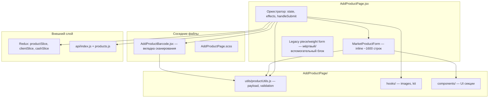
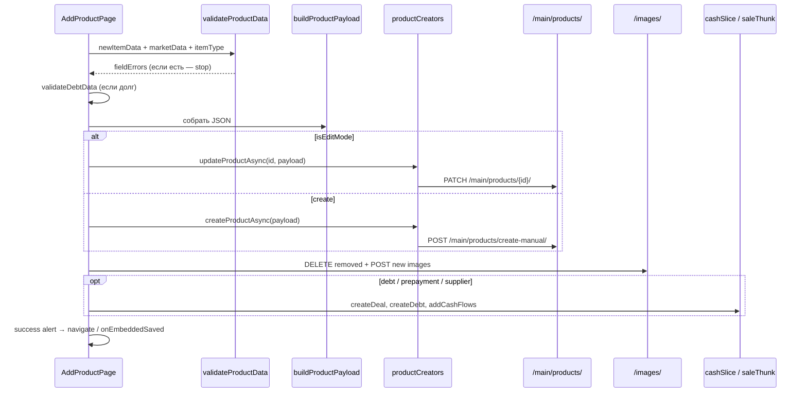

# AddProductPage — документация компонента

> **Файл:** `src/Components/Deposits/Sklad/AddProductPage.jsx` (~3619 строк)  
> **Дата:** 24 августа 2026  
> **Связанные документы:** [add-product-to-warehouse.md](../market/add-product-to-warehouse.md), [alternate-barcodes.md](../market/alternate-barcodes.md), [service-kind-no-quantity.md](../market/service-kind-no-quantity.md)

---

## Содержание

1. [Назначение](#1-назначение)
2. [Маршруты и точки входа](#2-маршруты-и-точки-входа)
3. [Архитектура компонента](#3-архитектура-компонента)
4. [Режимы работы](#4-режимы-работы)
5. [Состояние формы](#5-состояние-формы)
6. [UI: вкладки и секции формы](#6-ui-вкладки-и-секции-формы)
7. [Типы товаров (kind)](#7-типы-товаров-kind)
8. [Отправка данных (handleSubmit)](#8-отправка-данных-handlesubmit)
9. [API-контракт](#9-api-контракт)
10. [Вкладка «Сканирование» (AddProductBarcode)](#10-вкладка-сканирование-addproductbarcode)
11. [Embedded-режим](#11-embedded-режим)
12. [Модульная структура AddProductPage/](#12-модульная-структура-addproductpage)
13. [Redux и внешние зависимости](#13-redux-и-внешние-зависимости)
14. [Сценарии навигации (location.state)](#14-сценарии-навигации-locationstate)
15. [Известные ограничения и технический долг](#15-известные-ограничения-и-технический-долг)

---

## 1. Назначение

`AddProductPage` — **универсальная страница создания и редактирования номенклатуры** в legacy-модуле склада (`Deposits/Sklad`). Несмотря на расположение в общем модуле, фактически реализует **полноценную карточку товара маркета**: типы «товар / услуга / комплект», акции, упаковки, PLU, поставщик, долги, изображения.

Используется:

| Контекст | Как открывается |
|---|---|
| Склад маркета | `/crm/sklad/add-product`, кнопка «Создать товар» в `Warehouse.jsx` |
| Редактирование | `/crm/sklad/add-product/:id` из `ProductDetail.jsx` |
| Дублирование | `/crm/sklad/add-product` + `location.state.duplicate` |
| Скан с глобального каталога | `/crm/sklad/add-product` + `openScanTab` / `initialScanBarcode` |
| Приход от поставщика | Embedded-модалка в `SupplierReceiptPage.jsx` |
| Заголовок CRM | Breadcrumb «Товар» в `Header.jsx` |

> **Важно:** компонент лежит в `Deposits/`, но **не изолирован по сектору** — изменения затрагивают маркет и все маршруты, где подключён `/crm/sklad/add-product`.

---

## 2. Маршруты и точки входа

### CRM-маршруты (`src/config/routes/commonRoutes.jsx`)

| Путь | Режим |
|---|---|
| `/crm/sklad/add-product` | Создание |
| `/crm/sklad/add-product/:id` | Редактирование (`useParams().id`) |

Оба маршрута lazy-loaded и обёрнуты в `createProtectedRoute` (проверка подписки).

### Props компонента

```jsx
<AddProductPage
  embedded={false}                    // встроен в модалку, без полноэкранной навигации
  embeddedPrefillSupplierId=""        // UUID поставщика при embedded
  embeddedReturnTo=""                 // путь возврата (fallback: location.state.returnTo → /crm/sklad)
  onEmbeddedClose={null}              // callback «Назад» / закрытие модалки
  onEmbeddedSaved={null}              // callback после успешного сохранения
  forceProductOnly={false}            // скрыть выбор «Услуга / Комплект»
/>
```

---

## 3. Архитектура компонента



### Разделение ответственности

| Слой | Файл | Ответственность |
|---|---|---|
| Оркестратор | `AddProductPage.jsx` | Роутинг режимов, загрузка товара, submit, долги/касса, табы |
| Форма маркета | `MarketProductForm` (в том же файле, ~стр. 2023) | Вся разметка полей, расчёт цен, kit picker, поставщик |
| Payload / validation | `utils/productUtils.js` | `buildProductPayload`, `validateProductData` |
| Сканирование | `AddProductBarcode.jsx` | Отдельный flow через global-barcode + create-by-barcode |
| UI-куски | `components/*` | TypeSelector, BasicInfo, Images, PromotionRules, KitModal |

---

## 4. Режимы работы

### 4.1. Создание (по умолчанию)

- Заголовок: «Создание товара»
- Доступны вкладки **«Ввод вручную»** и **«Сканирование»**
- После успеха — alert + redirect через 1.5 с на `returnToPath`
- Дополнительно: cashflow, сделки, долги (см. [раздел 8](#8-отправка-данных-handlesubmit))

### 4.2. Редактирование (`/crm/sklad/add-product/:id`)

- `isEditMode = !!productId`
- При монтировании: `GET /main/products/{id}/` → заполнение формы
- Вкладка «Сканирование» **скрыта**
- `updateProductAsync` вместо `createProductAsync`
- Изображения: удаление с сервера убранных, upload новых с `file`
- Cashflow и сделки при редактировании **не создаются**

### 4.3. Дублирование

`location.state.duplicate === true` + `location.state.productData`:

- Копируются все поля, **кроме** `barcode` и `quantity` (очищаются)
- `initialProductImageIds` сбрасывается (новый товар)
- Router state очищается через `replace: true`

### 4.4. Embedded (модалка)

Пример — `SupplierReceiptPage.jsx`:

```jsx
<AddProductPage
  embedded
  forceProductOnly
  embeddedPrefillSupplierId={selectedSupplierId}
  embeddedReturnTo="/crm/market/procurement/receipt"
  onEmbeddedClose={() => setCreateProductOpen(false)}
  onEmbeddedSaved={async () => { /* закрыть + обновить список */ }}
/>
```

- `handleReturn` вызывает `onEmbeddedClose`, не `navigate`
- После save — `onEmbeddedSaved`, без перехода по URL
- `forceProductOnly` — только `kind=product`

---

## 5. Состояние формы

### 5.1. `newItemData` — основные поля

| Поле | Описание |
|---|---|
| `name` | Наименование * |
| `barcode` | Основной штрихкод * |
| `brand_name` | Название бренда (строка, не UUID) |
| `category_name` | Название категории |
| `price` | Цена продажи (до 3 знаков после запятой) |
| `wholesale_price` | Оптовая цена |
| `quantity` | Остаток на складе |
| `client` | UUID поставщика |
| `purchase_price` | Закупочная цена |
| `plu` | PLU для весов |
| `scale_type` | Legacy: `piece` / `weight` |

### 5.2. `marketData` — расширенные поля маркета

| Поле | Описание |
|---|---|
| `code`, `article` | Внутренний код, артикул |
| `hotkeyGroup` | Группа горячих клавиш кассы (1 буква → UPPERCASE в API) |
| `unit` | Единица измерения (по умолчанию `шт`) |
| `isWeightProduct` | Весовой товар |
| `isFractionalService` | Дробная услуга |
| `plu` | PLU (дублирует/синхронизируется с `newItemData.plu`) |
| `height`, `width`, `depth`, `weight` | Габариты → `characteristics` |
| `description` | Описание |
| `country` | Страна (dropdown из `data/countries.js`) |
| `markup`, `discount` | Наценка %, скидка % |
| `expiryDate` | Срок годности |
| `kitProducts` | Состав комплекта |
| `enablePieceSale` | Тумблер поштучной продажи через упаковки |
| `packagings` | Массив упаковок `{ id, name, quantity, pieceUnitPrice }` |
| `stock` | **Акционный товар** (не «есть на складе»!) |
| `promotionRules` | Ступени акции → `promotion_rules_input` |
| `alternateBarcodesText` | Доп. штрихкоды (многострочное поле) |
| `minStock` | Мин. остаток (**не отправляется в API**, только UI) |

### 5.3. Прочее состояние

| State | Назначение |
|---|---|
| `itemType` | `product` \| `service` \| `kit` → API `kind` |
| `activeTab` | `0` ручной ввод, `1` сканирование |
| `images` | Массив `{ file, preview, alt, is_primary, id? }` — хук `useProductImages` |
| `debt`, `amount`, `debtMonths`, `debtState` | Долг / предоплата поставщику |
| `fieldErrors` | Ошибки валидации по полям |
| `brandQuery`, `categoryQuery` | Серверный поиск справочников (debounce 350 ms) |

### 5.4. Автоматические эффекты

| Эффект | Поведение |
|---|---|
| PLU для весовых | При включении `isWeightProduct` / `isFractionalService` — автоподстановка `weightProductsCount + 1`, если PLU пуст |
| Цена от наценки | В `MarketProductForm`: `price = purchase_price × (1 + markup/100)` пока пользователь не менял цену вручную |
| Цена комплекта | Сумма `kitProducts[].price × quantity`, автообновление |
| Router state cleanup | `initialScanBarcode` / `openScanTab` читаются один раз, state сбрасывается |
| Prefill supplier | `embeddedPrefillSupplierId` или `location.state.prefillSupplierId` → `newItemData.client` |

---

## 6. UI: вкладки и секции формы

### Вкладка «Ввод вручную» → `MarketProductForm`

Порядок секций (упрощённо):

1. **ProductTypeSelector** — Товар / Услуга / Комплект (скрыт при `forceProductOnly`)
2. **ProductBasicInfo** — название, код, штрихкод, артикул, доп. штрихкоды, генерация EAN-13
3. **ProductImagesSection** — drag & drop, primary image
4. **Категория / Бренд** — `SearchSelect` + inline-создание
5. **Поставщик** — `useSearchableOptions` → `GET /main/clients/?type=suppliers`
6. **Для `product`:** цены, количество, весовой тумблер, PLU, упаковки, акция (`PromotionRulesEditor`), тип оплаты (долг/предоплата)
7. **Для `service`:** цена, скидка, дробная услуга
8. **Для `kit`:** `KitProductsPickerModal`, состав, автоцена
9. **Общее:** страна, габариты, описание, срок годности, мин. остаток
10. Кнопки «Сохранить» / «Отмена»

### Вкладка «Сканирование» → `AddProductBarcode`

Отдельный компонент с собственным submit-flow (см. [раздел 10](#10-вкладка-сканирование-addproductbarcode)).

### Legacy-блок (стр. ~1400–2020)

Форма «Штучный / Килограммовый» с упрощёнными полями. В текущей логике рендерится **только когда `loadingProduct === true`** (промежуточное состояние загрузки в edit mode). Основной UX для всех секторов — `MarketProductForm`.

---

## 7. Типы товаров (kind)

| UI `itemType` | API `kind` | Особенности |
|---|---|---|
| `product` | `product` | Обязательны `purchase_price`, `price`, `quantity`; акции, упаковки, PLU |
| `service` | `service` | `quantity=0`, `purchase_price=0`, без акций; опционально `is_weight` (дробная услуга) |
| `kit` | `bundle` | Обязателен состав (`kitProducts`); `packages_input` из позиций комплекта |

Маппинг в `buildProductPayload` (`utils/productUtils.js`).

### Поле `stock` — частая путаница

В API **`stock` = акционный товар** (ступенчатые скидки через `promotion_rules_input`), **не** флаг наличия на складе. Остаток — поле `quantity`.

---

## 8. Отправка данных (handleSubmit)

**Точка входа:** `handleSubmit` (~стр. 774).

### Поток



### Побочные операции (только создание)

| Условие | Действие |
|---|---|
| `debt === "Долги"` + поставщик | `POST /main/debts/` (тариф «Старт») + `createDeal` |
| `debt === "Предоплата"` | `createDeal` с `prepayment` |
| `!debt && !isEditMode && amount > 0` | `addCashFlows` — расход «Склад», сумма = `qty × purchase_price` (или сумма предоплаты) |
| `client && !debt` | `createDeal` со статусом «Продажа» |

Статус cashflow: `approved` на тарифе «Старт», иначе `pending`.

### Загрузка изображений

После save:

1. **Edit:** `DELETE /main/products/{id}/images/{imageId}/` для удалённых
2. **New files:** `POST /main/products/{id}/images/` (FormData: `image`, `alt`, `is_primary`)

Ошибки upload **не блокируют** основной flow (только `console.warn`).

---

## 9. API-контракт

Детальная таблица полей — в [docs/market/add-product-to-warehouse.md](../market/add-product-to-warehouse.md).

### Основные endpoints

| Операция | Метод | URL |
|---|---|---|
| Создание | POST | `/main/products/create-manual/` |
| Обновление | PATCH | `/main/products/{id}/` |
| Чтение (edit) | GET | `/main/products/{id}/` |
| Изображения | POST/DELETE | `/main/products/{id}/images/` |
| Бренды | GET | `/main/brands/` (+ search, pagination) |
| Категории | GET | `/main/categories/` |
| Поставщики | GET | `/main/clients/?type=suppliers` |
| Долг | POST | `/main/debts/` |

### Сборка payload

```javascript
import { buildProductPayload, validateProductData } from './AddProductPage/utils/productUtils';

const payload = buildProductPayload({
  newItemData,
  marketData,
  itemType,           // "product" | "service" | "kit"
  weightProductsCount // из productSlice для автоп PLU
});
```

Ключевые поля payload см. `productUtils.js:205–315`.

---

## 10. Вкладка «Сканирование» (AddProductBarcode)

**Файл:** `src/Components/Deposits/Sklad/AddProductBarcode.jsx`

Отдельный сценарий добавления через **глобальный каталог штрихкодов**:

1. Скан / ввод штрихкода → `getProductByBarcodeAsync`
2. Prefill формы из global product
3. Submit → `createProductWithBarcode` → `POST /main/products/create-by-barcode/`

Переиспользует из `AddProductPage/`:

- `PromotionRulesEditor`
- `buildPromotionRulesInput`, `parseAlternateBarcodesForApi`

Props от родителя:

| Prop | Назначение |
|---|---|
| `initialBarcode` | Автопоиск при переходе со склада (global product) |
| `selectCashBox` | Касса для cashflow |
| `onShowSuccessAlert` / `onShowErrorAlert` | Callbacks в AlertModal родителя |

Триггер с `Warehouse.jsx`:

```javascript
navigate("/crm/sklad/add-product", {
  state: { openScanTab: true, initialScanBarcode: scanned },
});
```

---

## 11. Embedded-режим

Используется когда карточку товара нужно создать **не покидая другой экран** (приход от поставщика).

| Prop | Поведение |
|---|---|
| `embedded={true}` | Кнопка «Назад» → `onEmbeddedClose` |
| `embeddedPrefillSupplierId` | Предзаполнение поля поставщика |
| `embeddedReturnTo` | Fallback path (не используется при embedded close) |
| `forceProductOnly={true}` | Скрыт `ProductTypeSelector`, `itemType` принудительно `product` |
| `onEmbeddedSaved` | Вызывается вместо `navigate` после успеха |

---

## 12. Модульная структура AddProductPage/

```
AddProductPage/
├── constants.js              # ITEM_TYPES, TABS, DEFAULT_*
├── utils/
│   ├── productUtils.js       # buildProductPayload, validateProductData, promotion rules
│   ├── debtUtils.js          # createDebt, validateDebtData
│   ├── barcodeUtils.js       # generateEAN13Barcode (используется Production)
│   ├── kitPickerUtils.js     # filterKitCompositionCandidates, filterKitPickerList
│   └── index.js
├── hooks/
│   ├── useProductImages.js   # ✅ используется
│   ├── useKitProducts.js     # ✅ используется
│   ├── useProductPriceCalculation.js  # ⚠️ дублируется inline в MarketProductForm
│   ├── useProductSubmit.js   # ⚠️ не подключён к основному компоненту
│   ├── useProductFormState.js
│   ├── useDebtForm.js
│   ├── useSupplierForm.js
│   ├── useBrandCategoryForms.js
│   └── index.js
└── components/
    ├── ProductTypeSelector.jsx
    ├── ProductBasicInfo.jsx
    ├── ProductImagesSection.jsx
    ├── PromotionRulesEditor.jsx
    ├── KitProductsPickerModal.jsx
    └── index.js
```

Краткий обзор модулей — в [AddProductPage/README.md](../../src/Components/Deposits/Sklad/AddProductPage/README.md).

---

## 13. Redux и внешние зависимости

### Redux slices

| Slice | Использование |
|---|---|
| `productSlice` | `creating`, `updating`, `brands`, `categories`, `products`, `weightProductsCount`, `scannedProduct` |
| `ClientSlice` | Список клиентов/поставщиков |
| `userSlice` | `company`, тариф «Старт» |
| `cashSlice` | `cashBoxes`, `addCashFlows` |

### Thunks / creators

| Creator | Когда |
|---|---|
| `createProductAsync` / `updateProductAsync` | Submit |
| `fetchProductsAsync` | Kit picker, начальная загрузка |
| `fetchBrandsAsync` / `fetchCategoriesAsync` | SearchSelect + «Смотреть ещё» |
| `createBrandAsync` / `createCategoryAsync` | Inline-создание |
| `createClientAsync` | Inline-создание поставщика |
| `createDeal` | Долг, предоплата, продажа поставщику |

### Hooks (вне модуля)

| Hook | Использование |
|---|---|
| `useDebouncedValue` | Поиск брендов/категорий, проверка уникальности имён |
| `useSearchableOptions` | Серверный поиск поставщиков в `MarketProductForm` |

---

## 14. Сценарии навигации (location.state)

| Ключ | Эффект |
|---|---|
| `returnTo` | Путь после save / «Назад» (default: `/crm/sklad`) |
| `prefillSupplierId` | UUID поставщика в `newItemData.client` |
| `openScanTab` | Открыть вкладку «Сканирование» |
| `initialScanBarcode` | Автопоиск в AddProductBarcode + открытие scan tab |
| `duplicate` + `productData` | Режим дублирования карточки |

После чтения `openScanTab` / `initialScanBarcode` state **сбрасывается** (`replace: true`), чтобы back/refresh не повторял поиск.

---

## 15. Известные ограничения и технический долг

| # | Проблема | Детали |
|---|---|---|
| 1 | **Монолитный файл** | ~3619 строк; `MarketProductForm` inline ~1600 строк — кандidate на вынос |
| 2 | **Legacy-форма** | Блок piece/weight (~600 строк) практически не используется; при edit loading может мелькать |
| 3 | **Состав комплекта при edit** | Загрузка `kitProducts` из `packages` **не реализована** (комментарий ~стр. 557) |
| 4 | **Дублирование kit при duplicate** | `kitProducts: []` — состав не копируется |
| 5 | **minStock** | Поле в UI, не уходит в API |
| 6 | **Неиспользуемые хуки** | `useProductSubmit`, `useProductFormState`, `useDebtForm` и др. подготовлены, но оркестратор их не вызывает |
| 7 | **Дублирование расчёта цены** | Логика есть и в `useProductPriceCalculation`, и inline в `MarketProductForm` |
| 8 | **Устаревший DATA_FLOW** | `DATA_FLOW_AddProductPage.md` описывает `stock` как «товар на складе» — неверно |
| 9 | **Cross-sector impact** | Любая правка в Deposits/Sklad влияет на маркет, барбер (PLU), production (barcode utils) |

### Рекомендации при доработке

1. Менять payload **только** через `buildProductPayload` + `validateProductData`.
2. Новые поля UI — добавлять в `marketData` / `newItemData` и документировать в [add-product-to-warehouse.md](../market/add-product-to-warehouse.md).
3. Для embedded-сценариев тестировать `forceProductOnly` + prefill supplier.
4. При работе с комплектами учитывать ограничение edit/load.
5. Не путать `stock` (акция) и `quantity` (остаток).

---

## Быстрая справка для разработчика

```bash
# Маршруты
/crm/sklad/add-product          # создать
/crm/sklad/add-product/:id      # редактировать

# Ключевые файлы
src/Components/Deposits/Sklad/AddProductPage.jsx
src/Components/Deposits/Sklad/AddProductPage/utils/productUtils.js
src/Components/Deposits/Sklad/AddProductBarcode.jsx
src/config/routes/commonRoutes.jsx

# API
POST   /main/products/create-manual/
PATCH  /main/products/{id}/
GET    /main/products/{id}/
POST   /main/products/{id}/images/
```

---

*Документ описывает фактическое поведение кода на август 2026.*
